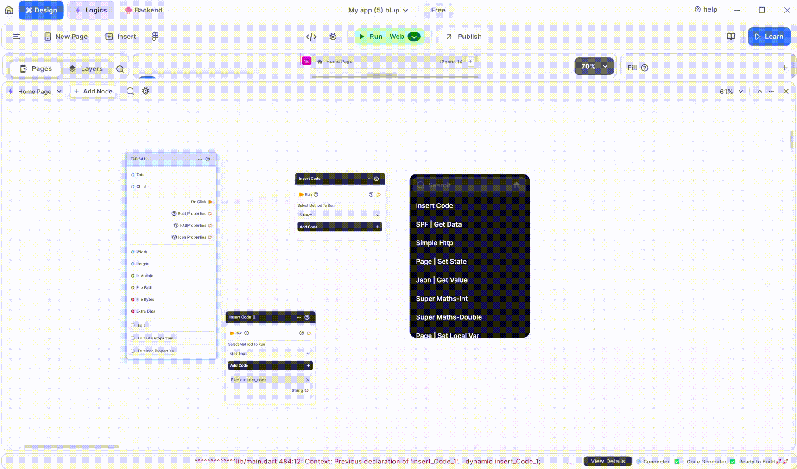

# Add Two Nodes - Get/Set Local Variable in Blup

<figure><figcaption>
Get & Set Local Variable
</figcaption></figure>

## What is the use of Get And Set Local Variable

The terms "Get" and "Set" are commonly used in the context of managing the state of a widget. 

**Get:** To retrieve or access the value of a local variable within a screen, you simply use its name.

**Set:** To update the value of a local variable within a screen, you typically use a function or method, often triggered by user interaction.

## How to use Get And Set Local Variable.

To use a Get and Set local variable in a Flutter screen:

1\. **Set the Value**: You first set a value to a variable within the screen. This means you assign a value to a variable, typically in response to some action or event on the screen.

2\. **Get the Value**: Once you've set the value, you can then retrieve or access that value within the same screen. This allows you to use or display the value elsewhere in the screen based on your needs.

If you have any ideas to make Blup better you can share them through our [Discord community channel ](https://discord.com/channels/940632966093234176/965313562425823303)

## Music to go with.
 

  
  
  Lofi music
  
  
  

