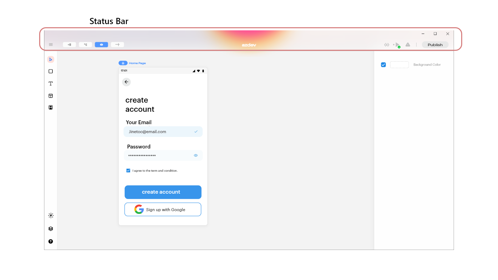
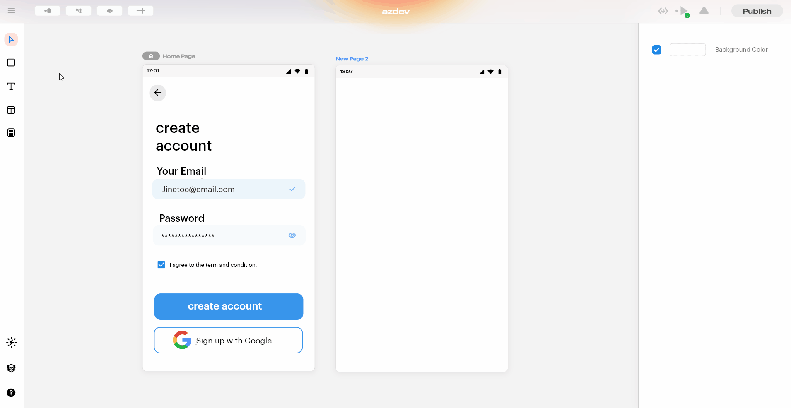
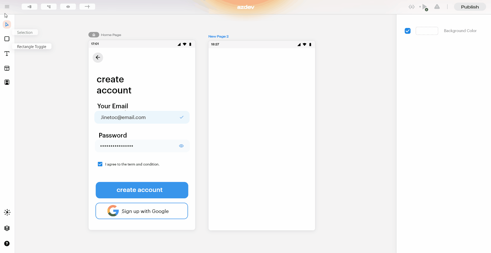
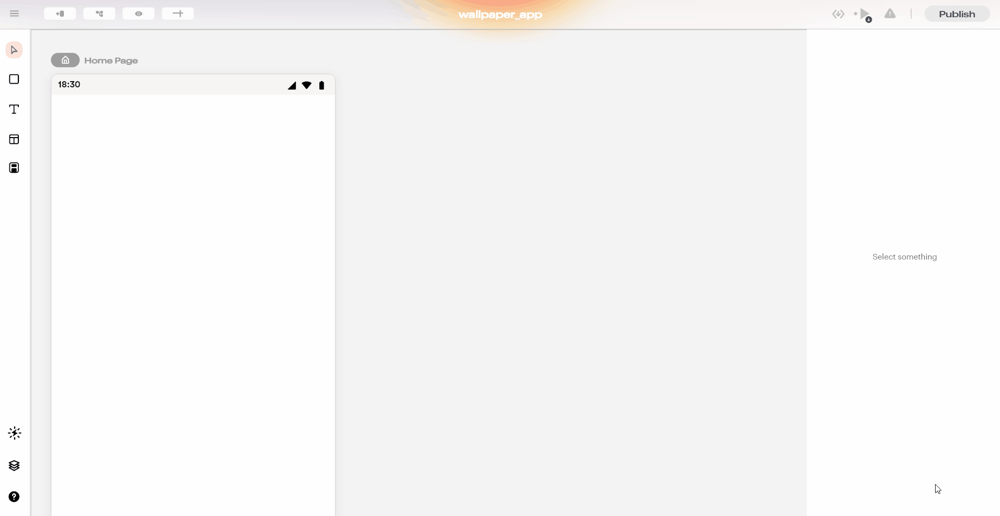
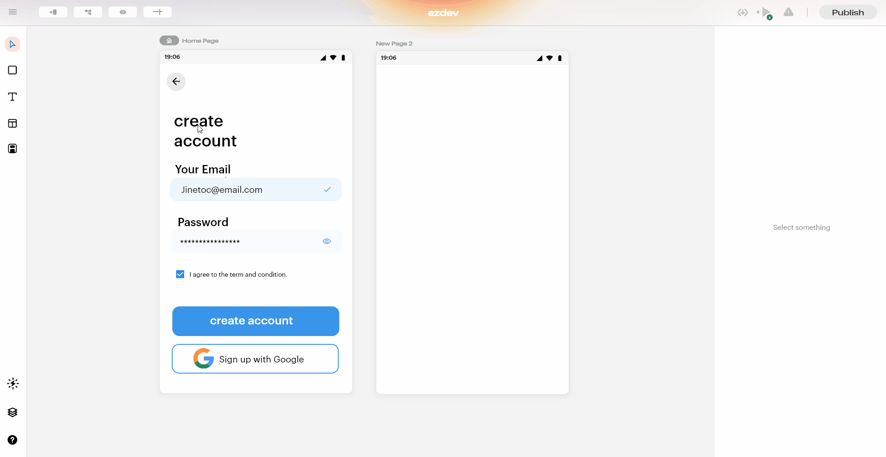
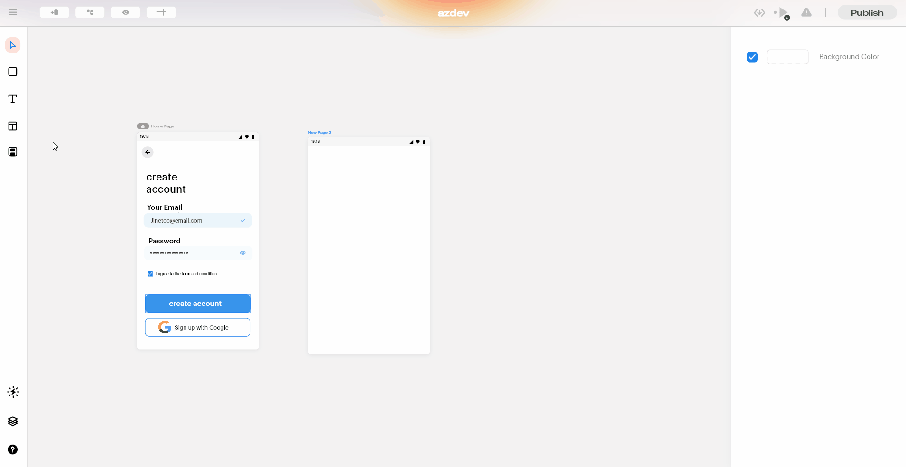
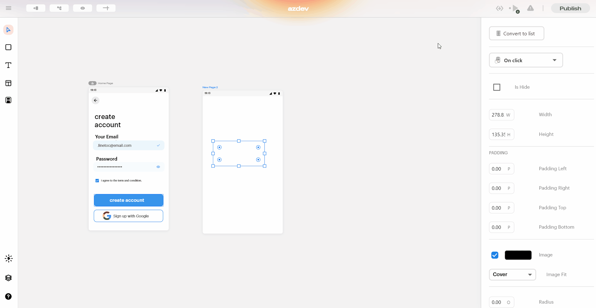
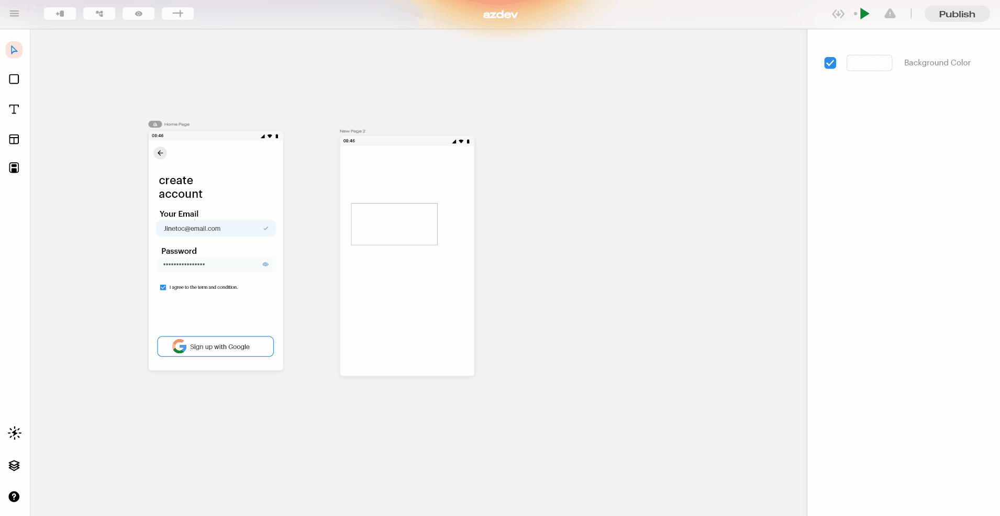

# Status Bar

## Status Bar

Some of the most important features that enable users to design interactive UI rapidly are housed in the status bar at the top of the screen. Let's look  into the different components of the Status Bar.

### File Button

As soon as you click on the file button a drop-down list pops up containing the following options:

#### New

The users can create a new blup project using this option. Once you click on the link you will be introduced to a pop-up window where you will be propmted to enter the project name. Click on create and you will be directed to a blank project.

#### Open

This option helps you to open an existing Blup project from local storage.

#### Export

Blup aids the user to transfer the project to another desktop without risking the loss of project-related assets like images, fonts, JSON files, etc. By clicking on “Export” a (project).blupx file will be generated. The user can share this (project).blupx with anyone.


<mark style="color:blue;">**Note**</mark><mark style="color:blue;">: The receiver can open the shared file via File->Open->(Project).BlupX</mark>


#### Import from Figma

Blup enables users to import designs from Figma to their specific projects if they have already created their UI in [Figma](https://www.figma.com/). Users can incorporate their creations into the Blup app with just the File ID and the Personal Access Token.

#### Help

This option helps you to make the most of the exponentially growing Blup community. You can help find answers to any problem that you are facing, or you can share what you are building with Blup and other thoughts on something you discovered about Blup. Blup prides itself of being a community driven platform.

### New Page

As the name suggests, the user can add new pages to their project using this button. By default, one page \[mobile canvas] will be present on the designer.

### Navigate

This button helps you to show all the page hooks (if the components of one page enables navigation to another page the two pages are said to be hooked) that are present on the different pages in the Blup Designer \[this can be achieved with the help of a couple of nodes in Blup Lightning, but navigate button is an easier alternative].

When the navigate button is activated, all the existing page hooks will be visible to the user. To add new page hooks, select the widgets(rectangle, or any other components of the page) stretch and drag the node point to the target page.&#x20;


<mark style="color:blue;">**Note:**</mark> <mark style="color:blue;"></mark><mark style="color:blue;">To learn more about the setting up page hooks refer</mark>[ <mark style="color:blue;">Blup Lightning</mark>](../blup-lightning/)


### UnHide Widget of the Current Page

This is used to temporarily unhide all the widgets that were opted to be hidden by the user.


<mark style="color:blue;">Note: To hide any widget see the documentation of</mark> [<mark style="color:blue;">Properties Panel.</mark>](properties-panel/)


### Show Keyboard Keys

Displays the current key being tapped, comes in handy when recording the coding sessions.

### Export Code – Flutter/dart

Users can download the raw code of the apps they've designed in blup using this option

The code generated is in the flutter format.


<mark style="color:blue;">Note: Whatever you have created with the help of blup always belongs to you, Blup doesn't own the code generated using blup.</mark>&#x20;


### Analyzer

Notifies the user if there are any errors in the logics.

### Run On Device

This functionality enables the user to run the app in their android devices.


<mark style="color:blue;">**Note:**</mark> <mark style="color:blue;"></mark><mark style="color:blue;">To run your app on a physical device you have to enable the developer option in your phone and also enable the USB debugging mode inside the settings of the phone.</mark>&#x20;


If you are using or installed blup for the first time then first you have to download the required components that blup needs to run the app on your mobile phone via USB cable. To download these components hover over the run button, a dialog box pops up having a download button, click on the download button to start downloading \[dialog box is only shown if the required components are not enabled].

If you have already installed the necessary components the button shows you a couple of options.

1. Restart Button - This button restarts the app with all the new changes. You can use this button when you have done some changes in the logics that you have kept in the init state node.
2. Hot reload Button –This button  hot reloads your apps instantly with all the new changes that . This functionality extremely fast and takes only a fraction of a second to reflect the changes.


<mark style="color:blue;">**Note:**</mark> <mark style="color:blue;"></mark><mark style="color:blue;">Hot reload functionality works only after the apps build is run on the phone atleast once.</mark>


3\.   Stop button - this button helps you to stop the apps running on your phone instantly.

### Publish Button

Users can publish their apps in AppStore or PlayStore using this button. We will get to the specifics of publishing the app in [publish-to-stores-ship](../publish-to-stores-ship/ "mention")

### Edit Setting

This button provides extra functionalities which can be used to change the several features available in blup.

Upon clicking the Edit Settings button the user will be introduced to a dialog box housing two options.

#### Project Details

Upon clicking this option  a dialog box pops up consisting of several input boxes where you can provide the required information like organization name and app name , to change the icon just click on the blup images and a file explorer window pops up from which you can choose any image for your icon.

#### Remove All SDK’s and Binaries

This option helps you to delete all the SDKs and binaries which you had installed when the app was run on a physical device through USB cable.

If you delete these components you will no longer be able to run apps for testing on your mobile phone via USB cable.

To delete them click on the Remove All SDK’s and Binaries then a dialog box pops up at the centre of the screen. Click on delete and you are done.

## Music to go with.


Lofi music


