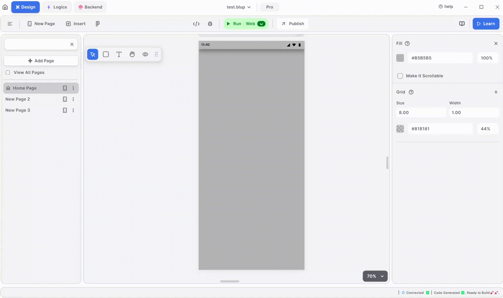

# How To Know Debug Print in Blup

<figure><figcaption>
Debug Print
</figcaption></figure>

In Blup, you can use debug print statements to see information while your app runs. First, run your application. Then, at the bottom of your screen, click "View Details." In the bottom right, you'll find the debug panel. Here, you can see statements printed by your application, which can help you understand its behavior and identify any issues.


<mark style="color:blue;">Note: Debugging means finding and fixing problems in your application.</mark>


If you have any ideas to make Blup better you can share them through our [Discord community channel ](https://discord.com/channels/940632966093234176/965313562425823303)

## Music to go with.
 

  
  
  Lofi music
  
  
  

