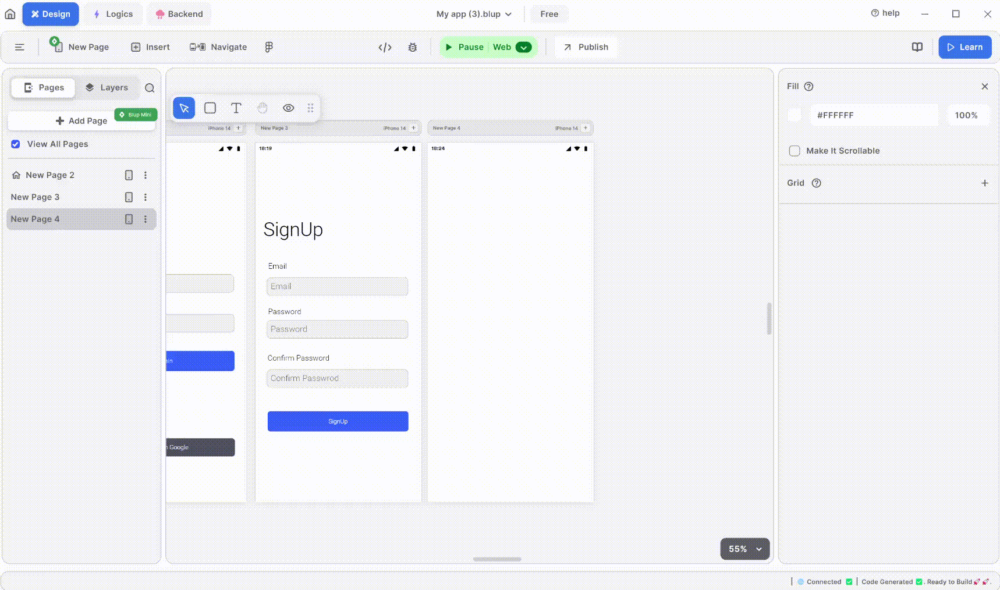

# How to Use Camera In Blup

<figure><figcaption>
Camera View
</figcaption></figure>

**To use the camera in Blup, follow these steps:**

1\. Click on the "Insert" tab.

2\. Drag and drop the "Camera" widget onto your UI screen where you want to use it.

3\. After dropping it, you can adjust the camera functionality according to your needs. This might involve setting properties such as resolution, flash mode, or capture mode.

4\. Once you've configured the camera, click on the "Run" button to check the camera functionality.
Test the camera by capturing photos or videos as needed.

If you have any ideas to make Blup better you can share them through our [Discord community channel ](https://discord.com/channels/940632966093234176/965313562425823303)

## Music to go with.
 

  
  
  Lofi music
  
  
  

