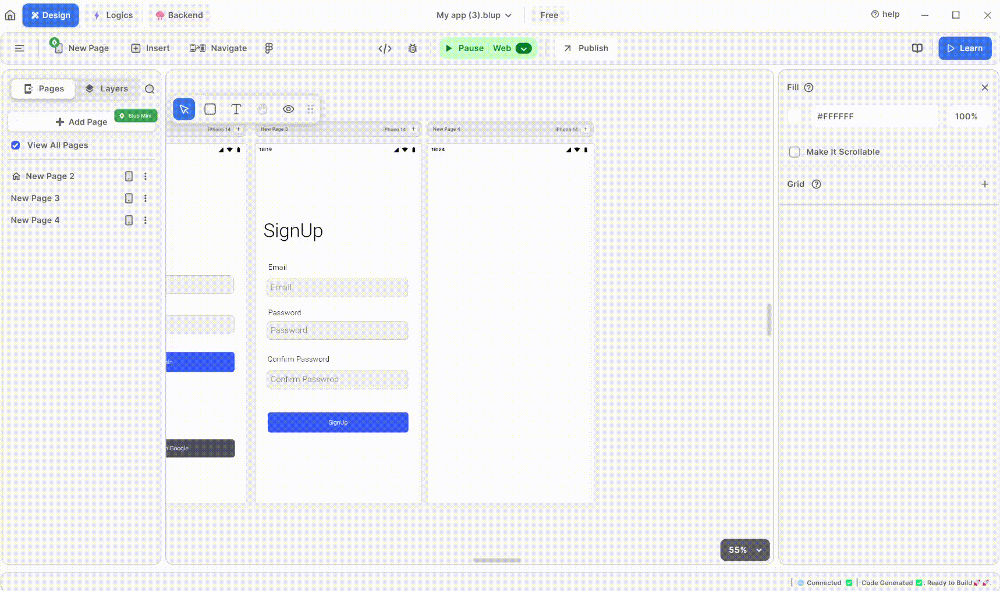

# How To Use WebView In Blup

<figure><figcaption>
Web View
</figcaption></figure>

1\. **Insert WebView**: Add a WebView widget to your UI screen. You can customize its height and width according to your preferences.

2\. **Set WebView URL**: In the UI editor, specify the URL that you want the WebView to load. This is where you define the web content you want to display within the WebView.

3\. **Run Emulator**: Launch the emulator or simulator to preview how the WebView looks in your app.

If you have any ideas to make Blup better you can share them through our [Discord community channel ](https://discord.com/channels/940632966093234176/965313562425823303)

## Music to go with.
 

  
  
  Lofi music
  
  
  

