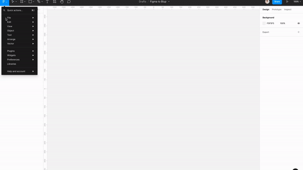
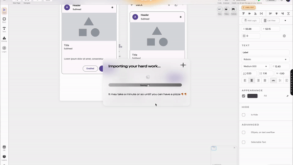

# Import from Figma

There are some steps to bring your figma file inside Blup.

### **Step 1: Copy the File Id from URL.**

When you open up your figma file in a browser. You would have to copy the text after '.../file/' and before the next '/...'.

<figure><figcaption></figcaption></figure>

### Step 2: Paste the File Id.

Paste the file-id you got from the first step and paste it in the "Import from Figma" dialog box.

<figure><figcaption></figcaption></figure>

### Step 3: Create a Token from Figma.

<figure><figcaption></figcaption></figure>

### Step 4: Wait & let the magic happen!

<figure><figcaption></figcaption></figure>
