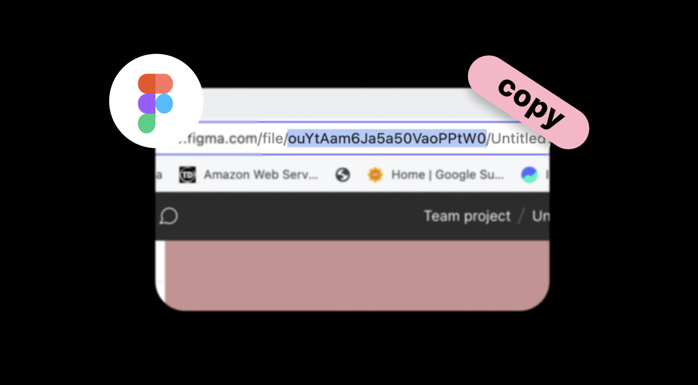
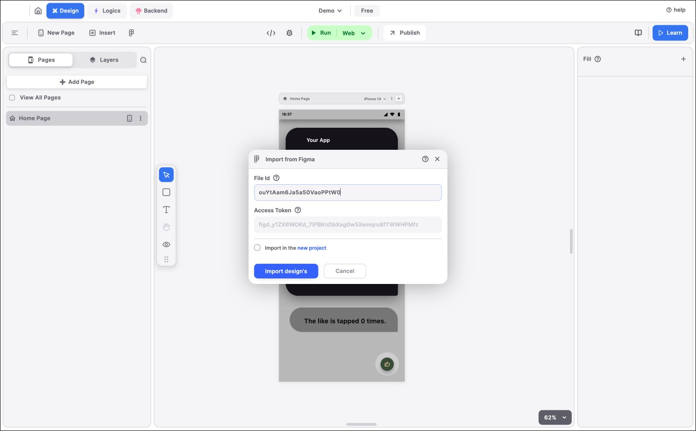

# Import from Figma

There are some steps to bring your Figma file inside Blup.

### **Step 1: Copy the File ID from the URL**

When you open up your Figma file in a browser, you must copy the text after '.../file/' and before the next '/...'. from the file URL.

<figure><figcaption>
Copy File FiD
</figcaption></figure>

### Step 2: Paste the File ID

Paste the file-id you got from the first step and paste it in the File ID of  **Import from Figma** dialog box.

<figure><figcaption>
Paste the file-id
</figcaption></figure>

### Step 3: Create a Token from Figma

<figure><figcaption>
Create token from figma
</figcaption></figure>

### Step 4 Paste the copied token

Paste the copied token you got from the third step and paste it in the File ID of  **Import from Figma** dialog box

<figure><figcaption>
paste the copied token
</figcaption></figure>

### Step 5: Wait & let the magic happen!

1. Click on **Import design's** Button
2. Select the frames you want to import and click on **Import**
3. And the magic happens.

<figure><figcaption></figcaption></figure>

