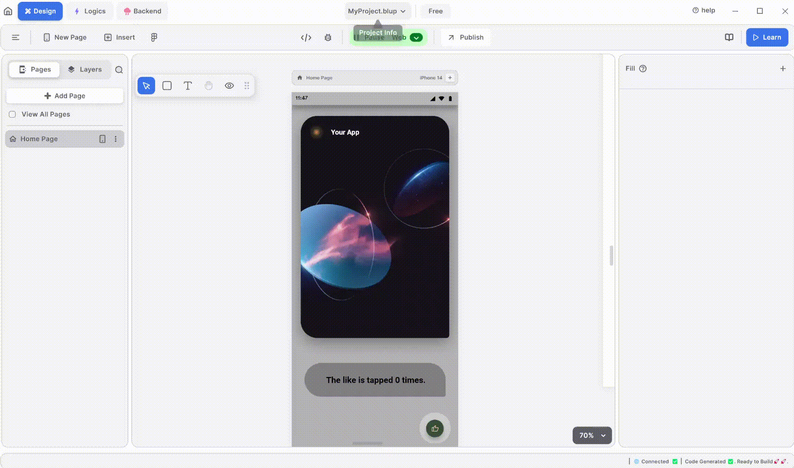
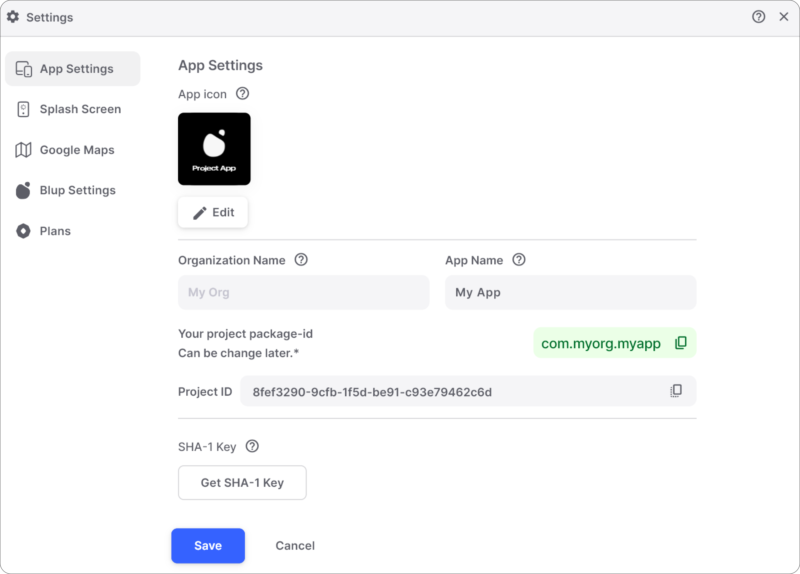
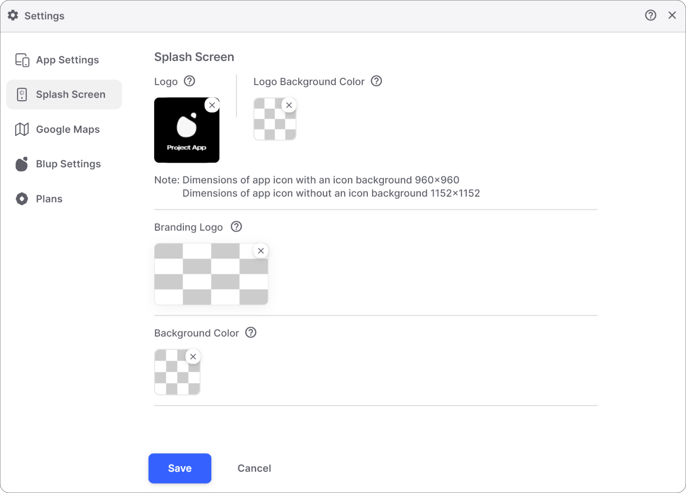
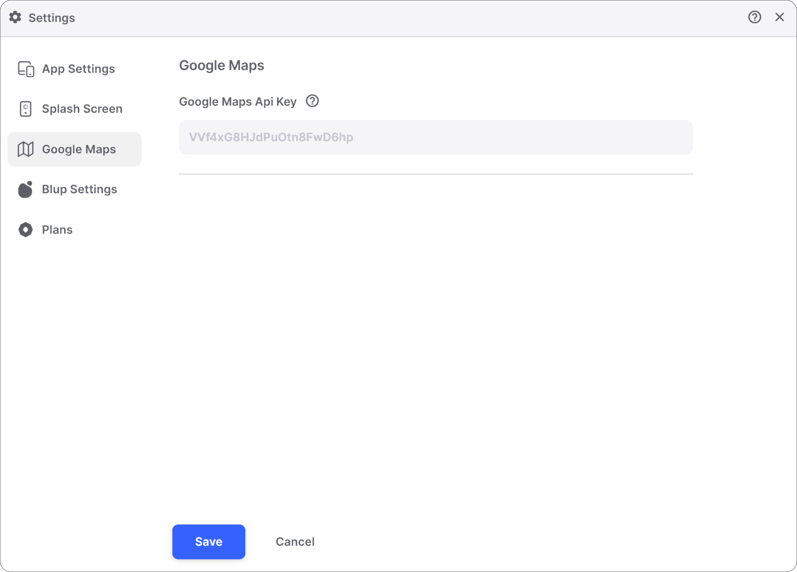
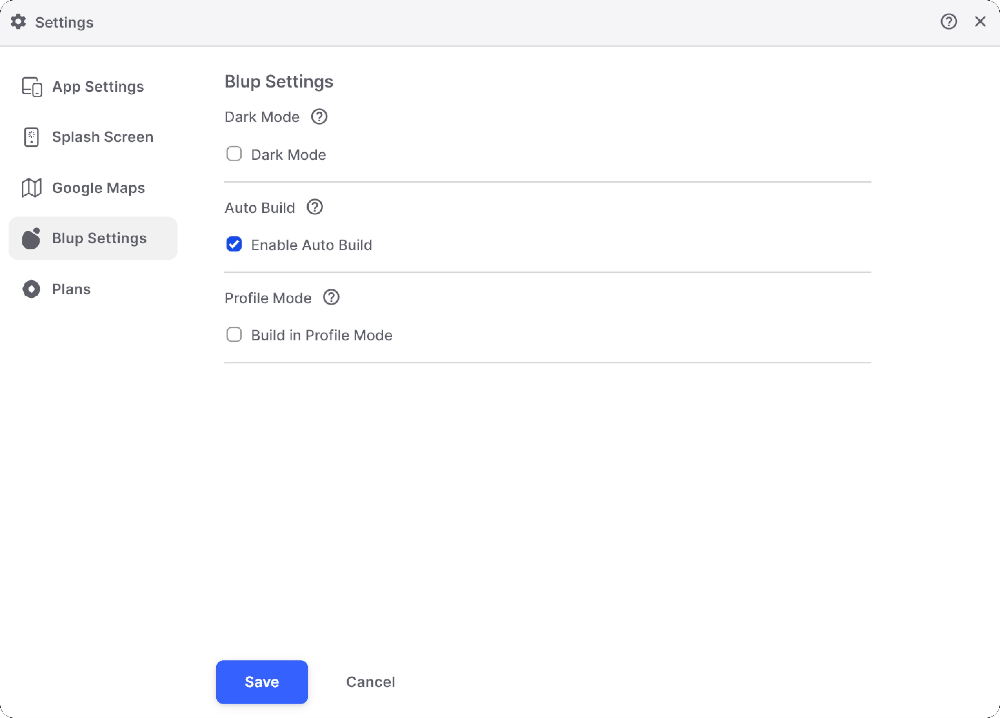
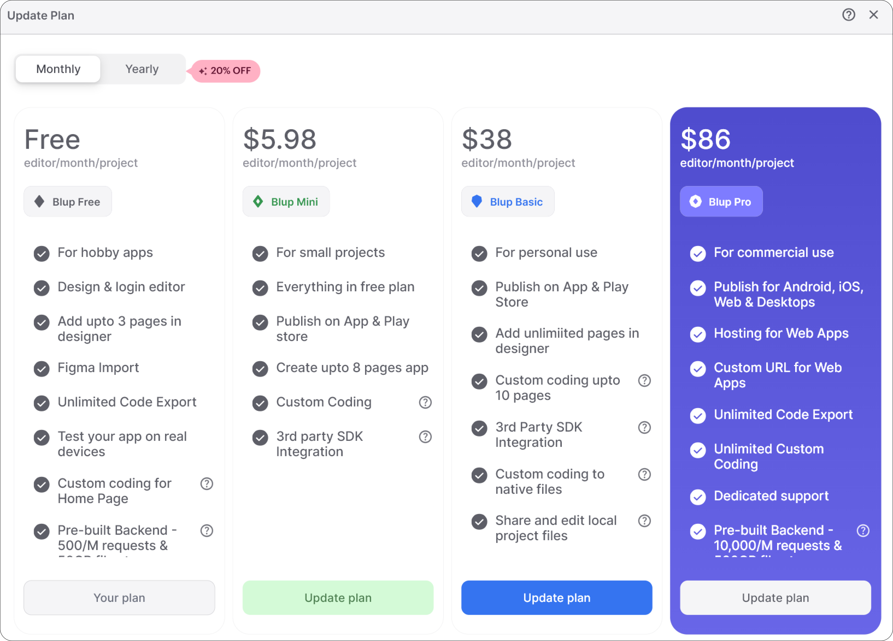

# Settings Widget

<figure><figcaption>
Blup Settings
</figcaption></figure>

The Settings widget in BLUP empowers users with precise control over various project aspects and configurations. Upon opening, the widget presents a tab bar view with five options:

1. *App Settings*
2. *Splash Screen*
3. *Google Maps API Key*
4. *BLUP Settings*
5. *Plans*

#### App Settings

<figure><figcaption>
App Settings
</figcaption></figure>

The App Settings tab allows users to configure fundamental parameters related to their BLUP application:

- *App Icon*: Users can select or upload an app icon to represent their application.
- *Organization Name*: Enables users to update the organization name associated with their project.
- *App Name*: Provides the option to modify the application's name, reflecting its identity and purpose.
- *Project Package ID*: A unique identifier for the Flutter application package, often following a reversed domain name format.
- *Project ID*: An identifier assigned to a project within a specific ecosystem or service, such as Firebase, for administrative and management purposes.
- *SHA-1 Key*: Allows users to generate an SHA-1 key, crucial for certain functionalities like authentication and API access.

#### Splash Screen

<figure><figcaption>
Splash Screen
</figcaption></figure>

The Splash Screen tab empowers users to configure the initial screen displayed when launching their BLUP-developed application:

- *Logo*: Users can upload or edit the logo displayed on the splash screen.
- *Logo Background Color*: Specifies the background color for the logo.
- *Branding Logo*: Option to include a branding logo, typically positioned at the bottom of the splash screen.
- *Background Color*: Sets the background color for the splash screen, enhancing its visual appeal.

#### Google Maps API Key

<figure><figcaption>
Google Map API Key
</figcaption></figure>

The Google Maps API Key tab facilitates the integration of Google Maps functionalities into BLUP projects. Here, users can input and manage their API keys directly, enabling seamless integration of maps and location-based services within their applications.

#### BLUP Settings

<figure><figcaption>
Blup Settings
</figcaption></figure>

The BLUP Settings tab offers customization options for various BLUP-specific configurations:

- *Dark Mode*: Allows users to toggle between dark and light modes for enhanced user experience.
- *Auto Build*: Enables automatic building of the current project in BLUP.
- *Profile Mode*: Facilitates building the app in profile mode, optimizing performance for testing and debugging.

#### Plans

<figure><figcaption>
Blup Plans
</figcaption></figure>

Under the Plans tab, users can manage their subscription plans for BLUP, including upgrading, downgrading, or canceling subscriptions, and accessing details about each plan tier's features and benefits.