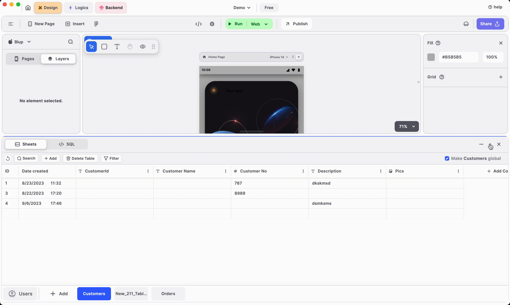

# Backend 🔗




Backend Introduction


<figure><figcaption></figcaption></figure>




Stream it!


<figure><figcaption></figcaption></figure>



In Blup, the Backend consists of 2 parts:

1. **Backend Bar**
2. **Backend Tab View**

### Backend Bar

The backend bar consists of a switcher to switch between sheets and SQL and the right-side menu consists of a backend menu, expand/minimize backend, and close backend.

<figure><figcaption>
Backend bar
</figcaption></figure>

#### Sheets SQL Switcher

This button helps you to quickly switch between the **Sheets** panel and **SQL** tab.

To build the backend of your app, you need to continuously switch between the **Sheets** and the **SQL**, this is where this switch button comes in handy.

<figure><figcaption></figcaption></figure>

#### Expand/Minimize Backend

The **expand/minimize Backend** button helps you to minimize or expand the window.

This button is quite useful when you want to use more space to work with the editor or the sheets section.

<figure><figcaption></figcaption></figure>

#### Close Backend

The **close backend** button is used to close the backend panel.

<figure><figcaption>
Backend - close
</figcaption></figure>

### Backend tab view

* When Sheets is selected in the Backend bar, the backend tab view shows.

<figure><figcaption>
Backend - Sheets
</figcaption></figure>

* When SQL is selected in the Backend bar, the left side of the backend tab view shows all SQL queries created by the user and SQL query manipulation, filtering tab, and the right side of the backend tab view has an SQL editor to edit the query.

<figure><figcaption>
Backend - SQL
</figcaption></figure>


**Note:** You can also resize the backend panel by dragging the top of the backend panel.


<figure><figcaption>
Backend - resize
</figcaption></figure>

### Music to go with.


Lofi music

