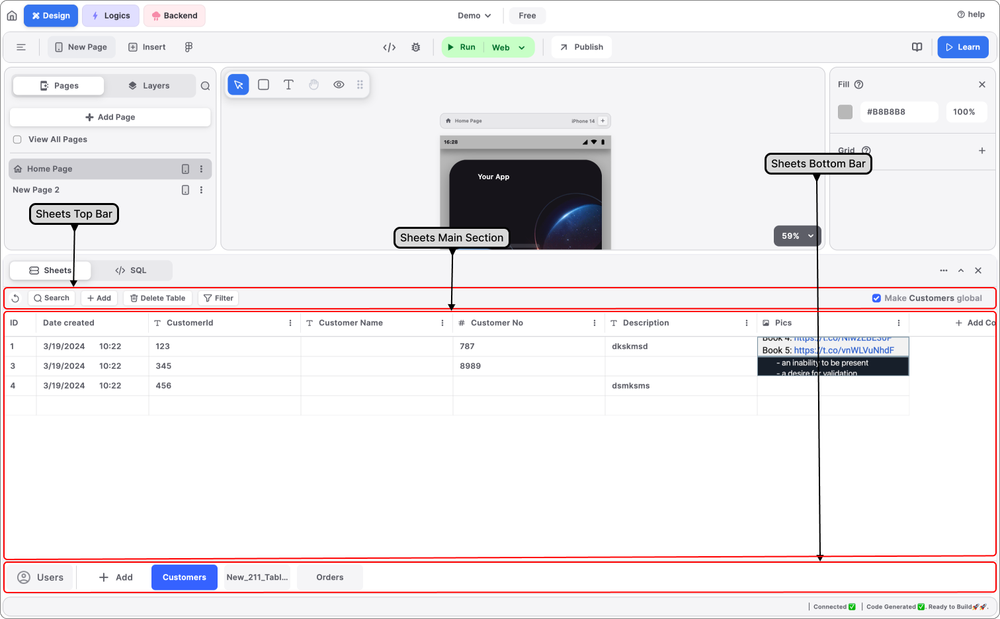

# Sheets

Sheets is an advanced graphical user interface (GUI) database meticulously developed to seamlessly integrate with Blup. Crafted from the ground up, Sheets operates in tandem with Blup, facilitating smooth data management. Leveraging the robust infrastructure of Amazon Web Services (AWS),&#x20;

Sheets ensure top-notch security for your data. Furthermore, its architecture guarantees high availability, enabling users to effortlessly load and save data within the Sheets environment.


<mark style="color:blue;">Note - You can either insert the data into the database manually or you can use the Blupsheet node to insert data dynamically or the sql editor where you can write and manage your sql queries, based on the feature of the app choose whatever you like.</mark>


Sheets database is similar to a traditional relational database in the sense. In Sheets, we also store data in the form of a table \[rows and columns].

When you open you will see that Sheets consists of several sections, so let's go over each section one by one.

<figure><figcaption>
Sheets
</figcaption></figure>

## Sheets Top Bar&#x20;

This section has different options for manipulating the tables. Let's see all the options one by one.

### **Refresh Button**

This button is used to refresh the current selected table.&#x20;

### **Search Button**

On enabling this button, a search bar will appear below the names of all the columns present in your table, where you can search the data corresponding to the data type of the column.

### **Add Table Button**

This button is used to create a new table in the database, a default-named table will be created which you can modify.

### **Delete Table Button**

This button is used to delete a table from the database, this button is disabled by default if no table is present.

### **Filter Button**

On enabling this button, a filter option will appear on the side of all the columns present, where you can apply the filters to the data present. Filter options that are available are :&#x20;

* A-Z / Z-A for Text-type columns
* Newest First / Oldest First for Date Time type columns
* Smallest First / Largest First for Int type columns

### **Make Table Global Checkbox**

On clicking this checkbox, you make your table available for your other projects which you have made from the same user ID. This feature comes in handy when you need the same database or tables for two different projects i.e. when you are making linked projects which need communication.

## Sheets Main Section

This section consists of all the data stored in the table in the form of rows and columns. Here you can add columns, modify column field types, and names, or delete the column via the options dropdown present beside the name of each column. You can also add a new table from the **Add Table** button present on the rightmost side of the column list.

If no table is present, an empty state will come having an option to add a new table.

### Sheets Main Section

In the bottom bar or bottom section of Sheets, you can see that all the tables present in the Sheets are shown here. Also, there is an **Add button** in case you want to create a new table.


<mark style="color:blue;">Note – by default, there is a table present in Sheets</mark>

<mark style="color:blue;">Users table - This table consists of all the login information of the user, data gets stored in the table when the user uses the Google sign-in method to log into the app. You can also store this data in other tables, but this table consists of this data by default.</mark>


## Understanding the working of Sheets

If you want to use sheets as your backend database first you need to define the schema for the database which means that you need to structure the database i.e. how many tables does it have, and how many columns each table has. and what the type of column in a particular row.

For example - suppose you are building apps that can store the data of students \[student management app], then you can define a table with column-like student id \[number], student name \[single line text], student department \[single line text], student date of birth \[date and time].

### How to create a new Table in Sheets

To create a new table in Sheets go to the bottom section of the Sheets and then click on the plus/add icon present next to the user's table, it will create the new table.

When a new table is created by default two-column with single-line text as types are already generated for you. These by default columns can be easily modified you can change the name as well as the types of both columns in the table.

### Modifying tables in Sheets

To modify the table present in Sheets press the options icon present next to each column name heading.

Clicking on this option icon will show you multiple options:&#x20;

* Change the field type
* Rename the column
* Delete the column

#### Change the field type

This option present in the dialog box will help you to change the field type of the column.

Clicking on this option will show you a dropdown menu that consists of several options like number, date and time, paragraph, etc. Choose any option according to your needs.

#### Rename Column Name&#x20;

This option is used to change the name of the column to anything that you want to have


<mark style="color:blue;">Note: The names should not contain any space between them. You can use '\_' instead.</mark>


#### Delete

This option helps you to delete the currently selected column with all the data present in the column.


<mark style="color:blue;">Note: When you delete any column all the data that is stored in that column will be deleted and cannot be recovered.</mark>


## Music to go with.


Lofi music

