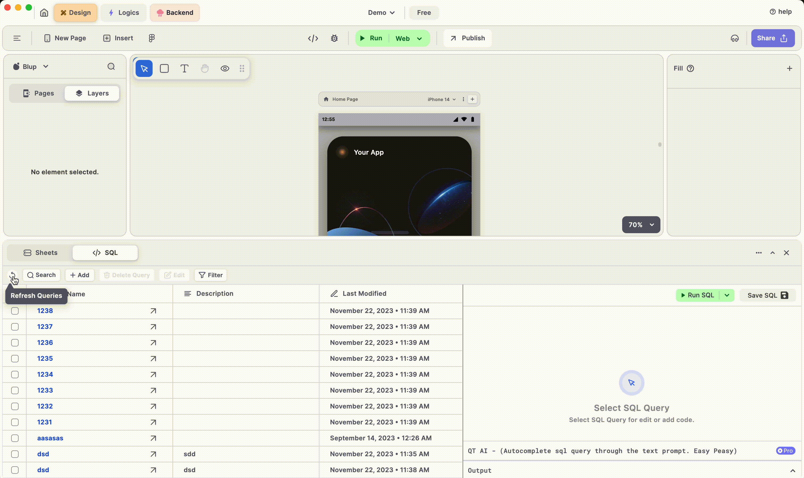
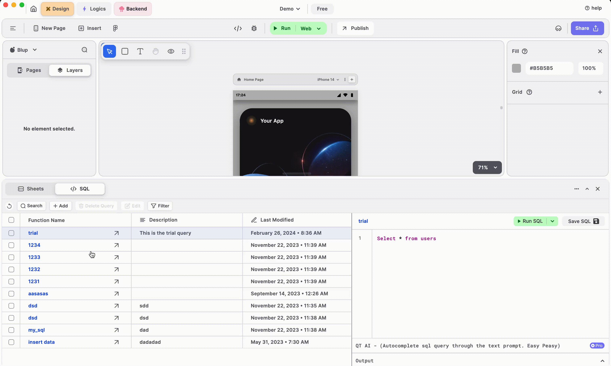
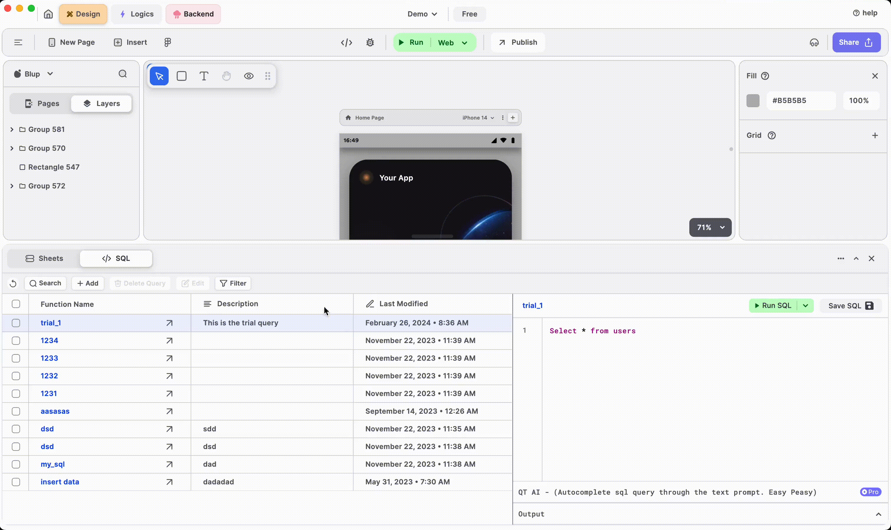
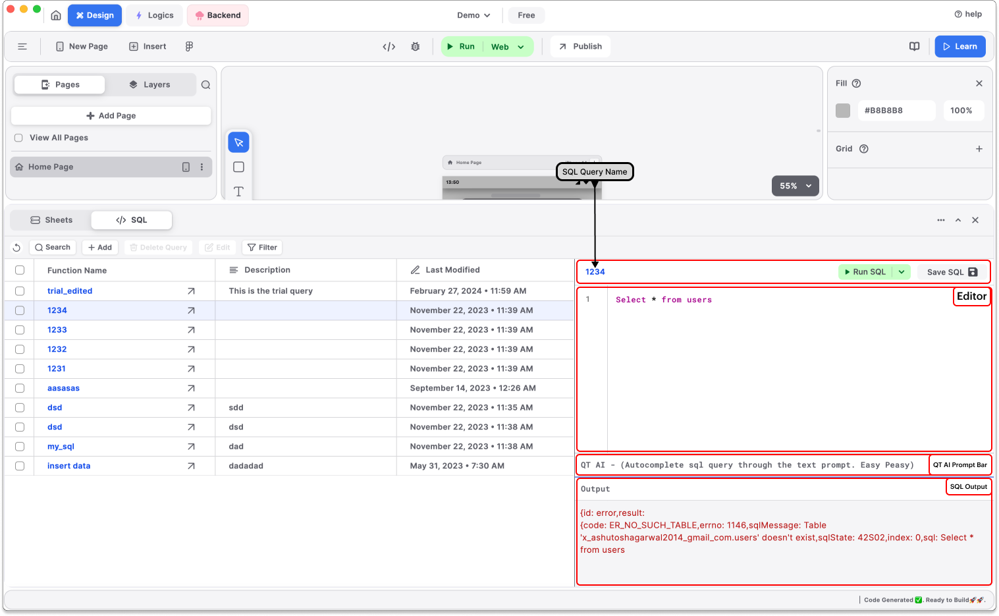
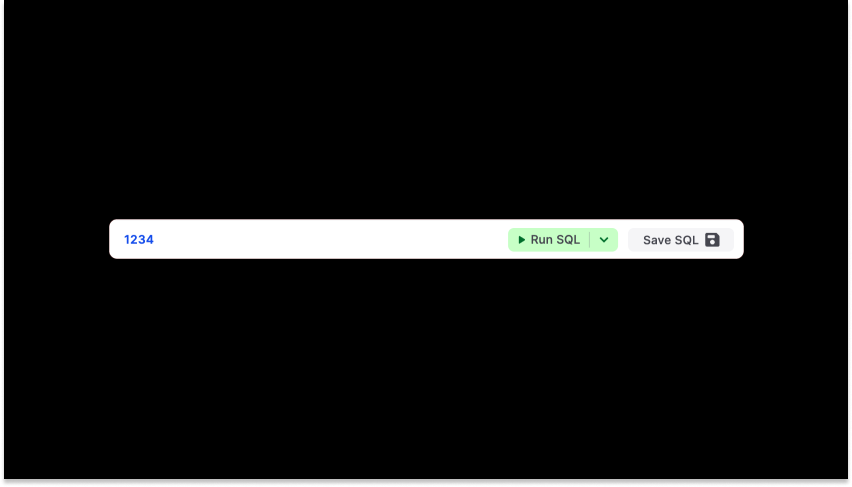
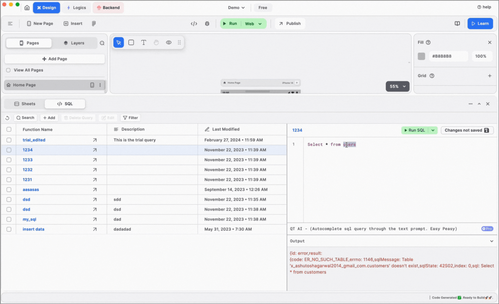
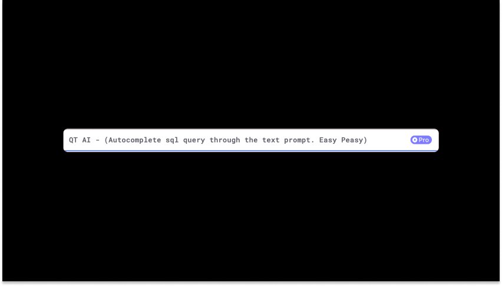
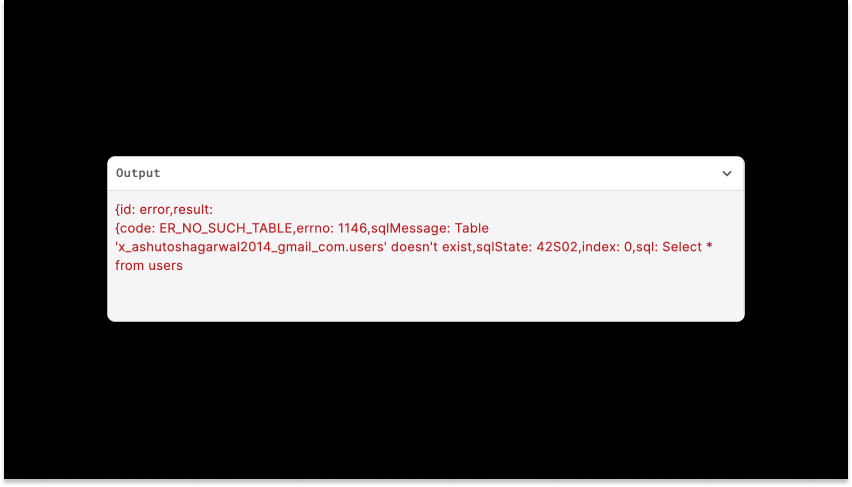

# SQL

SQL in blup is similar to a traditional SQL editor in the sense, that in SQL you can manage, and edit your SQL queries and, through SQL query you can modify data from the tables present in Sheets.

The SQL consists of mainly 3 sections:

* **SQL Queries View**
* **SQL Bar**
* **SQL Editor**

<figure><picture><source srcset="../../.gitbook/assets/light mode.png" media="(prefers-color-scheme: dark)"></picture><figcaption>
SQL
</figcaption></figure>

### **SQL Queries View**

**SQL Queries View** consists of all **SQL** **Queries** that you have created. This mainly consists of three columns, the **Name** of the query, the **Description** of the query, and the **Last Modified** date of the query.

You can select any query by checking the check box on the left side of each query entry and perform operations like edit or delete.

This View helps in managing all SQL queries you have made, this can come in handy if you have a large project.

<figure><picture><source srcset="../../.gitbook/assets/SQL Queries View Dark.png" media="(prefers-color-scheme: dark)"></picture><figcaption>
SQL Querues View
</figcaption></figure>

### SQL Bar

The **SQL Bar** includes several buttons designed to help you efficiently manage SQL queries. These buttons serve various purposes, such as refreshing all queries and editing query details. Let’s explore them one by one! 😊

<figure><picture><source srcset="../../.gitbook/assets/Screenshot 2024-02-14 at 11.14 2.png" media="(prefers-color-scheme: dark)"></picture><figcaption></figcaption></figure>

**Refresh Button**

This button is used to refresh all SQL queries.

<figure><picture><source srcset="../../.gitbook/assets/reload_queries_dark.gif" media="(prefers-color-scheme: dark)"></picture><figcaption>
Refresh Button
</figcaption></figure>

#### **Search Button**

On enabling this button, a search bar will appear below the **Name**, **Description,** and **Last Modified** of your queries. The SQL queries are stored in a table which is explained below, so that you can search a query based on the **Name or** **Description or Last Modified** that you provide in the search bar.

<figure><picture><source srcset="../../.gitbook/assets/search_query_dark.gif" media="(prefers-color-scheme: dark)"></picture><figcaption>
Search Button
</figcaption></figure>

#### **Add Query Button**

**The Add Query Button** is used to create a new query.

On clicking this button a pop-up will appear asking you to enter the **Name** and **Description** of the query which you want to make.

This is done so that you can manage different queries and keep track of what the particular query does in writing the description.

<figure><picture><source srcset="../../.gitbook/assets/add_query_dark.gif" media="(prefers-color-scheme: dark)"></picture><figcaption>
Add Query Button
</figcaption></figure>

#### **Delete Query Button**

**The Delete Query** button is used to delete a query, this button is disabled by default if no query is selected or present.

Firstly, select a query to delete it.

<figure><picture><source srcset="broken-reference" media="(prefers-color-scheme: dark)"></picture><figcaption>
Delete Query
</figcaption></figure>

> Note: You can also delete multiple queries by selecting them.

#### **Edit Query Button**

**The Edit Query** button is used to edit a query, the **Edit Query** is disabled by default if no query is selected.

On clicking **Edit Query,** a pop-up will appear containing the **Name** and **Description** of the query that you can edit and save.

<figure><picture><source srcset="../../.gitbook/assets/edit_query_dark.gif" media="(prefers-color-scheme: dark)"></picture><figcaption>
Edit Query
</figcaption></figure>

#### **Filter Button**

On enabling the **Filter Button**, a filter option will appear on the right side of all the columns present in the **SQL Queries View**, where you can apply the filters on the data present. There are some filter options like:

* A-Z / Z-A for Text-type columns - sort by ascending or descending for text
* Newest First / Oldest First for Date Time type columns - sort by datetime.

<figure><picture><source srcset="../../.gitbook/assets/filter_query_dark-ezgif.com-video-speed.gif" media="(prefers-color-scheme: dark)"></picture><figcaption>
Filter Queries
</figcaption></figure>

**SQL Editor**

The **SQL Editor** is one of the most important parts of the SQL section. Here you can write your SQL queries and test them. The query that you have clicked from the SQL query table is shown here.

<figure><figcaption>
SQL Editor
</figcaption></figure>

The SQL Editor has mainly 4 parts:

### **1.**  SQL Editor **Top Bar**

The top bar consists of three things :

1\) **SQL Query Name** - Name of the query that is opened.

2\) **Run SQL Button** - This is used to run the SQL query, along with this you can also configure a test event by clicking the dropdown arrow from the Run SQL button.

3\) **Save SQL Button** - This is used to save an edited SQL query, you need to run the query or press this button in order to save the query you have written.

<figure><figcaption>
SQL Editor Top Bar
</figcaption></figure>

### _**2.  Editor**_

Here you can write your SQL queries, this works as a traditional code editor where you can copy, cut, and paste your code along with SQL syntax highlighting

<figure><figcaption>
sql-editor
</figcaption></figure>

### _**3.  QT AI Prompt Bar**_

The SQL section has an AI-powered editor called QT AI, where you can write a prompt and the respective SQL query will be generated for you. For example, you can give a prompt "Give me all the phone numbers from the user table", it AI automatically recognizes the context and gives you a SELECT query.

<figure><figcaption>
qt-ai-prompt
</figcaption></figure>

### _**4.  Output Section**_

This is where you get the execution results of your sql query, it shows you the error encountered if any, or the success result obtained from running the query.

<figure><figcaption>
sql-output
</figcaption></figure>

## Music to go with.


Lofi music


