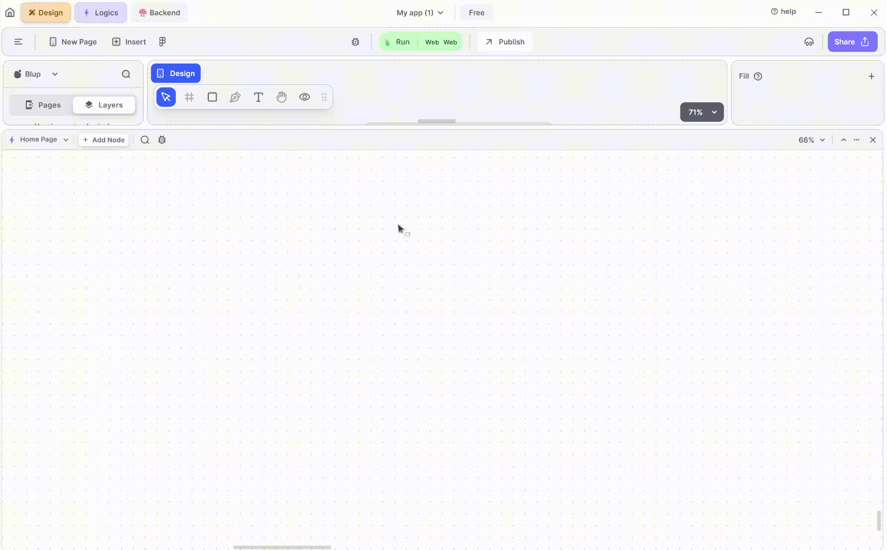
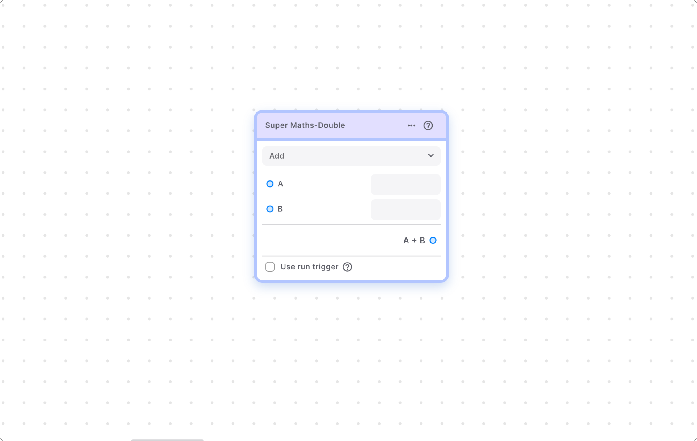
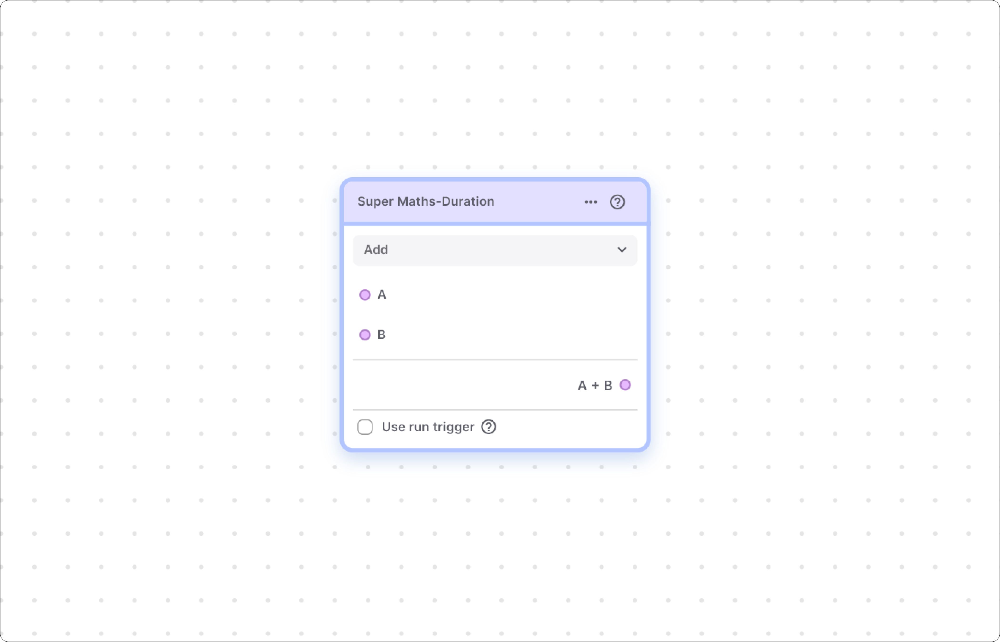

# Maths Node Section

## Maths Section

The Maths section of this tool provides various nodes designed to perform arithmetic operations on different types of variables such as integers, doubles, and durations. Let's explore each node in detail.

## SuperMaths | Int Node

This node is used to perform arithmetic operations like addition, subtraction, multiplication etc. on integers \[which do not have a decimal point].

### Components Of Node

<table><thead><tr><th width="211"></th><th></th></tr></thead><tbody><tr><td><strong>Operation type drop-down menu</strong></td><td>This menu helps you to define the arithmetic operation which you want to perform on the integer numbers. For example, if you want to perform division then choose division from the drop-down option.</td></tr><tr><td><strong>"A" node point</strong></td><td>This input node point helps to input the first integer number, you can provide the number either by node point or directly through the input box.</td></tr><tr><td><strong>"B" node point</strong></td><td>This input point helps to input the second integer number and similar to "A" node point you can provide the number either by node point or directly through the input box.</td></tr><tr><td><strong>Use run trigger</strong></td><td>This check box is used to add run trigger to the node.</td></tr><tr><td><strong>Results</strong></td><td>This node point provides you with the result of the arithmetic operation on the two numbers.</td></tr></tbody></table>

## SuperMaths | Double Node

This node is used to perform arithmetic operations like addition, subtraction, multiplication etc. on double numbers \[which has decimal a point].

### Components Of Node

|                                   |                                                                                                                                                                            |
| --------------------------------- | -------------------------------------------------------------------------------------------------------------------------------------------------------------------------- |
| **Operation type drop-down menu** | This menu helps to define the arithmetic operation which you want to perform. For example, if you want to perform division then choose division from the drop-down option. |
| **"A" node point**                | This input node point helps to input the first decimal number, you can provide the number either by node point or directly through the input box.                          |
| **"B" node point**                | This input point helps to input the second decimal number and similar to "A" node point you can provide the number either by node point or directly through the input box. |
| **Use run trigger**               | This check box helps you to add a run trigger to the node.                                                                                                                 |
| **Results**                       |  This node point provides you with the result of the arithmetic operation on the two numbers.                                                                              |

## SuperMaths | Duration Node

This node is used to perform arithmetic operations like addition, subtraction, multiplication on Duration. For example, you want to add 6 hours 32 mins and 10 hours 25 min such types of arithmetic operations can be performed with this node.

### Components Of Node

|                                    |                                                                                                                                                                                                              |
| ---------------------------------- | ------------------------------------------------------------------------------------------------------------------------------------------------------------------------------------------------------------ |
| **Operation type drop-down menu**  | This menu helps you to define the arithmetic operation which you want to perform on the duration For example if you want to perform division on the duration then choose division from the drop-down option. |
| **"A" node point**                 | This input node point helps to input the first duration, you can provide the duration either by node point or directly through the input box.                                                                |
| **"B" node point**                 | This input point helps you to input the second duration and similar to A node point, you can provide the number either by node point or directly through the input box.                                      |
| **Use run trigger**                | This check box helps you to add a run trigger to the node.                                                                                                                                                   |
| **Results**                        |  This node point provides you with the result of the arithmetic operation on the two numbers.                                                                                                                |



Lofi music


