# ToDo App

This tutorial guide you through creating a to-do app, ToDo app is allows users to manage tasks and activities. It typically includes features such as adding tasks, organizing them into categories or lists, setting due dates and priorities, marking tasks as completed, and possibly syncing data across multiple devices.

## Steps to Build ToDo App

The steps to build the app are as follows:

- [1. Design the User Interface](#design-the-user-interface)
- [2. Set Up Data Storage](#set-up-data-storage)
- [3. Implement Logic](#implement-logic)

### 1. Design the User Interface {#design-the-user-interface}

In this step, we'll add the UI elements or widgets for the 'Home' and 'Form' screens and the navigation between the two pages.

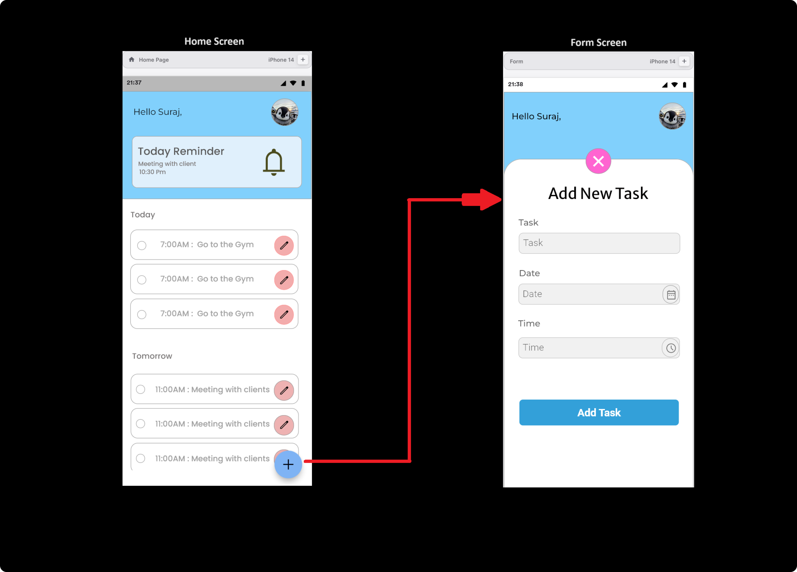

#### 1.1 Building Home Screen

Here is a simplified approach to creating the UI for a screen that displays all tasks according to their dates in a to-do app:

1. Design the Top Section:

- Use a Container widget to create the topmost section of the UI.

- Add padding and choose a background color for the container to define the top section.

- Add an icon from the Icon widget and customize its size and color as needed.

- Use a CircleAvatar widget to display a circular image, and fill it with an image from your assets.

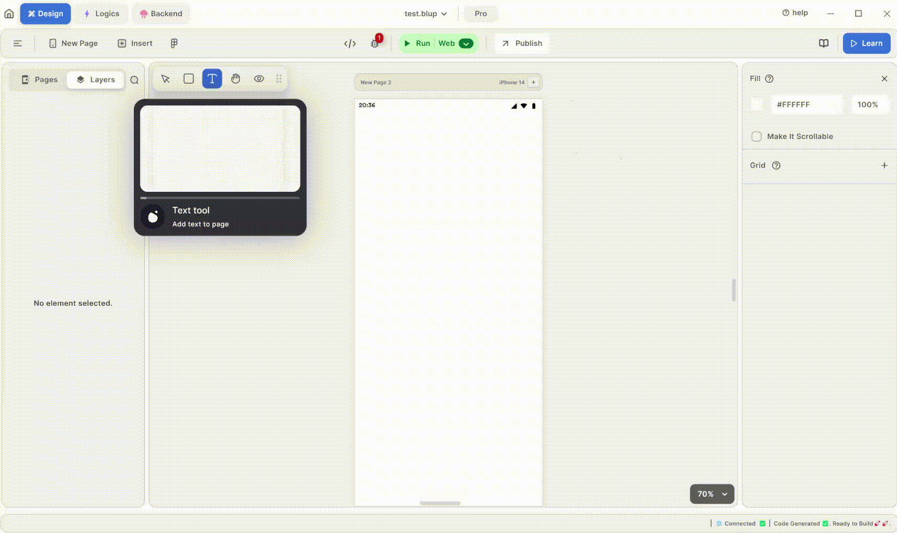

2. Add Text Elements:

- Add Text widgets to display information such as the date or a title.

- Customize the text style, including font size and font type, to match your design.

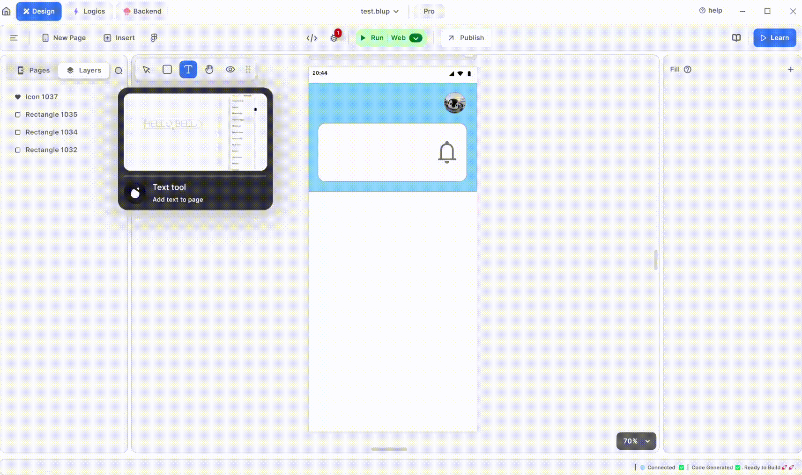

3. Create the Task Theme:

- Create a theme for the task list items, such as a specific layout and style for tasks.

- Keep the task theme simple for ease of use and a clean design.

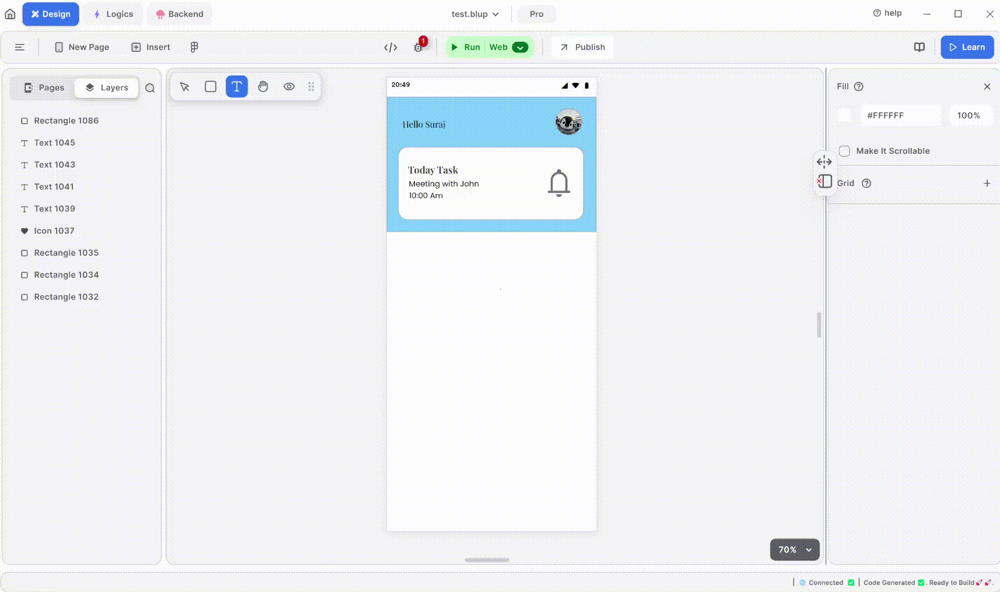

4. Organize Tasks in a ListView:

- Use a ListView widget to display tasks according to their dates.

- Group the elements for each date as a separate list item in the ListView.

- Customize the ListView to show multiple tasks as a scrollable list.

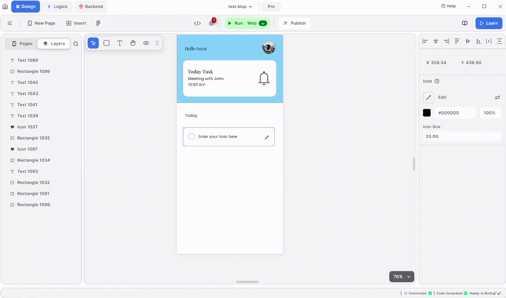

5. Add a Floating Action Button:

- Include a floating action button (FloatingActionButton widget) to allow users to add new tasks.

- When clicked, the button should navigate the user to another screen where they can input and add a new task.

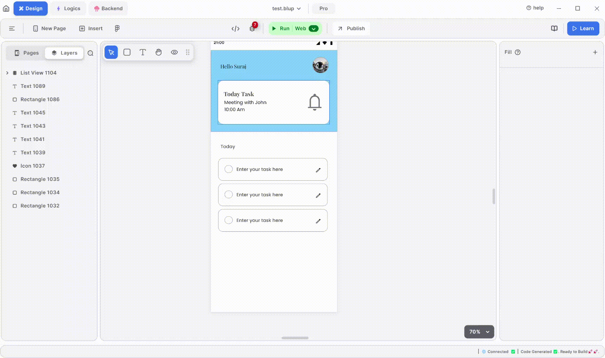

6. Design the Task Input Screen:

- Use a Container widget to create the main layout of the screen.

- Customize the container by setting its background color, padding, and other properties.

#### 1.2 Building TODO Form

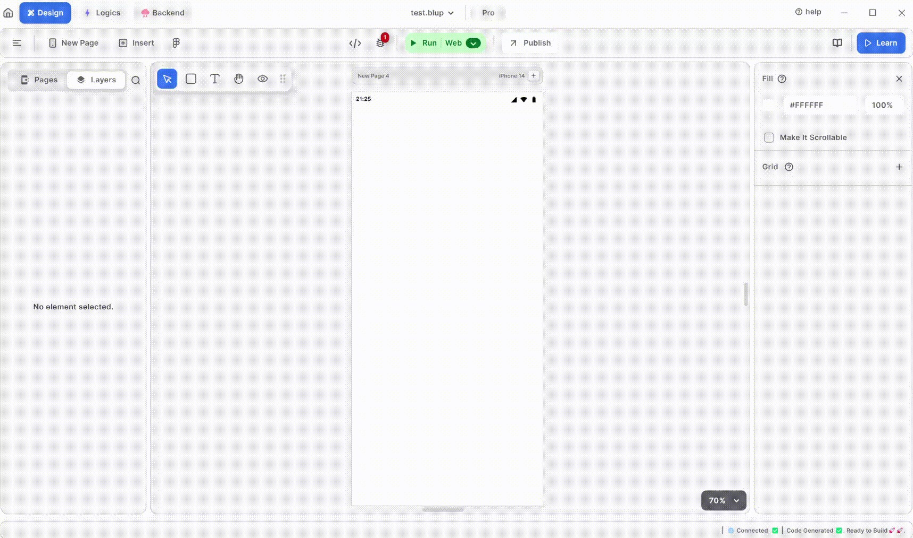

1. Add Input Fields and Button:

- Add a TextField widget to take input for the task title or description.

- Customize the TextField by adjusting its width and height as needed.

- Add a Button (e.g., ElevatedButton or FlatButton) to allow the user to submit the new task.

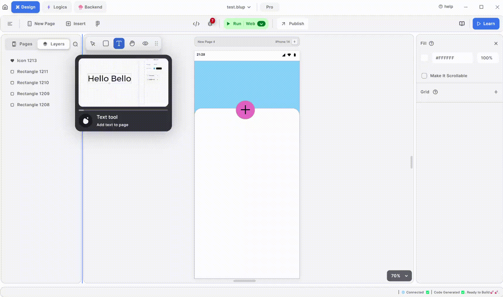

2. Customize Text and Placeholder:

- Add a placeholder text (hint text) to the TextField to guide the user on what to enter.

- Customize the button with appropriate text, such as "Add Task" or "Submit".

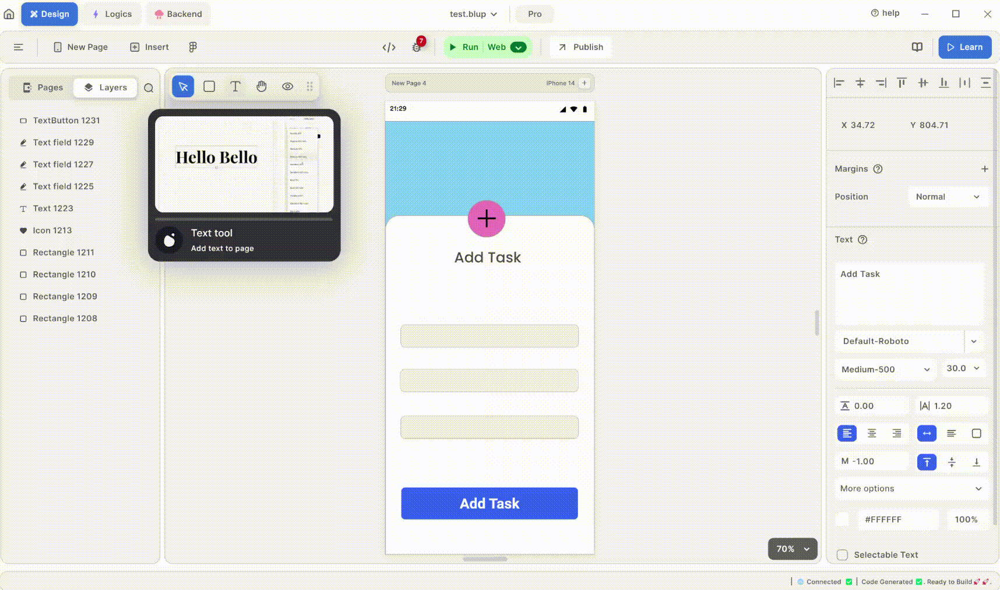

### 2. Set Up Data Storage {#set-up-data-storage}

In this section, you will set up data storage by creating a table and writing queries for creating, uploading, reading, and deleting data.

#### 2.1 Creating the Table

- Choose a name for your table, avoiding the use of user or list in the table name.

- Set the table as global if you want it to be accessible from different parts of your app.

- Define the fields you need for your table, such as columns for task names, due dates, and statuses.

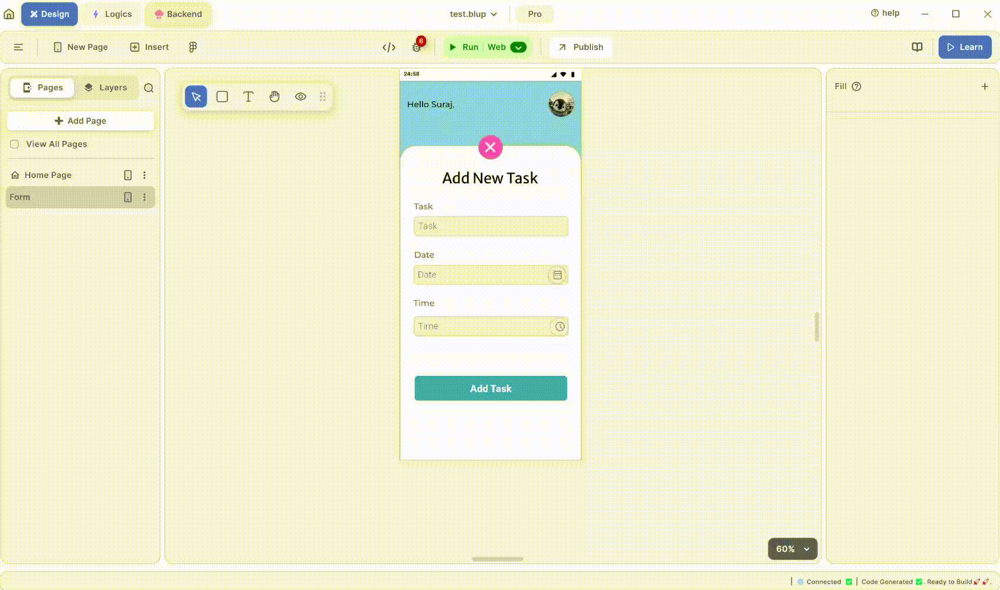

#### 2.2 Writing Queries

1. Add data to the table

- You should have basic knowledge of SQL to write queries for data operations.

- Create a query, giving it a name and a description of what it does.

- Write the query in the designated query field.

- Save the query, and use the test option to check if the query is correct.

- To test the query, provide key-value pairs in the test event configuration, and run the query to see the output below.

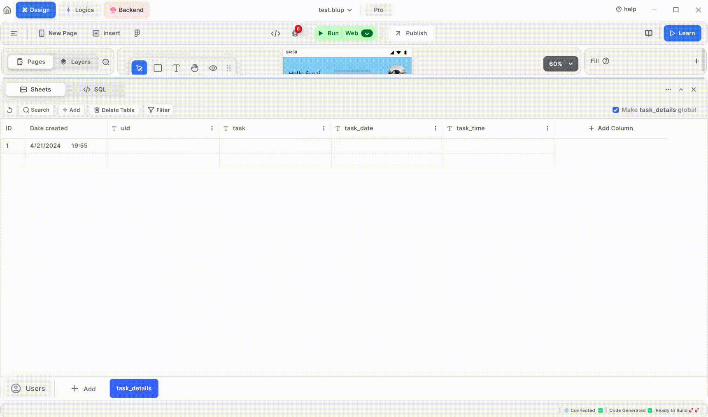

2. Get data from the table

Just select all(*) from the table to get all the data.

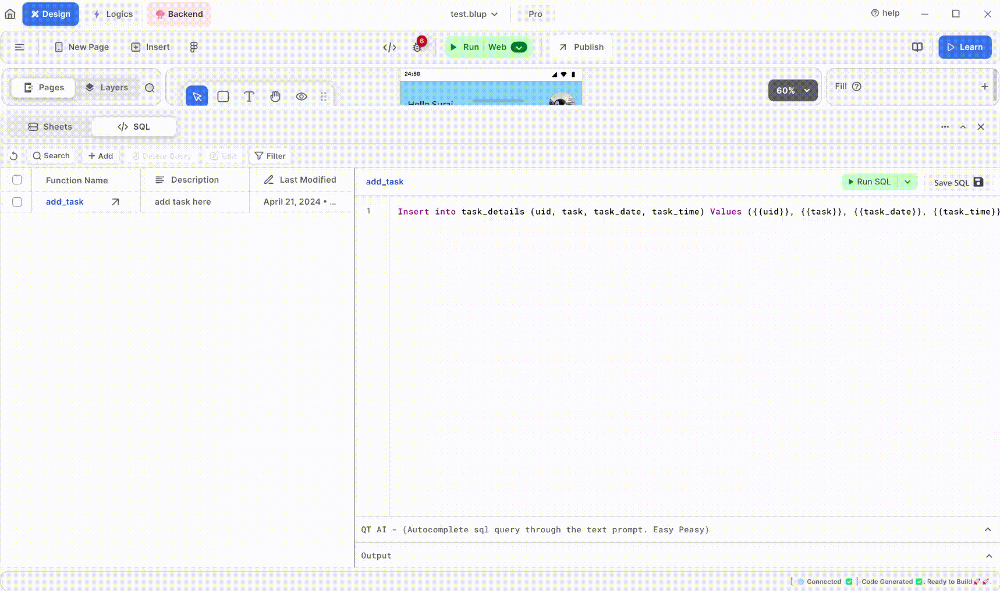

### 3. Implement Logic {#implement-logic}

In this section we implement the logic for the UI and connect them them with the backend.

#### 3.1 Adding logics to the UI

1. Navigate to the Form Screen:

- Right-click on the FAB (Floating Action Button) and choose "Add Logic."

- Add a "Page Navigator" node and connect the FAB's "On Click" event to the "Run" event of the Page Navigator node.

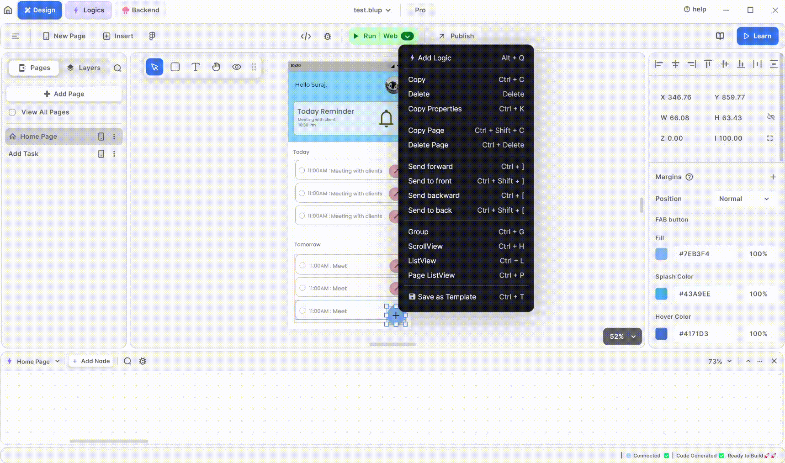

2. Filling Out the Form Screen:

- For each text field, right-click and select "Add Logic" to open the text field node. 

- Connect the "On Text Changed" event of each text field to its own function.

- Extract the text from each text field and connect it to the BlupSheet API query for "Add_task" to store the text field data.

- Add logic to the button: connect its "On Click" event to the "Run" event to trigger the BlupSheet API.

- Check the status of the BlupSheet API using "On Success" and "On Failure" events. Log any responses in the Debug console.

-If the API call is successful, navigate back to the Home Page by attaching the navigator to the "On Success" event of the BlupSheet API.

3. Show data to the Home Screen:

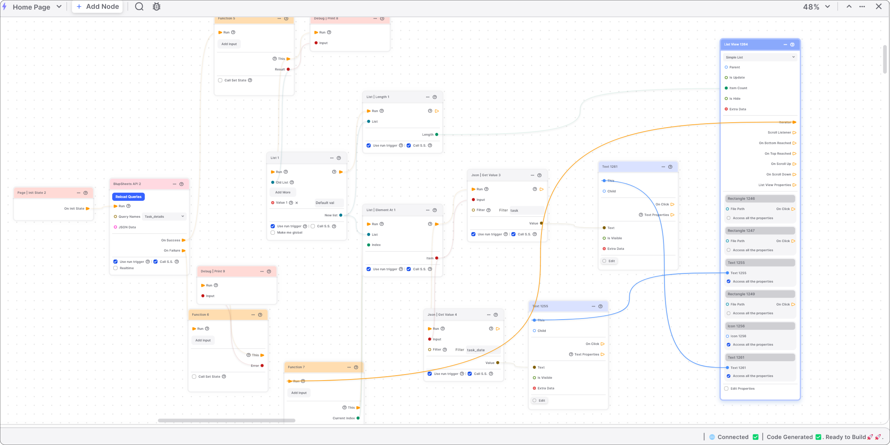

- Open a BlupSheet API and select "task_details" to get the data from the form.

- Check if the API is working by attaching its "On Success" and "On Failure" events to their respective functions and taking debug prints.

- If the API is working perfectly, use a List Node.

- Connect the output node ("New List") to the List length node to find the length of the list.

- Attach "New List" to the List ElementAt node to access each element's index.

- Connect the List length output node ("Length") to the item count of the List view.

- Connect the output node ("Item and Run Trigger") of List ElementAt to the Get Value node.

- Attach the outputs (value) to the text of your List view to display the data in the list.

If you have any ideas to make Blup better you can share them through our [Discord community channel ](https://discord.com/channels/940632966093234176/965313562425823303)

## Music to go with.
 

  
  
  Lofi music
  
  
  

