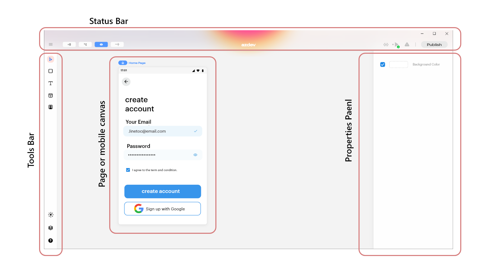

# Design (UI) ✏️








Lofi music




BlupDesigner helps you to design stunning & creative user interfaces of the pages for your applications seamlessly.

BlupDesigner has multiple panels, namely.

* The[ Status Bar](blup-menu-bar.md) is present at the top.
* [Tools Bar](tools-section.md), present on the left side.
* The [Properties panel](properties-panel/) is present on the right side.
* [Pages(Mobile Canvas) ](../logics/ui-nodes/pages.md)is present in the center.

In the coming sections we will take a deep dive into these sections separately

