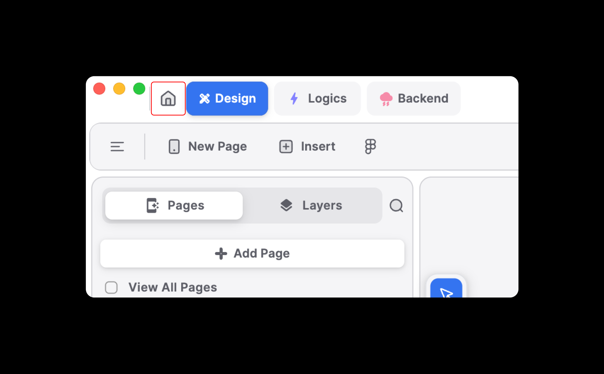
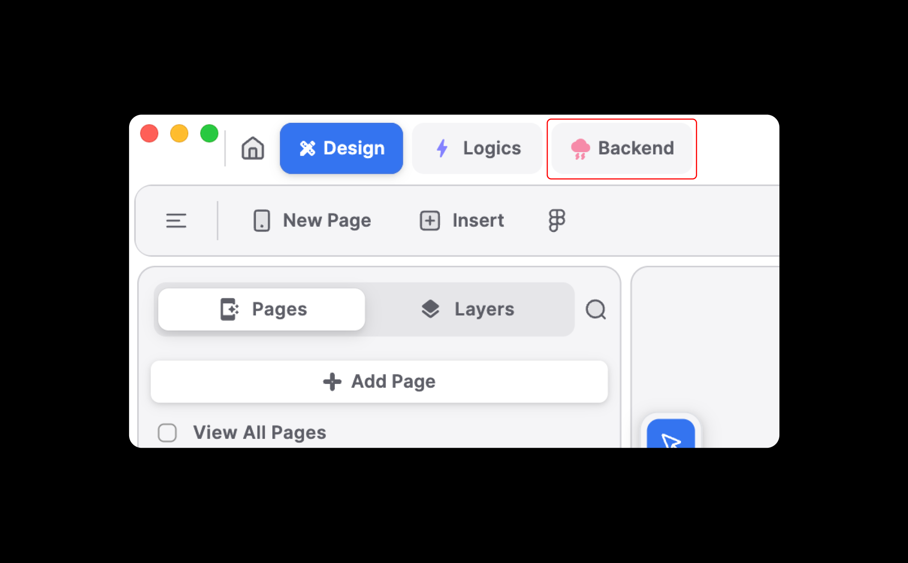
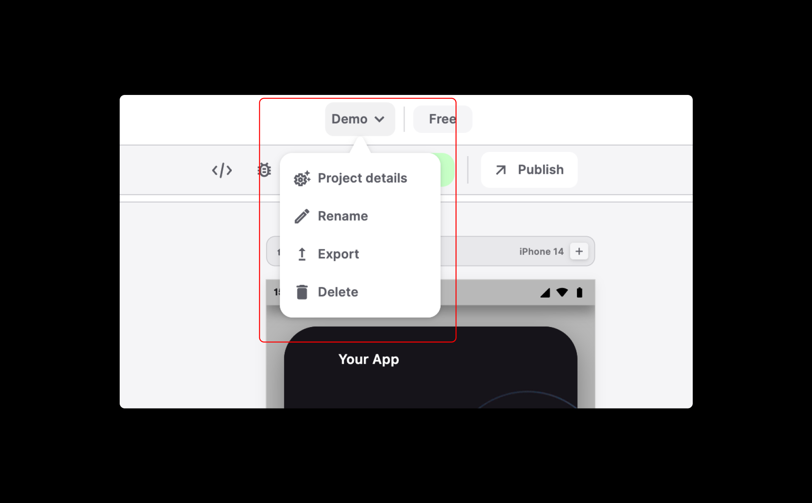
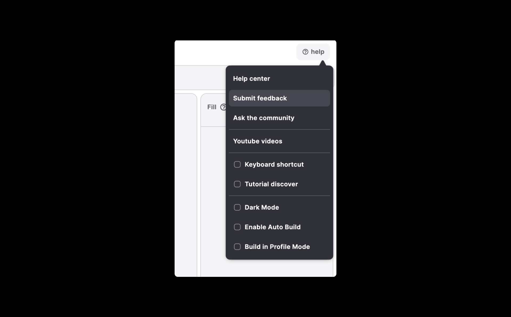

# Blup Top Bar

### **Home**

* Navigate to the Blup dashboard.
* Access projects, tutorials, community, favorite projects, bin (deleted projects), support and settings.

<figure><figcaption>
Home
</figcaption></figure>

### **Design**

The core engine for your Blup applications, enabling you to craft designs and user interfaces with unparalleled flexibility.

<figure><figcaption>
Design
</figcaption></figure>

### **Logics**

A logic system for creating logic around designs and interactions.

Supports a variety of nodes, including variables and SDKs hosted on pub.dev.

<figure><figcaption>
Logics
</figcaption></figure>

### **Backend**

A pre-built backend system built on AWS.

Provides powerful SQL-type queries for building real-time applications.

<figure><figcaption>
backend
</figcaption></figure>

### **Project Info**&#x20;

As soon as you click on the project info button a drop-down list pops up containing the following options:

* **Project Details:** Streamline app control: manage settings, access profile details, subscriptions, invoices, and plans from one place.
* **Rename:** Rename the current project.
* **Export:** Export the project as BlupX for easy sharing.
* **Delete:** Delete the current project.

<figure><figcaption>
Project Info
</figcaption></figure>

### **Project Plan**

Displays the current subscribed plan (free, basic, or pro).

<figure><figcaption>
Project Plan
</figcaption></figure>

### **Help Button**&#x20;

As soon as you click on the help button a drop-down list pops up containing the following options:

* **Help Center:** Opens the website URL to help users understand Blup.&#x20;
* **Submit Feedback:** Takes users to the Blup Discord to submit feedback.&#x20;
* **Ask the Community:** Facilitates collaboration with fellow Bluppers on Discord.&#x20;
* **YouTube Videos:** Plays all available videos on the Blup YouTube channel directly in the app.
* **Keyboard Shortcut:** Opens a widget displaying keyboard shortcuts.&#x20;
* **Tutorial Discover:** Opens a widget to revisit tutorials anytime.&#x20;
* **Dark Mode:** Toggles between dark mode and light mode.
* **Enable Auto Build:** The user can enable auto-build.
* **Build in Profile Mode:** To build the app in profile mode.

<figure><figcaption>
Help
</figcaption></figure>

If you have any ideas to make Blup better you can share them through our [Discord community channel](https://discord.com/channels/940632966093234176/965313562425823303)

### Music to go with. 


Lofi music

