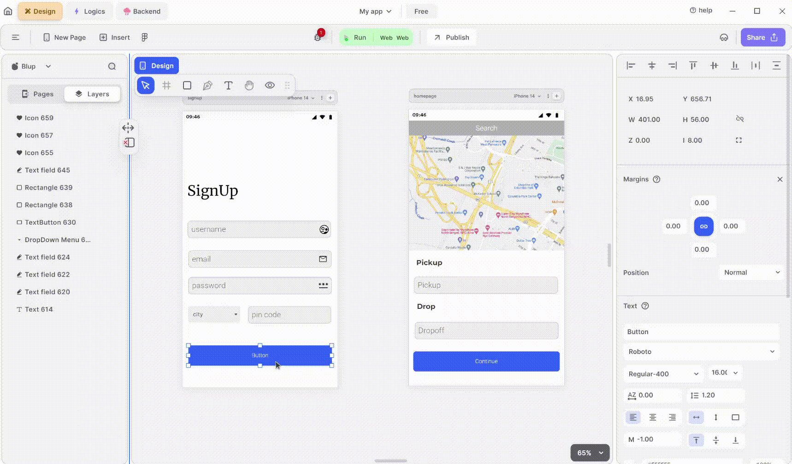

# How to use navigate page in Blup

<figure><figcaption>
Navigation to the page
</figcaption></figure>

To navigate between pages in Blup, follow these steps:

**1.** Select the element from your UI (e.g., a button) that you want to use for navigation.

**2.** Right-click on the selected element and choose "Add Logics" from the context menu.

**3.** Attach an "On Click" event to the function associated with the selected element.

**4.** Connect the "On Click" event to the page navigator.

**5.** Choose the destination page from the dropdown menu in the page navigator.

If you have any ideas to make Blup better you can share them through our [Discord community channel ](https://discord.com/channels/940632966093234176/965313562425823303)

## Music to go with.
 

  
  
  Lofi music
  
  
  

