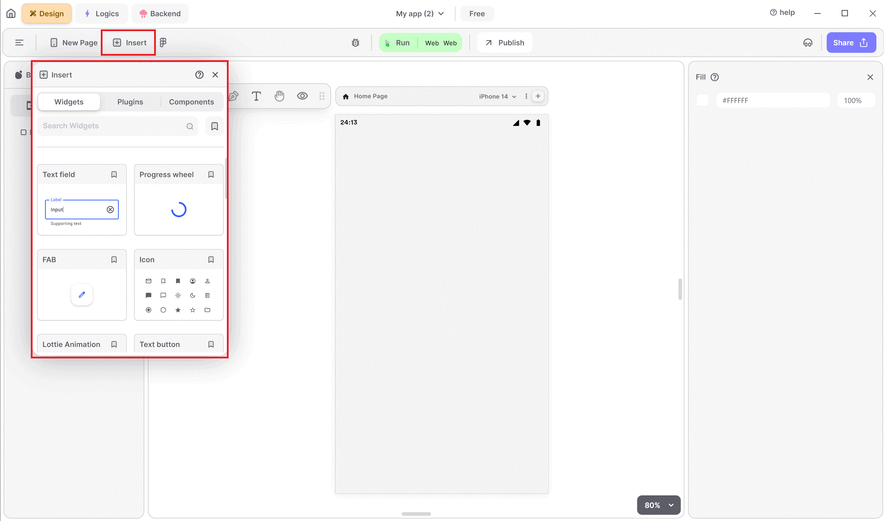

# Insert Widgets

<figure><figcaption>
Insert Widgets
</figcaption></figure>

Widgets are tools you can use to improve the appearance and user-friendliness of your UI, making it more attractive and readable.

To enhance your UI, simply select a widget from the options provided, then drag and drop it onto your screen. Customize its components, such as size and color, to tailor it to your needs and preferences.

Now, let's explore the available widgets.

[TextField Widget](textfield-widget.md)

[Alert DialogBox Widget](alert-dialogbox-widget.md)

[AppBar Widget](appbar-widget.md)

[CameraView Widget](cameraview-widget.md)

[CheckBox Widget](checkbox-widget.md)

[Date Picker Widget](date_picker-widget.md)

[FAB Widget](fab-widget.md)

[Icon Widget](icon-widget.md)

[IOS DatePicker Widget](textfield-widget.md)

[IOS Timer Widget](ios-timer-widget.md)

[Lottie Widget](lottie-widget.md)

[MapView Widget](mapview-widget.md)

[Multi Choice Widget](multi-choice-widget.md)

[Progress Bar Widget](progress-bar-widget.md)

[Progress Wheel Widget](progress-wheel-widget.md)

[Radio Widget](radio-widget.md)

[Slider Widget](slider-widget.md)

[Switch Widget](switch-widget.md)

[TextButton Widget](textbutton-widget.md)

[Time Picker Widget](timepicker-widget.md)

[Web View Widget](web-view-widget.md)

## Music to go with.


Lofi music

