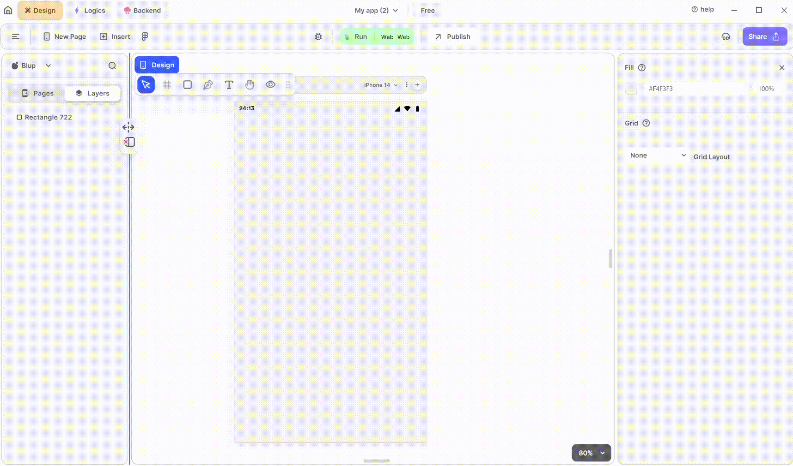

# AppBar Widget

 AppBar widget is a fundamental component used to create the top app bar, which typically contains the application's title, navigation icons, action buttons, and other relevant information. 

<figure><figcaption>
App Bar
</figcaption></figure>

To utilize an AppBar in your UI, adhere to these steps:

**1.** Drag the AppBar widget from the Insert menu and drop it into top of the desired Page.

**2.** Customize the appearance and behavior of the AppBar by adjusting its properties in the editing section on the right.

**3.** Enhance the AppBar by adding different icons to make your header more visually appealing.

### Components of AppBar Widget

<table>
  <thead>
    <tr>
      <th>Component</th>
      <th>Description</th>
    </tr>
  </thead>
  <tbody>
    <tr>
      <td><strong>Align Icons</strong></td>
      <td>Click icons or use shortcut keys to align AppBar Widget. For example, click "Align Left" or use Ctrl+Shift+Left to left-align AppBar Widget.</td>
    </tr>
    <tr>
      <td><strong>Postitions</strong></td>
      <td>Set AppBar positions on the X and Y axes of the mobile canvas.</td>
    </tr> 
    <tr>
      <td><strong>Appbar Size</strong></td>
      <td>Specify the width and height of the Appbar widget by providing values for width (W) and height (H).</td>
    </tr> 
    <tr>
      <td><strong>Z rotation</strong></td>
      <td>Rotate the AppBar by specifying a rotation value.</td>
    </tr>
     <tr>
      <td><strong>Border Radius</strong></td>
      <td>Adjust corner curvature by providing a value to create rounded corners. Individual corner adjustments are available by clicking on each corner.</td>
    </tr>
    <tr>
      <td><strong>Margin</strong></td>
      <td>Provide margin to the Appbar from any of the four directions by specifying the margin value.</td>
    </tr>
    <tr>
      <td><strong>Color</strong></td>
      <td>This section will give Appbar a selected color.</td>
    </tr>
    <tr>
      <td><strong>Shadow Color</strong></td>
      <td>This section will give Appbar a shadow color.</td>
    </tr>
    <tr>
      <td><strong>Elevation</strong></td>
      <td>Specify the elevation that you want to give to the AppBar.</td>
    </tr>
    <tr>
      <td><strong>Title</strong></td>
      <td>Specify the title of the AppBar if you want to make the title centre, or specify the spacing by giving the value.</td>
    </tr>
    <tr>
      <td><strong>Toolbar</strong></td>
      <td>Specify the height of the toolbar and opacity by give the value to it.</td>
    </tr>
    <tr>
      <td><strong>Text property</strong></td>
      <td>Modify AppBar text directly in the provided field, and changes will reflect on the mobile canvas.</td>
    </tr><tr>
      <td><strong>Font Type</strong></td>
      <td>Choose the preferred font type for selected AppBar text.</td>
    </tr>
    <tr>
      <td><strong>Font Style</strong></td>
      <td>Select font styles from a dropdown menu.</td>
    </tr>
    <tr>
      <td><strong>Font Size</strong></td>
      <td>Define the font size of the selected AppBar text.</td>
    </tr>
    <tr>
      <td><strong>Letter spacing</strong></td>
      <td>Specify spacing between letters of the selected AppBar text.</td>
    </tr><tr>
      <td><strong>Line Height</strong></td>
      <td>Define the height between lines of AppBar text.</td>
    </tr><tr>
      <td><strong>Left Align</strong></td>
      <td>This option aligns the AppBar text from the left.</td>
    </tr><tr>
      <td><strong>Centre Align</strong></td>
      <td>This option aligns the AppBar text to the centre.</td>
    </tr><tr>
      <td><strong>Right Align</strong></td>
      <td>This option aligns the AppBar text to the right.</td>
    </tr><tr>
      <td><strong>Auto Width</strong></td>
      <td>The width of the text will be adjusted automatically depending on the size of the container housing the selected AppBar text.</td>
    </tr><tr>
      <td><strong>Auto heiight</strong></td>
      <td>The height of the text will be adjusted automatically depending on the size of the container housing the selected AppBar text.</td>
    </tr><tr>
      <td><strong>Fixed size</strong></td>
      <td>The dimensions of the text will remain fixed regardless of the size of the container housing the selected AppBar text.</td>
    </tr>
    <tr>
      <td><strong>Max Line</strong></td>
      <td>This property helps you to define the maximum number of lines the selected text can specify for example, if you define the value as 2 then the AppBar text can only take up 2 lines.</td>
    </tr>
    <tr>
      <td><strong>Font color</strong></td>
      <td>Change the color of the text using color picker, hex code, or RGB sliders.</td>
    </tr>
     <tr>
      <td><strong>Ellipsis, on text overflow</strong></td>
      <td>Show "..." if AppBar text overflows the specified max line limit.</td>
    </tr>
     <tr>
      <td><strong>Selectable Text</strong></td>
      <td>Allow users to select AppBar text for toolbar operations by checking this field.</td>
    </tr>
    <tr>
      <td><strong>Visible</strong></td>
      <td>By checking the checkbox the entire selected list will be hidden.</td>
    </tr>
  </tbody>
</table>

If you have any ideas to make Blup better you can share them through our [Discord community channel ](https://discord.com/channels/940632966093234176/965313562425823303)

## Music to go with.
 

  
  
  Lofi music
  
  
  

