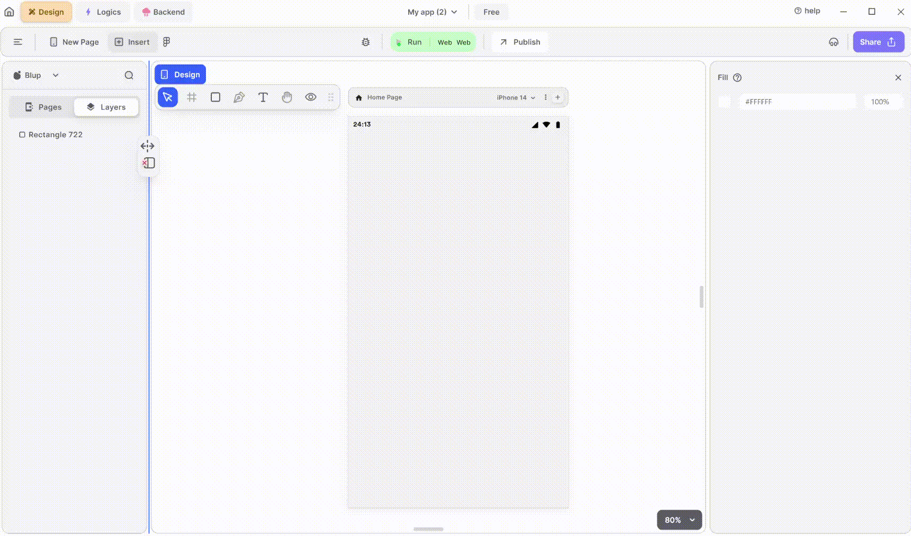

# Camera View Widget

<figure><figcaption>
Camera View
</figcaption></figure>

To utilize an Camera View in your UI, adhere to these steps:

**1.** Drag the Camera View widget from the Insert menu and drop it into your desired location within your UI.

**2.** Customize the appearance and behavior of the Camera view by adjusting its properties in the editing section on the right.

**3.** Enhance the Camera View by adding additional features such as zoom in, zoom out, recent files, and camera direction controls. These features can be implemented using single tick.

### Components of Camera View Widget

<table>
  <thead>
    <tr>
      <th>Component</th>
      <th>Description</th>
    </tr>
  </thead>
  <tbody>
    <tr>
      <td><strong>Align Icons</strong></td>
      <td>Click icons or use shortcut keys to align Camera View Widget. For example, click "Align Left" or use Ctrl+Shift+Left to left-align Camera View Widget.</td>
    </tr>
    <tr>
      <td><strong>Postitions</strong></td>
      <td>Set Camera View Widget positions on the X and Y axis of the mobile canvas.</td>
    </tr> 
    <tr>
      <td><strong>Camera View Widget Size</strong></td>
      <td>Define the width and height of the Camera View Widget by providing values for width (w) and height (h).</td>
    </tr> 
    <tr>
      <td><strong>Z rotation</strong></td>
      <td>Rotate the Camera View Widget by specifying a rotation value.</td>
    </tr>
     <tr>
      <td><strong>Border Radius</strong></td>
      <td>Adjust corner curvature by providing a value to create rounded corners. Individual corner adjustments are available by clicking on each corner.</td>
    </tr>
    <tr>
      <td><strong>Margin</strong></td>
      <td>Provide margin to the Camera View Widget from any of the four directions by specifying the margin value.</td>
    </tr>
    <tr>
      <td><strong>Camera type</strong></td>
      <td>Specify whether the camera should be used for photos, videos, or both.</td>
    </tr><tr>
      <td><strong>Camera Direction</strong></td>
      <td>Specify the direction of the camera: front, back, or external.</td>
    </tr>
    <tr>
      <td><strong>Camera Checkbox</strong></td>
      <td>Check the checkboxes according to your requirements. For example, enable zoom in/out, select recent files, or show camera direction selector.</td>
    </tr>
    <tr>
      <td><strong>Colors</strong></td>
      <td>Specify the color of the camera by selecting it from the toottip or by giving hex color code.</td>
    </tr><tr>
      <td><strong>Icons Color</strong></td>
      <td>Specify the colors of the icons according to your need.</td>
    </tr>
    <tr>
      <td><strong>Text Color</strong></td>
      <td>Specify the color of the text in the camera.</td>
    </tr>
     <tr>
      <td><strong>Selected Text Color</strong></td>
      <td>Specify the text color on selected text.</td>
    </tr><tr>
      <td><strong>Video Record Color</strong></td>
      <td>Give the color of the icon of record when recording a video according to your need.</td>
    </tr>
    <tr>
      <td><strong>Visible</strong></td>
      <td>By checking the checkbox the entire selected list will be hidden.</td>
    </tr>
  </tbody>
</table>

If you have any ideas to make Blup better you can share them through our [Discord community channel ](https://discord.com/channels/940632966093234176/965313562425823303)

## Music to go with.
 

  
  
  Lofi music
  
  
  

