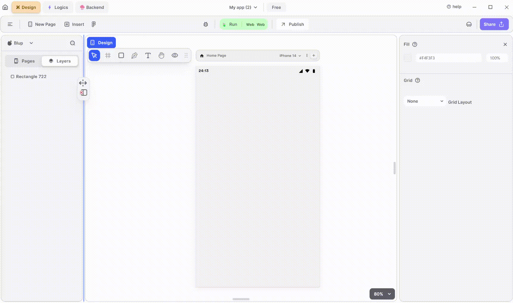

# CheckBox Widget

Checkbox widget is used to represent a toggleable option with two states: checked and unchecked. Users can tap the checkbox to toggle its state. 

<figure><figcaption>
Check Box
</figcaption></figure>

To utilize an CheckBox in your UI, adhere to these steps:

**1.** Drag the CheckBox widget from the Insert menu and drop it into your desired location within your UI.

**2.** Customize the appearance and behavior of the CheckBox by adjusting its properties in the editing section on the right.

### Components of CheckBox Widget

<table>
  <thead>
    <tr>
      <th>Component</th>
      <th>Description</th>
    </tr>
  </thead>
  <tbody>
    <tr>
      <td><strong>Align Icons</strong></td>
      <td>Click icons or use shortcut keys to align CheckBox Widget. For example, click "Align Left" or use Ctrl+Shift+Left to left-align CheckBox Widget.</td>
    </tr>
    <tr>
      <td><strong>Postitions</strong></td>
      <td>Set CheckBox Widget positions on the X and Y axis of the mobile canvas.</td>
    </tr> 
    <tr>
      <td><strong>CheckBox Widget Size</strong></td>
      <td>Specify the width and height of the CheckBox by providing values for width (w) and height (h).</td>
    </tr> 
    <tr>
      <td><strong>Z rotation</strong></td>
      <td>Rotate the CheckBox Widget by specifying a rotation value.</td>
    </tr>
     <tr>
      <td><strong>Border Radius</strong></td>
      <td>Adjust corner curvature by providing a value to create rounded corners. Individual corner adjustments are available by clicking on each corner.</td>
    </tr>
    <tr>
      <td><strong>Margin</strong></td>
      <td>Provide margin to the CheckBox Widget from any of the four directions by specifying the margin value.</td>
    </tr>
    <tr>
      <td><strong>Checkbox Value</strong></td>
      <td>On selecting the value you get the tick and on unselecting it will remove the tick.</td>
    </tr><tr>
      <td><strong>Checkbox Tristate</strong></td>
      <td>On UnSelecting tristate meaning the checkbox can only be checked or unchecked. However, when checking the tristate, it enables the third state, where the checkbox can be in an indeterminate state.</td>
    </tr>
    <tr>
      <td><strong>Icon Color</strong></td>
      <td>Select the color of the icon that you want to put in check.</td>
    </tr>
    <tr>
      <td><strong>Active Color</strong></td>
      <td>It will give checkbox the color according to your need.</td>
    </tr><tr>
      <td><strong>Focus Color</strong></td>
      <td>It will represents the color that is displayed when a widget gains focus</td>
    </tr>
    <tr>
      <td><strong>Hover Color</strong></td>
      <td>It will represent the color that is displayed when a widget is hovered over by the cursor.</td>
    </tr>
    <tr>
      <td><strong>Visible</strong></td>
      <td>By checking the checkbox the entire selected checkbox widget will be hidden.</td>
    </tr>
  </tbody>
</table>

If you have any ideas to make Blup better you can share them through our [Discord community channel ](https://discord.com/channels/940632966093234176/965313562425823303)

## Music to go with.
 

  
  
  Lofi music
  
  
  

