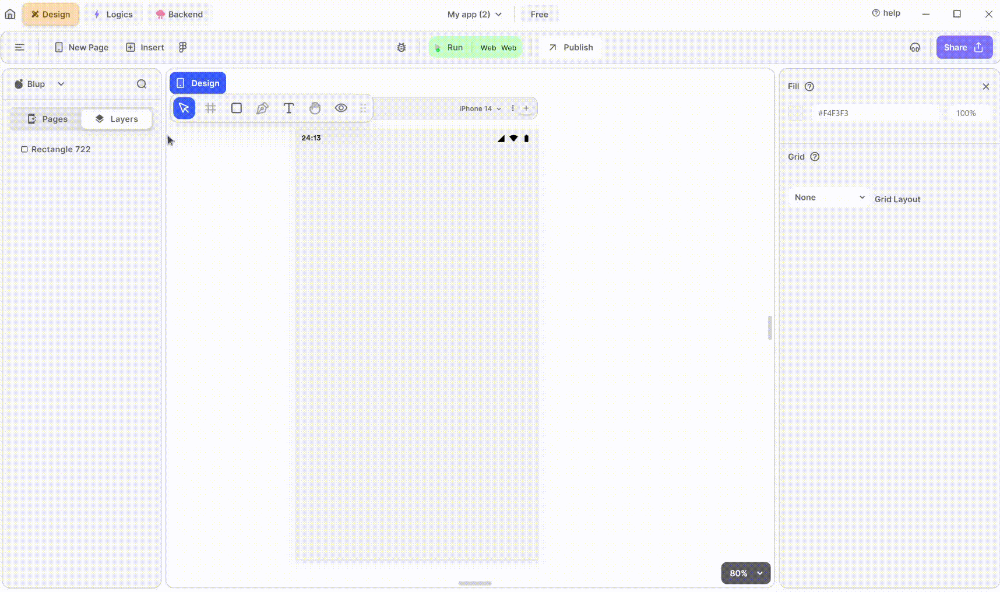

# FAB Widget

<figure><figcaption>
FAB
</figcaption></figure>

To utilize an FAB(FloatingActionButton) in your  UI, adhere to these steps:

**1.** Drag the FAB widget from the Insert menu and drop it into your desired location within your UI.

**2.** Customize the appearance and behavior of the FAB by adjusting its properties in the editing section on the right.

If you have any ideas to make Blup better you can share them through our [Discord community channel ](https://discord.com/channels/940632966093234176/965313562425823303)

## Music to go with.
 

  
  
  Lofi music
  
  
  

