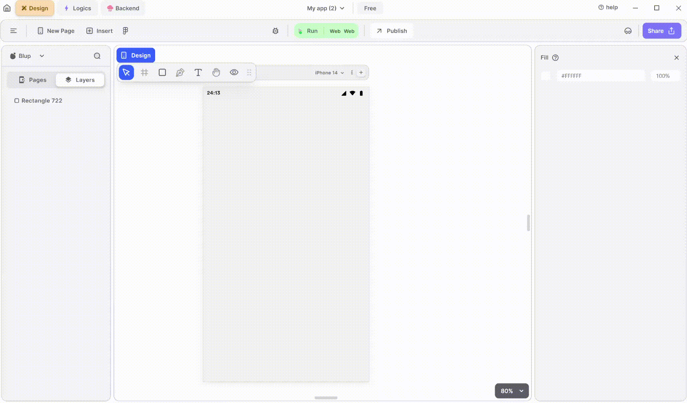

# Icon Widget

<figure><figcaption>
Icons
</figcaption></figure>

To utilize an Icon in your UI, adhere to these steps:

**1.** Drag the Icon widget from the Insert menu and drop it into your desired location within your UI.

**2.** Select the Icon according to your need.

**3.** Customize the appearance and behavior of the Icon by adjusting its properties in the editing section on the right.

### Components of Icon Widget

<table>
  <thead>
    <tr>
      <th>Component</th>
      <th>Description</th>
    </tr>
  </thead>
  <tbody>
    <tr>
      <td><strong>Align Icons</strong></td>
      <td>Click icons or use shortcut keys to align Icon. For example, click "Align Left" or use Ctrl+Shift+Left to left-align Icon.</td>
    </tr>
    <tr>
      <td><strong>Postitions</strong></td>
      <td>Set Icon positions on the X and Y axes of the mobile canvas.</td>
    </tr>
    <tr>
      <td><strong>Margin</strong></td>
      <td>Adjust Icon margin from top, bottom, left, or right by specifying margin values.</td>
    </tr>
    <tr>
      <td><strong>Icon Edit</strong></td>
      <td>Select the icon of your need from the pop up icons menu there you can get and coustomise icons also according to your need, </td>
    </tr>
     <tr>
      <td><strong>Icon color</strong></td>
      <td>From here you can give icon a color according to your need.</td>
    </tr> <tr>
      <td><strong>Icon Size</strong></td>
      <td>From here you can give icon size according to your need.</td>
    </tr>
    <tr>
      <td><strong>Visible</strong></td>
      <td>By checking the checkbox the entire selected icon widget will be hidden.</td>
    </tr>
  </tbody>
</table>

If you have any ideas to make Blup better you can share them through our [Discord community channel ](https://discord.com/channels/940632966093234176/965313562425823303)

## Music to go with.
 

  
  
  Lofi music
  
  
  

