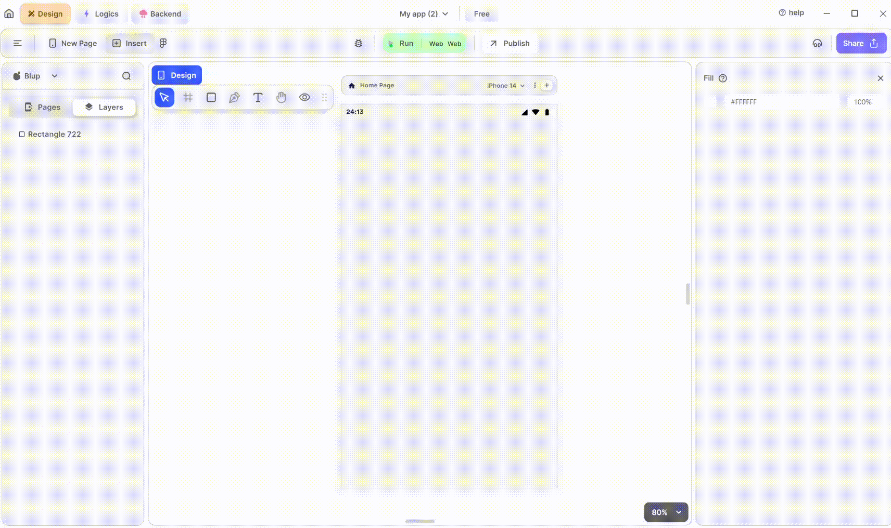

# IOS Timer Widget  

<figure><figcaption>
IOS Timer
</figcaption></figure>

Integrating an iOS-style Timer widget into your UI is simple. Follow these steps to make it happen:

**1.** Drag the IOS Timer widget from the Insert menu and drop it into your desired location within your UI.

**2.** Customize the appearance and behavior of the IOS Timer by adjusting its properties in the editing section on the right.

**3.**  Additionally, you can select the mode and theme type of the Timer. The mode determines whether the Timer displays HoursMinutes, MinutesSeconds or HourMinuteSecond, while the theme type controls the visual style of the Timer.

### Components of IOS Timer Widget

<table>
  <thead>
    <tr>
      <th>Component</th>
      <th>Description</th>
    </tr>
  </thead>
  <tbody>
    <tr>
      <td><strong>Align Icons</strong></td>
      <td>Click icons or use shortcut keys to align Timer Widget. For example, click "Align Left" or use Ctrl+Shift+Left to left-align Timer Widget.</td>
    </tr>
    <tr>
      <td><strong>Postitions</strong></td>
      <td>Set Timer Widget positions on the X and Y axis of the mobile canvas.</td>
    </tr> 
    <tr>
      <td><strong>Timer Widget Size</strong></td>
      <td>Specify the width and height of the Timer Widget by providing values for width (w) and height (h).</td>
    </tr> 
    <tr>
      <td><strong>Z rotation</strong></td>
      <td>Rotate the Timer Widget by specifying a rotation value.</td>
    </tr>
     <tr>
      <td><strong>Border Radius</strong></td>
      <td>Adjust corner curvature to create rounded corners. Individual corner adjustments are available by clicking on each corner.</td>
    </tr>
    <tr>
      <td><strong>Margin</strong></td>
      <td>Provide margin to the Timer Widget from any of the four directions by specifying the margin value.</td>
    </tr>
    <tr>
      <td><strong>Time picker IOS Mode</strong></td>
      <td>Select the mode of the timer in which you want to show the Timer widget: Hm (HourMinute), Ms (MinuteSecond), or both.</td>
    </tr><tr>
      <td><strong>Theme type</strong></td>
      <td>Choose between light or dark theme for your Timer widget.</td>
    </tr>
  <tr>
      <td><strong>Fill</strong></td>
      <td>Apply a color to the Timer widget.</td>
    </tr>
   <tr>
      <td><strong>Border Color</strong></td>
      <td>Choose a color to set the border color of the Timer widget. Adjust the border color from inside, outside, or center of the Timer widget by selecting it from the drop-down.</td>
    </tr>
   <tr>
      <td><strong>Shadow</strong></td>
      <td>Apply a shadow effect to the Timer by selecting either a normal or inner shadow type.</td>
    </tr>
    <tr>
      <td><strong>Visible</strong></td>
      <td>By checking the checkbox the entire Timer widget will be hidden.</td>
    </tr>
  </tbody>
</table>

If you have any ideas to make Blup better you can share them through our [Discord community channel ](https://discord.com/channels/940632966093234176/965313562425823303)

## Music to go with.
 

  
  
  Lofi music
  
  
  

