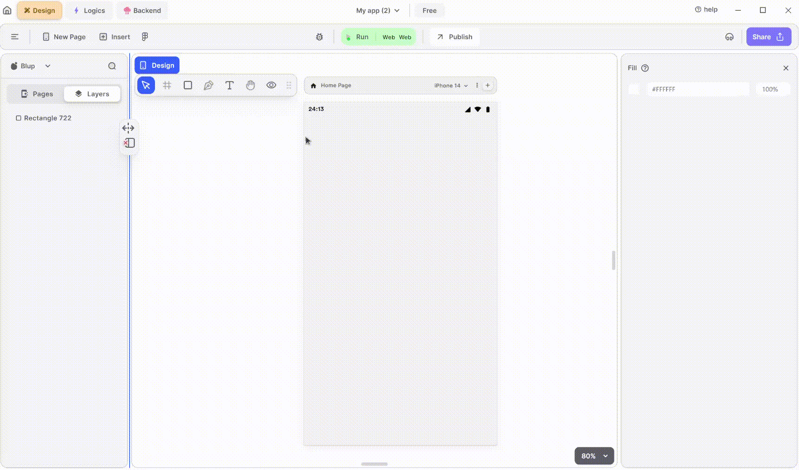

# Progress bar Widget

Progress bar widget to create a progress bar, which visually represents the progress of a task with a horizontal bar.

<figure><figcaption>
Progress Bar
</figcaption></figure>

Integrating a Progress Bar into your UI is essential for indicating progress or loading states to the user. Follow these steps to utilize it effectively:

**1.** Drag the Alert Progress bar widget from the Insert menu and drop it into your desired location within your UI.

**2.** Customize the appearance and behavior of the Progress Bar by adjusting its properties in the editing section on the right. You can modify properties such as size, position, color, and style to match your UI design and convey the desired visual representation of progress.

**3.** Use the Progress Bar to display progress or loading status to the user. You can update the progress value dynamically based on the progress of a task or operation in your application.

### Components of Progress bar Widget

<table>
  <thead>
    <tr>
      <th>Component</th>
      <th>Description</th>
    </tr>
  </thead>
  <tbody>
    <tr>
      <td><strong>Align Icons</strong></td>
      <td>Click icons or use shortcut keys to align  Progress bar Widget. For example, click "Align Left" or use Ctrl+Shift+Left to left-align  Progress bar Widget.</td>
    </tr>
    <tr>
      <td><strong>Postitions</strong></td>
      <td>Set Progress bar Widget positions on the X and Y axis of the mobile canvas.</td>
    </tr>
    <tr>
      <td><strong>Margin</strong></td>
      <td>Adjust the Progress Bar Widget margin from the top, bottom, left, or right by specifying margin values.</td>
    </tr>
    <tr>
      <td><strong>Progress bar value</strong></td>
      <td>Set the Progress Bar value to determine the range shown in the Progress Bar according to your needs. If you want to show it as a loading indicator, use the value -1.</td>
    </tr> <tr>
      <td><strong>Progress bar Color</strong></td>
      <td>This will give the color to your Progress Bar according to your need.</td>
    </tr> <tr>
      <td><strong>Progress bar Background Color</strong></td>
      <td>This will give the background color to your Progress Bar according to your need.</td>
    </tr>
    <tr>
      <td><strong>Visible</strong></td>
      <td>By checking the checkbox the entire selected Progress bar widget will be hidden.</td>
    </tr>
  </tbody>
</table>

If you have any ideas to make Blup better you can share them through our [Discord community channel ](https://discord.com/channels/940632966093234176/965313562425823303)

## Music to go with.
 

  
  
  Lofi music
  
  
  

