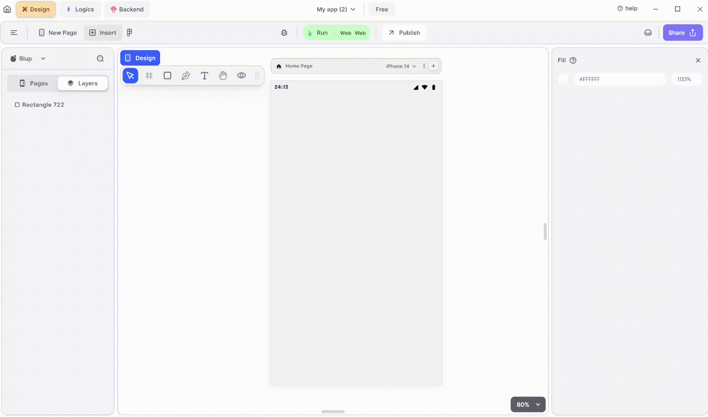

# TimePicker Widget

<figure><figcaption>
TimePicker
</figcaption></figure>

To utilize an Time Picker in your Flutter UI, adhere to these steps:

**1.** Drag the Time Picker widget from the Insert menu and drop it into your desired location within your UI.

**2.** Customize the appearance and behavior of the Time Picker by adjusting its properties in the editing section on the right.

### Components of TimePicker Widget

<table>
  <thead>
    <tr>
      <th>Component</th>
      <th>Description</th>
    </tr>
  </thead>
  <tbody>
    <tr>
      <td><strong>Align Icons</strong></td>
      <td>Click icons or use shortcut keys to align the TimePicker Widget. For example, click "Align Left" or use Ctrl+Shift+Left to left-align TimePicker Widget.</td>
    </tr>
    <tr>
      <td><strong>Postitions</strong></td>
      <td>Set TimePicker Widget positions on the X and Y axes of the mobile canvas.</td>
    </tr>
    <tr>
      <td><strong>Margin</strong></td>
      <td>Adjust TimePicker Widget margin from top, bottom, left, or right by specifying margin values.</td>
    </tr>
    <tr>
      <td><strong>TimePicker Show</strong></td>
      <td>Show the preview of the clock for selecting the time.</td>
    </tr><tr>
      <td><strong>TimePicker Initial Time</strong></td>
      <td>Set the time that you want to show initially.</td>
    </tr>
    <tr>
      <td><strong>Fill color</strong></td>
      <td>Give color to the TimePicker widget.</td>
    </tr>
   <tr>
      <td><strong>Border Color</strong></td>
      <td>Choose a color to set the widget border color. Adjust the border color from inside, outside, or center of the widget by selecting it from the drop-down.</td>
    </tr>
    <tr>
      <td><strong>Border Width</strong></td>
      <td>Adjust the border width by providing a value. Select specific sides for border width by clicking the checkboxes.</td>
    </tr>
     <tr>
      <td><strong>Shadow</strong></td>
      <td>Apply a shadow effect to the widget by selecting either a normal or inner shadow type.</td>
    </tr>
    <tr>
      <td><strong>Visible</strong></td>
      <td>By checking the checkbox the entire selected TimePicker Widget will be hidden.</td>
    </tr>
  </tbody>
</table>

If you have any ideas to make Blup better you can share them through our [Discord community channel ](https://discord.com/channels/940632966093234176/965313562425823303)

## Music to go with.
 

  
  
  Lofi music
  
  
  

