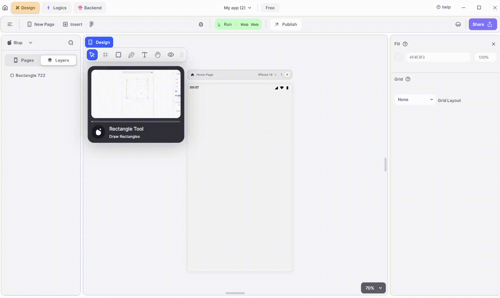

# Pages Properties

<figure><figcaption>
Page UI
</figcaption></figure>

## Background colour

The background color of the entire page can be altered. You can pick a colour by using the eyedropper, entering the hex code or from the manually adjusting the RGB scroller and selecting the appropriate saturation and lighting.

## Grid

You can view the selected page in the grid format of your choice using this option. This enables the user to position the widgets more efficiently.
