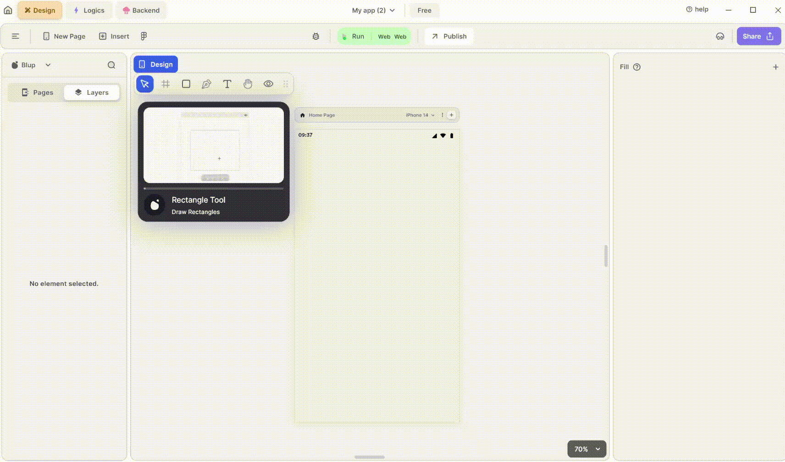

# Rectangle Properties

<figure><figcaption>
Rectangle UI
</figcaption></figure>

<table><thead><tr><th width="176"></th><th></th></tr></thead><tbody><tr><td><h4>Align Top</h4></td><td>Aligns the selected rectangle to the top of the page.</td></tr><tr><td><h4>Align Vertical Center</h4></td><td>Positions the selected rectangle right at the center of the vertical axis.</td></tr><tr><td><h4>Align Bottom </h4></td><td>Aligns the selected rectangle to the bottom of the page.</td></tr><tr><td><h4>Align left</h4></td><td>Aligns the selected rectangle to the left of the page.</td></tr><tr><td><h4>Align Horizontal Center</h4></td><td>Positions the selected rectangle right at the center of the horizontal axis.</td></tr><tr><td><h4>Align Right</h4></td><td>Aligns the selected rectangle to the right of the page.</td></tr><tr><td><h4>Add Logic</h4></td><td>Serves as another entry point to<a href="../../logics/"> Blup Lightning. </a></td></tr><tr><td><h4>Setup view</h4></td><td>

This button allows users to choose the type of view the rectangle has to portray. The various options available for this are:
<ul><li><em>List View</em>: The contents inside the rectangle will be presented in a scrollable unordered list format.</li><li><em>PageList View:</em> By enabling the PageList view, the selected rectangle will exhibit a list view of another page specified by the user. User can specify the page to be presented through the 'Add Pages to PageList' option.</li><li>Scroll View: Scroll view option allows you to scroll through the contents in the rectangle</li></ul></td></tr><tr><td><h4>Position</h4></td><td>You can change the position of the selected rectangle along the horizontal and vertical axis manually through the input box present.</td></tr><tr><td><h4>Width and Height</h4></td><td>This property helps you to assign the width and height manually through the input box present.</td></tr><tr><td><h4>Padding</h4></td><td>You can adjust the padding of the selected rectangle through this. Either padding is added to each side individually or you can add for all the sides at once</td></tr></tbody></table>


<mark style="color:blue;">Note: Padding is the space immediately surrounding an element within its cell.</mark>


<table><thead><tr><th width="176"></th><th></th></tr></thead><tbody><tr><td><h4>Corner Radius</h4></td><td>You can change the border radius of the selected rectangle manually using this option. Either the border radius is changed one side at a time or all at once.</td></tr><tr><td><h4>Fill</h4></td><td>This property is used to alter the background colour/gradient to the selected rectangle. Click on the color tile next to 'Fill', a dialog box pops up where you can adjust the various properties such as hue, lighting, saturation, opacity etc. When you have decided on a colour, click on the checkbox right next to the colour tile to apply it.</td></tr><tr><td><h4>Border</h4></td><td>This provides the option to apply colour and width to the border of the rectangle. Click on the color tile next to 'Border", a dialog box pops up where you can adjust the various properties such as hue, lighting, saturation, opacity etc. When you have decided on a colour, click on the checkbox right next to the colour tile to apply it. The width of the border can also be manually altered by the user by typing into the input box just below the 'Border' option.</td></tr><tr><td><h4>Shadow</h4></td><td><h2></h2>
This property is used to add shadow to your rectangle. Click on the color tile next to "Shadow", a dialog box pops up where you can adjust the various properties such as hue, lighting, saturation, opacity etc. When you have decided on a colour, click on the checkbox right next to the colour tile to apply it. 

 There are three main input boxes present with this property

a. X-axis - The applied shadow can be moved in the horizontal direction using this option.

b. Y-axis – The applied shadow can be moved in the vertical direction using this option..

c. B – This property expands the effect of the applied shadow, If the value is smaller then the shadow is concentrated into a small area and vice versa.

d. S- The spread radius can be modified of the applied shadow can be modified through this.
</td></tr><tr><td><h4>Inner Shadow</h4></td><td>
This property is used to add  shadow to the interior your rectangle. Click on the color tile next to "Inner Shadow", a dialog box pops up where you can adjust the various properties such as hue, lighting, saturation, opacity etc. When you have decided on a colour, click on the checkbox right next to the colour tile to apply it. 

 There are three main input boxes present with this property

a. X-axis - The applied shadow can be moved in the horizontal direction using this option.

b. Y-axis – The applied shadow can be moved in the vertical direction using this option..

c. B – This property expands the effect of the applied shadow, If the value is smaller then the shadow is concentrated into a small area and vice versa.
</td></tr><tr><td><h4>Is Hide checkbox</h4></td><td>Checking this checkbox hides the selected rectangle.</td></tr></tbody></table>


<mark style="color:blue;">Note: If you have hidden multiple widgets on a single screen and you wanted to see them all at once then you can see them with the help of the “Un-Hide widget of current Page” button present in the status bar.</mark>

