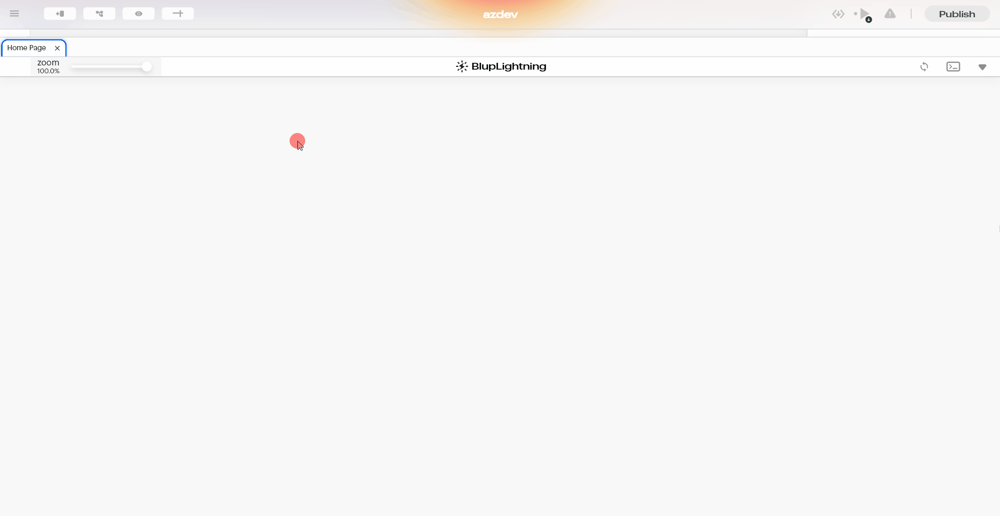
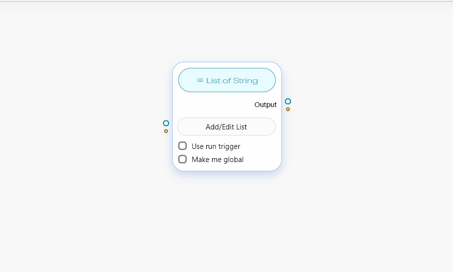
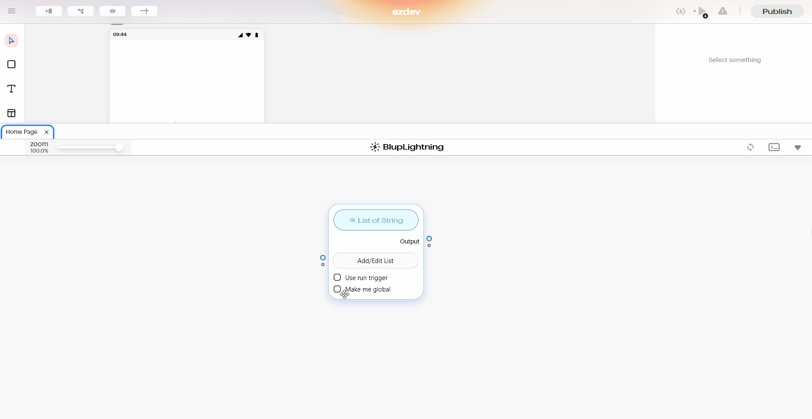
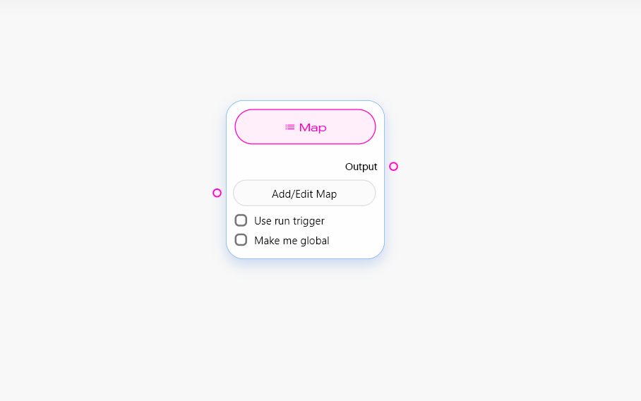
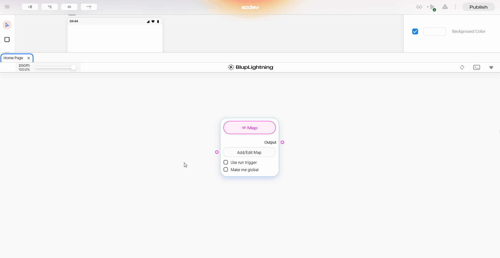

# Collection Section

## Collection Section Nodes

This section consists of nodes that help you define a collection of values together instead of defining them one by one, you can use the list and map nodes to define multiple values at once.

Now Let's go over each node in this section one by one.

## List Node

This Node helps you to define a collection of elements \[ordered], these elements can be of any type, for example, you can have a list of integers that consist of multiple integer values at once or you can have a list of strings that consist of multiple values of string. Data in the list is stored with the help of an index which means that the first value in the list has an index of 0 similarly second value in the list has an index of 2 and so on.

### Components of List

<table><thead><tr><th width="130"></th><th></th></tr></thead><tbody><tr><td><strong>Add/Edit List</strong> </td><td>On click of this button, a dialog box opens up which you can define the first value in the first input box to define the next value click on add item at the bottom of the dialog box to add the second input box on which you can define the second value of the list. Similarly, you can add additional values.</td></tr></tbody></table>


<mark style="color:blue;">Note: If you wanted to remove any item that you have defined you can use the minus icon on the right side of each input box.</mark>



<mark style="color:blue;">Note: After you are done adding the items, you can use the save button present at the bottom of the dialog box to save what you have added, and similar to other nodes you can also provide the already defined list through the same node point.</mark>


<table><thead><tr><th width="160"></th><th></th></tr></thead><tbody><tr><td><strong>Use run trigger</strong></td><td>This check box helps you to add a run trigger to the node.</td></tr><tr><td><strong>Make me Global</strong></td><td>This checkbox helps you to make the node be available globally, i.e. you can use this data present in the node in other tabs also.</td></tr><tr><td><strong>Output</strong></td><td>This output node point provides you with the list that you have added to this node as output.</td></tr></tbody></table>

## Map Node

This node helps to define a collection of key Value pairs \[the key is a unique element whereas the value is the data associated with the key].

Example of data - you could have a map of age and name where age is acting as key and name is acting as value.

You can retrieve and assign value in a map with the help of a key, but the most important part is that the key should be unique.

### Components Of Node.

<table><thead><tr><th width="135"></th><th></th></tr></thead><tbody><tr><td><strong>Add/Edit Map</strong></td><td>This helps you to define a map as soon as you click on the map you can see a dialogue box open up in the center of the screen with one input box for the key and another one for value where you can define the key-value pairs. Similar to the List node if you wanted to add more key-value pairs use the button add item present at the bottom of the dialog box to generate more inputs. If you wanted to delete/remove any key pairs that you have added through the dailog box you can use the minus icon button present in the dialog box against each key-value pair's input boxes.</td></tr><tr><td><strong>Use run trigger</strong></td><td>This check box helps to add a run trigger to the node.</td></tr><tr><td><strong>Make me Global</strong></td><td>This checkbox helps you to make the node available globally, which means that you can use the data present in the node in other tabs also.</td></tr><tr><td><strong>Output</strong></td><td> This output node pointprovidese you with the map that you have added in this node as output.</td></tr></tbody></table>
