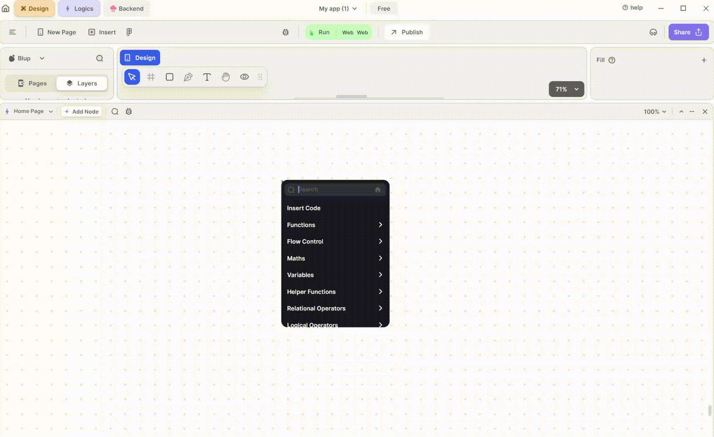
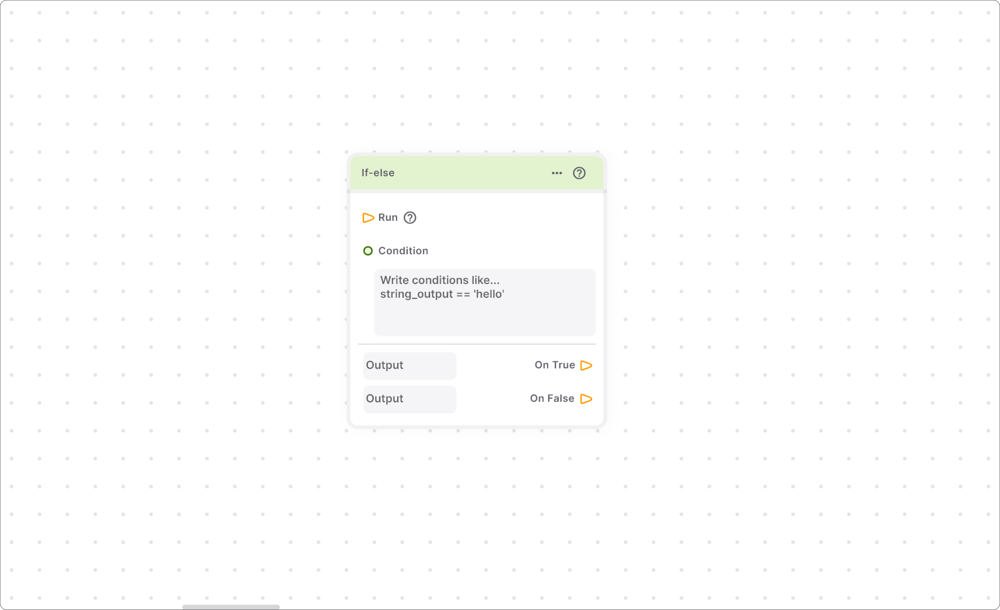
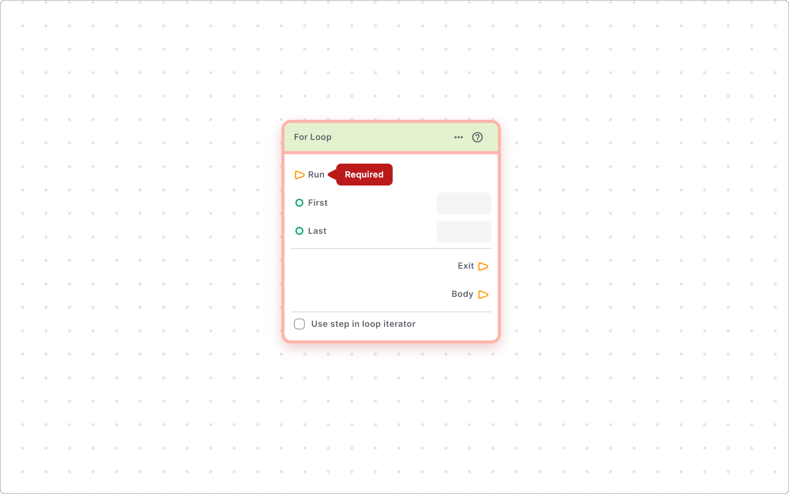
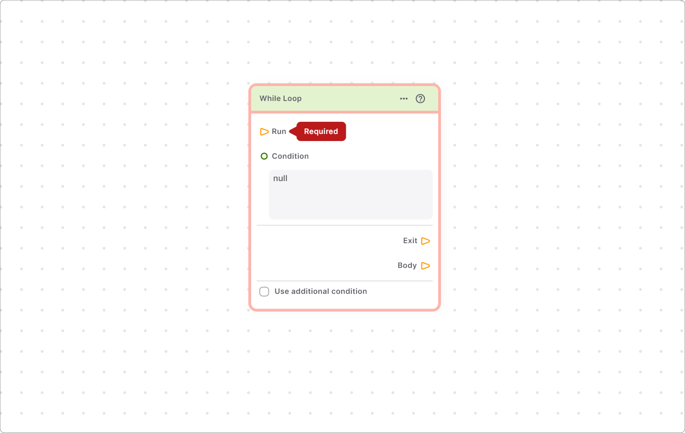

# Flow Control Section

## Flow Control

This section consists of nodes that help you to control the flow of execution of the program.

## If-else Node

This node is one of the most widely used node, this node can be used to divert the flow of execution according to whether the criteria specified by you is satisfied or not.

### Components of Nodes.

<table><thead><tr><th width="232"></th><th></th></tr></thead><tbody><tr><td><strong>Run</strong></td><td>This input node point acts as a starting point for the node.</td></tr><tr><td><strong>Condition</strong></td><td>This input node point help to define the condition based on which you want to change the flow of the program Note you can also used the input box below the node point to directly input the condition instead of giving it through the program.</td></tr><tr><td><strong>True</strong> </td><td>This output node point help you to execute certain logic if the condition provides is true.</td></tr><tr><td><strong>False</strong></td><td>This output node point helps you to execute certain logic if the condition provided is false.</td></tr></tbody></table>

## For Loop Node

This node helps to perform some logic repeatedly.

### Components of for Loop

<table><thead><tr><th width="219"></th><th></th></tr></thead><tbody><tr><td><strong>Run</strong></td><td> This input node point acts as a starting point for the node.</td></tr><tr><td><strong>First</strong></td><td>  This input node point helps you to provide the starting value \[starting value is an initial value given to loop]. You can also use the input box provided to give the first value for the node.</td></tr><tr><td><strong>Last</strong></td><td> This input node point helps you to provide the starting value [starting value is an initial value given to loop]. Similar to the first node point, you can also use to input box provided to give the first value for the node. </td></tr><tr><td><strong>Use Step in Loop iterator</strong></td><td>If you check this checkbox, then a new step node point is generated which helps to add the step size.</td></tr><tr><td><strong>Exit</strong></td><td>This output node point helps you to define the logic you want to execute after the loop execution is finished.</td></tr><tr><td><strong>Body</strong></td><td>All the logic that you want to execute repeatedly comes under this node point.</td></tr></tbody></table>


<mark style="color:blue;">Note: The starting value is always smaller than the final value.</mark>


## While Loop Node

This node is very similar to the for loop, it helps you to execute some logic repeatedly. The major difference between the for loop and while is that in while loop we don’t know how many times the loop will run but we can specify a terminating condition\[a condition which halts the execution of the loop].

### Components of while Loop

<table><thead><tr><th width="159"></th><th></th></tr></thead><tbody><tr><td><strong>Run</strong> </td><td>This input node point acts as a starting point for the node.</td></tr><tr><td><strong>Condition</strong></td><td>This input node point helps you to provide the condition which helps you to start the execution of the loop.</td></tr><tr><td><strong>Exit</strong></td><td>This output node point helps you to define and logic that you want to execute after the loop execution is finished.</td></tr><tr><td><strong>Body</strong></td><td>All the logic that you want to execute repeatedly comes under this node point.</td></tr></tbody></table>

  
  
  Lofi music
  
  
  

