# Function Node Section

All the nodes that help you achieve some functionality are present under this section for example upload files, authentication, payments etc.

Now, Let's go over each node in this section.

## Function Node

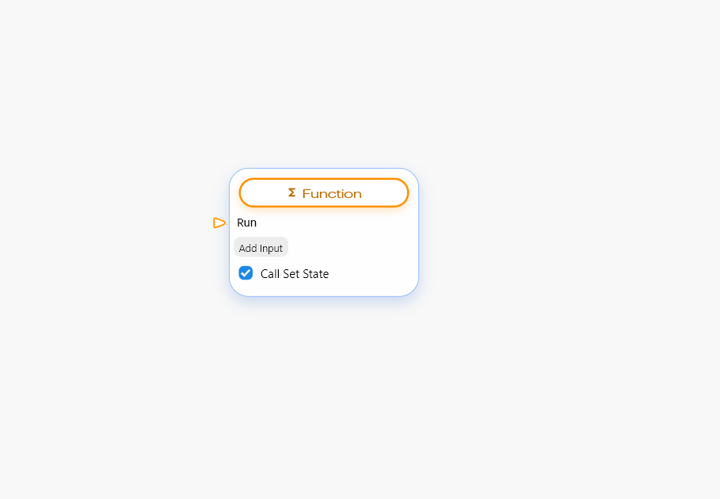

This Node helps you to generate the function in which you can add some input argument and these arguments are available as functions output. To add an argument just click on the add input button which will add an input node point and you can add any type of input node.

On it's own this node doesn’t serve much purpose but this node is very helpful when combined with some other nodes from the function section.

## File Picker Node

This node helps to pick a file from your device for example, you want to pick an image that is present in the gallery of your phone. You can achieve this functionality easily with the help of this node.

To achieve this define the type of file you want to pick from the device.

If you want to pick multiple files at once check the Allow multiple files checkbox at the bottom of the node.

### How to Use File Picker Node

**Step1:** Get the File Picker node from the arsenal in blup lightning.

**Step2:** Choose the type of file you want to pick for example, if you want to pick images then choose the images only option from the drop-down list.


<mark style="color:blue;">Note: If you want to allow the user to choose multiple files then check the Allow multiple files checkbox at bottom of the node.</mark>


**Step3**: Now to get the desired output like a file path or file name, click OnFilePicked output node point and stretch it. As soon you leave it, a function node point is generated which consist of output node point like file type, file name, file path.

Now to run the file picker node OnClick of a button just connect the OnClick node point to your run input node point.

## File Uploader To BSS Node

This node helps you to upload files \[any type] exclusively to the blupsheets database, if you want to upload files to the servers you can use the other node TUS file uploader. This node is mostly used in pair with the file picker node to first pick the file from the device storage and then click upload it to the blupsheets database.

### Components Of Node

<table><thead><tr><th width="219"></th><th></th></tr></thead><tbody><tr><td><strong>Run input node point</strong></td><td>This input node point acts as a starting point for the node to perform its functionality.</td></tr><tr><td><strong>List of File paths</strong></td><td>This input node point takes a list of files path to be uploaded into the blupsheets database.</td></tr><tr><td><strong>OnUploadSuccess()</strong></td><td>This output node helps you to execute any logic if you uploading is successfully done. </td></tr></tbody></table>


<mark style="color:blue;">Note: To get an additional output node point it needs to be stretched.</mark>


<table><thead><tr><th width="209"></th><th></th></tr></thead><tbody><tr><td><strong>OnUploadingFailuire</strong></td><td>This output node is used to execute any logic if your uploading failed.</td></tr><tr><td><strong>OnUploading</strong></td><td>This output node point performs some logic while your data is being uploaded to the database.</td></tr></tbody></table>

### How to Use File Uploader To BSS Node

**Step 1:** Get the file uploader BSS node from the arsenal panel in blup lightning.

**Step 2:** Provide the run trigger from where you want to run the node functionality in your case that can be on click of a button or we can bind this node with the file picker node.

**Step 3:** Provide the second input which is a list of file paths for which, if you directly know the file paths you can provide the list of file paths or you can use the file picker node for this.

**Step 4:** To get the download URL of the file uploaded you need to stretch the onUploadsucces output node point, as soon as you do it you can see a new function node is generated which consist of a list of download URL.


**Note: If you want to perform some functionality if uploads fail can use the OnUploadFailure output node point**


Similarly, if you want to perform some logic while your file is being uploaded you can use the onUploading node point this point also provides you additional node points like progress or current index etc.&#x20;

## TUS File Uploader Node

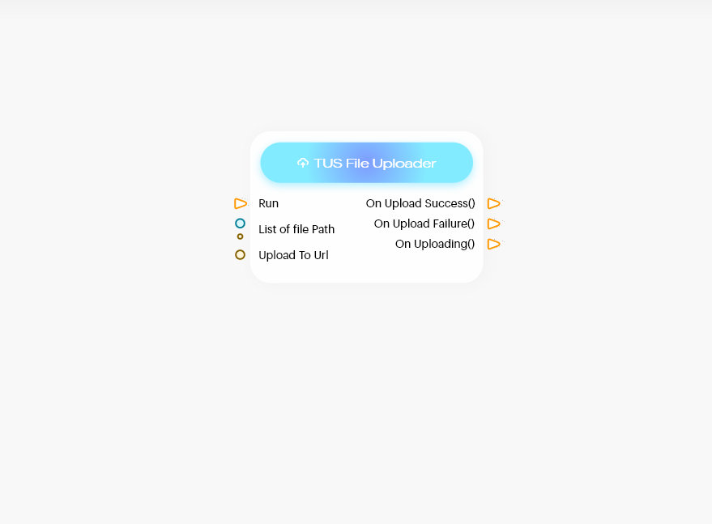

The functionality performed by this node is very similar to the file Uploader BSS node the major difference is that this node helps you to upload the file anywhere like it's your own server.

### Components of file Uploader node to BSS

<table><thead><tr><th width="222"></th><th></th></tr></thead><tbody><tr><td><strong>Run input node point</strong></td><td>This input node point acts as a starting point for the node to perform its functionality.</td></tr><tr><td><strong>List of File paths</strong> </td><td>This input node point takes a list of files path which you want to upload.</td></tr><tr><td><strong>Upload to Url</strong></td><td>This input node point is used to provide the URL where you want to upload your file like the endpoint to your server.</td></tr><tr><td><strong>OnUploadSuccess()</strong></td><td>This output node helps you to execute any logic when your uploading is successfully done. If you want to get additional output node points like download Url to files, it needs to be stretched.</td></tr><tr><td><strong>OnUploadingFailuire()</strong> </td><td>This output node is used to execute any logic if your uploading failed and similar to onUploadingSuccess if you want to get additional output node points you have to stretch it.</td></tr><tr><td><strong>OnUploading()</strong></td><td>This output node point helps you to perform some logic while your data is being uploaded to the database, similar to onUploadingSuccess if you want to get additional output node points you have to stretch it.</td></tr></tbody></table>

## Shared Preferences Sub-Section

This section provides you with the node that helps you to store data \[key-value pairs] in system memory, which means that even if the user closes your apps it retains the data stored through these nodes.

### SPF| Store Data node

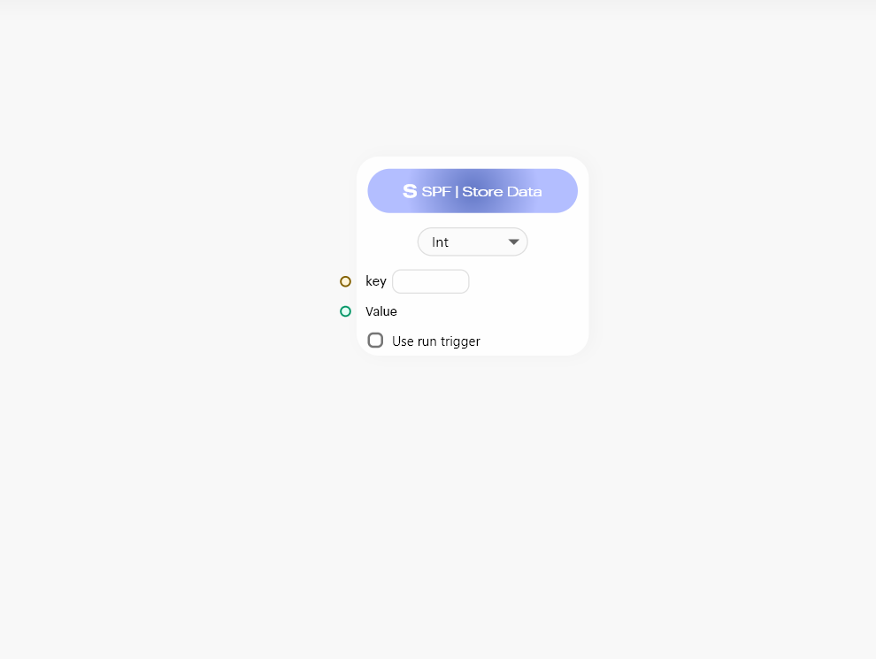

This node helps you to store data\[key-value Pairs ] in system memory so that they can be preserved even if the user closes the apps or removes it from the background as well.

#### Components of Node.

|                              |                                                                                                                                                                                                                           |
| ---------------------------- | ------------------------------------------------------------------------------------------------------------------------------------------------------------------------------------------------------------------------- |
| **Dropdown Menu**            |  This dropdown menu is used to define the type of values which are going to be stored with the key. For example, if you want to store strings as values with the key you can select the Strings option from the dropdown. |
| **Key node point**           | This input node point is used to provide the key which acts as s unique identifier for storing the values, this key should be unique. This can accept unique Strings.                                                     |
| **Values Node Point**        | This input node point helps you to provide the value, this value is associated with the key that you provided in the previous input.                                                                                      |
| **Use run trigger Checkbox** | This check box helps you to add a run trigger to the node.                                                                                                                                                                |

### SPF| Get Data Node

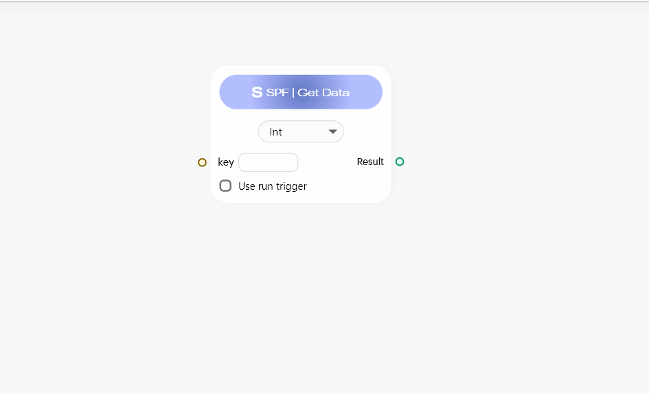

This node as the name suggests helps you to get the data \[key-value pairs]] that you stored in system memory with the help of SPF| store data node.

#### Components of Node.

|                              |                                                                                                                                                                                                                               |
| ---------------------------- | ----------------------------------------------------------------------------------------------------------------------------------------------------------------------------------------------------------------------------- |
| **Dropdown Menu**            | This dropdown menu is used to define the type of values that are going to be stored along with the key. For example, if you want to store strings as values with the key you can select the Strings option from the dropdown. |
| **Key node point**           | This input node point is used to provide the key which acts as s unique identifier for storing the values, this key should be unique.                                                                                         |
| **Use run trigger Checkbox** | This check box helps you to add a run trigger to the node.                                                                                                                                                                    |

## Audio Player Sub-Section

### Audio Player | Init Node

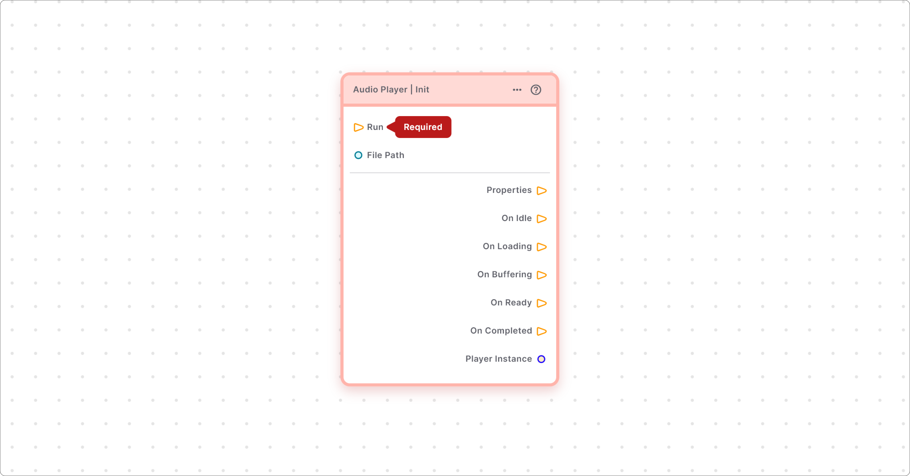

### Audio Player | Props

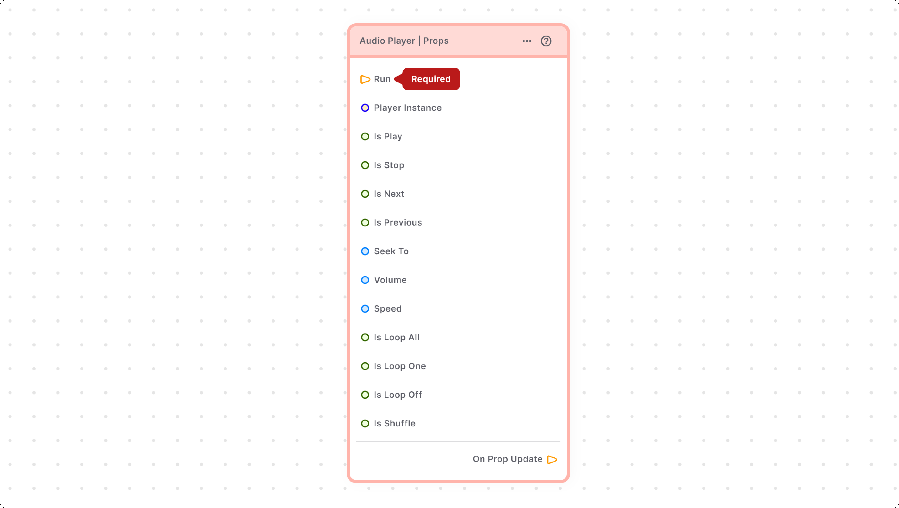

## Social Login Sub-Section

### Social Login | First Time

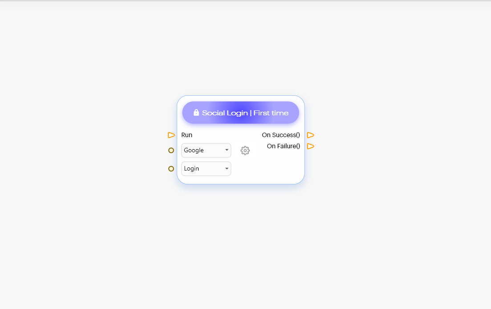

### Social Login | If Already Present Node

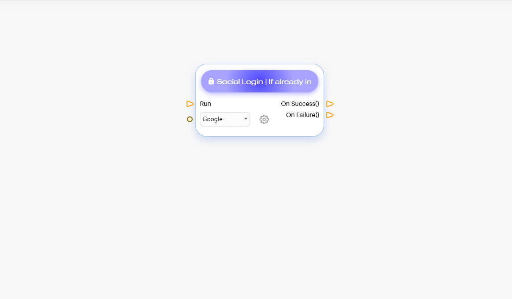

## Page Navigator

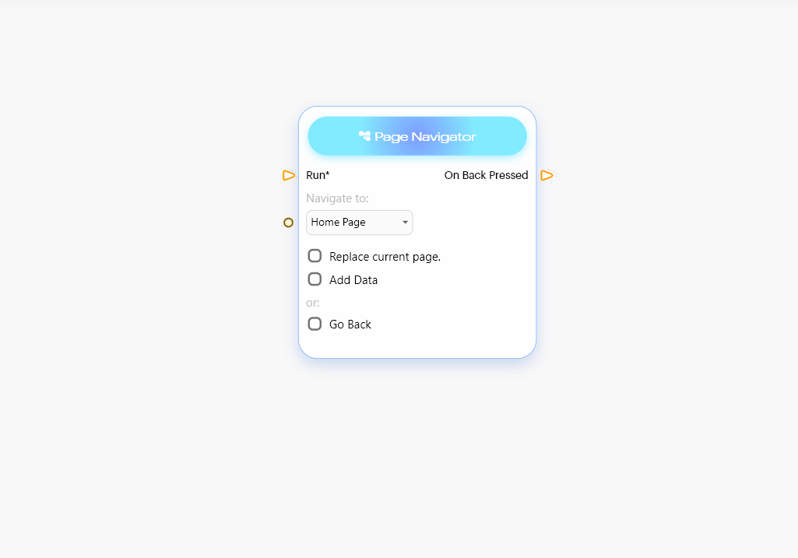

This node helps you to navigate between pages in your app. For example, like navigating from one page to another on the click of a button, it will also help you to get back to the previous page from any page. This node helps you achieve that functionality.

### Components of Page Navigator

|                                     |                                                                                                                                                                                                                                                                                                                                      |
| ----------------------------------- | ------------------------------------------------------------------------------------------------------------------------------------------------------------------------------------------------------------------------------------------------------------------------------------------------------------------------------------ |
| **Run**                             | This input node point acts as a starting point for the node to perform its functionality.                                                                                                                                                                                                                                            |
| **Navigate to the drop-down menu**  | This drop-down list consists of all the pages that are present in your project, so if you want to navigate to another page, just select that option. Page name can also be provided with the node point instead of the drop-down menu just make sure the string value provided through the node point exactly matches the Page name. |
| **Replace current page checkbox**   |  When you navigate from one page to another page it doesn’t replace that page, instead, it puts that page on the top of your current page, so if you press the back button on your phone itnavigatese back to the same page. But if you checked this checkbox the current page is replaced by another page.                          |
| **Add Data**                        | This checkbox is used to send data when you navigate from one page to another as soon as you checked this checkbox a new Add Data node point is generated to which you can attach any type of data that you want to send to the next page.                                                                                           |
| **Go back checkbox**                | This checkbox helps you to navigate back to the previous page. You can use this checkbox to navigate back to only one page.                                                                                                                                                                                                          |
| **Go back until CheckBox**          |  When you want to navigate back multiple pages at once this checkbox is used. When you check this checkbox it will generate a drop-down menu that consists of all the pages that you have in your application if you want to navigate back toa  ceratin page choose that page name in the drop-down option.                          |

## Simple HTTP Node

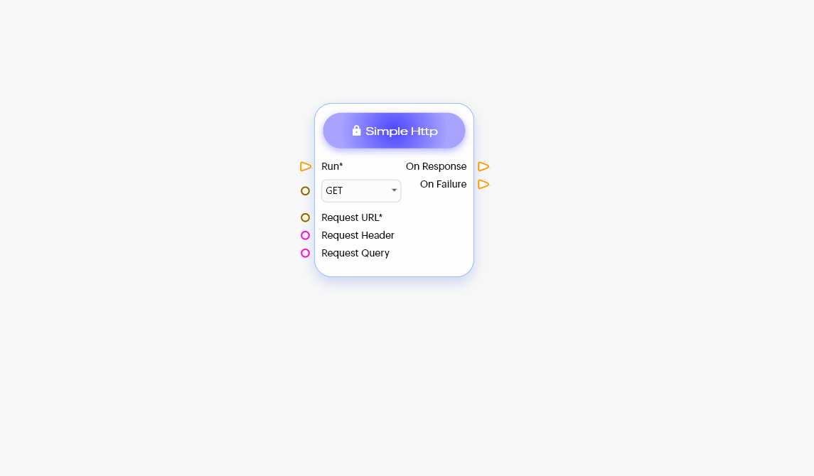

This node helps you to interact with your API. It can Get, update and delete data that is present in your server.

This node is very helpful in case you are managing your servers/backend.

### Components of Simple Http

<table><thead><tr><th width="197"></th><th></th></tr></thead><tbody><tr><td><strong>Run</strong></td><td>This input node point acts as a starting point for the node to perform its functionality.</td></tr><tr><td><strong>HTTP method drop-down</strong></td><td>
This drop-down menu helps you to select the type of operation which you want to perform on your server/API.

<strong>Get</strong>: this option is used when you only want to read data from your API.

<strong>PUT:</strong> This option is used when you want to update existing data in the database.

<strong>POST</strong>: This option is used when you want to add new data to your database.
</td></tr><tr><td><strong>Request URL</strong></td><td>This node point is used to provide the endpoint [URL which helps to connect with backend service].</td></tr><tr><td><strong>Request Header</strong></td><td>This input node point is used to provide headers for the API call [headers are like extra sources of information for each API call you make, these headers contain meta-data associated with API request].</td></tr><tr><td>Request query</td><td>
 This node point changes according to the value that you have selected in the drop-down menu.

<strong>GET – Request Query:</strong> This node point helps to pass any argument which can be used to fetch a particular type of data.

<strong>POST – Request Body:</strong> This node point is used to pass data that you want to add to your Database.

<strong>PUT – Request Body</strong>: This node point is used to pass data that you want to update in your Database.
</td></tr><tr><td>On Response</td><td>This output node point is used to perform some logic once you receive your response from your backend.</td></tr></tbody></table>


<mark style="color:blue;">Note: If you want an additional node point to stretch the OnResponse node point further, you can use the function node generated which consists of an additional node point.</mark>


|                |                                                                          |
| -------------- | ------------------------------------------------------------------------ |
| **On Failure** | This output node point helps you to perform logic if your request fails. |


<mark style="color:blue;">Note: If you want an additional node point to stretch the OnResponse node point further, you can use the function node generated which consists of an additional node point.</mark>


## URI Encode Node

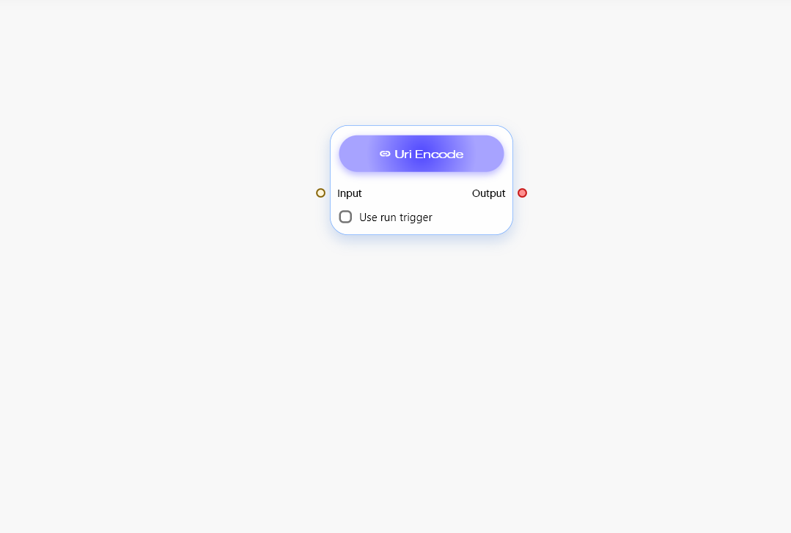

This node is used to encode the URI. Just pass the URI which you want to encode and from the result output node you will get encoded URI

Why we encode URI - when your URL consists of some spaces or special characters it can lead to a problem while executing the API. To avoid any such problems we use an encoding.

### Components Of Node

<table><thead><tr><th width="168"></th><th></th></tr></thead><tbody><tr><td>Input </td><td> This node point is used to take the URI that you want to encode.</td></tr><tr><td>Use run trigger checkbox</td><td> This check box helps you to add a run trigger to the node.</td></tr><tr><td>Output</td><td>This output node point provides the result of the encoded URI which you have passed in the input node point.</td></tr></tbody></table>

## Share Node

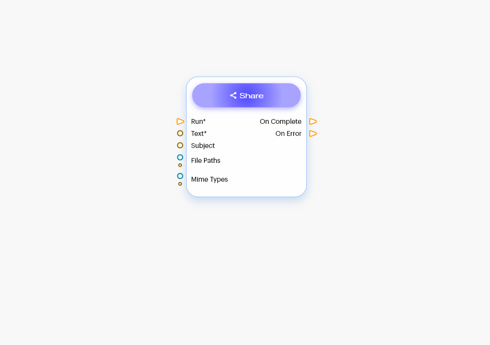

This node is used to share files with other apps.

## Comment Node

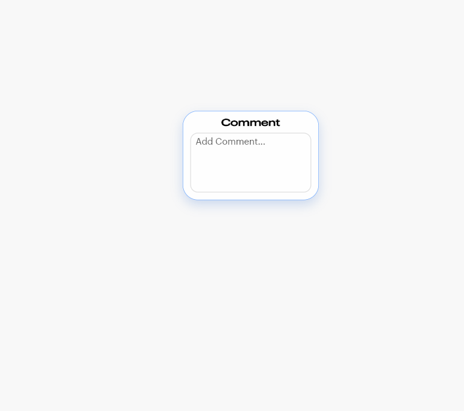

This node is used for putting any short note or a simple piece of information. To put a note in the node just use the Input box provided in the node and drag anywhere in the blup lightning.
