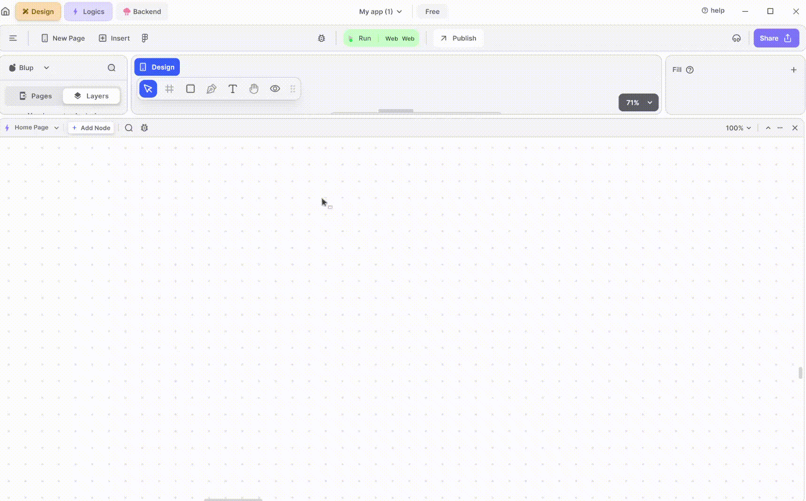
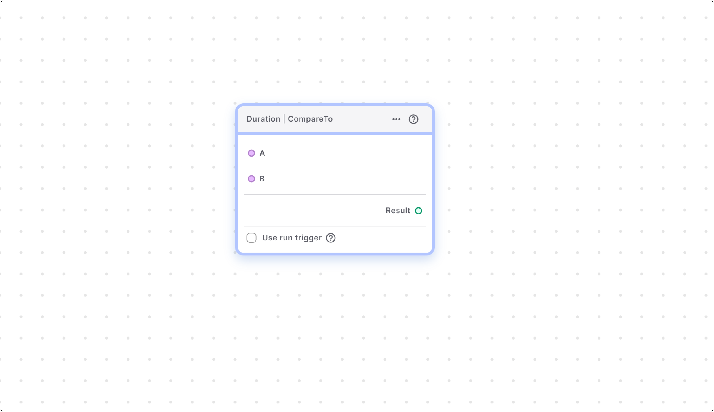
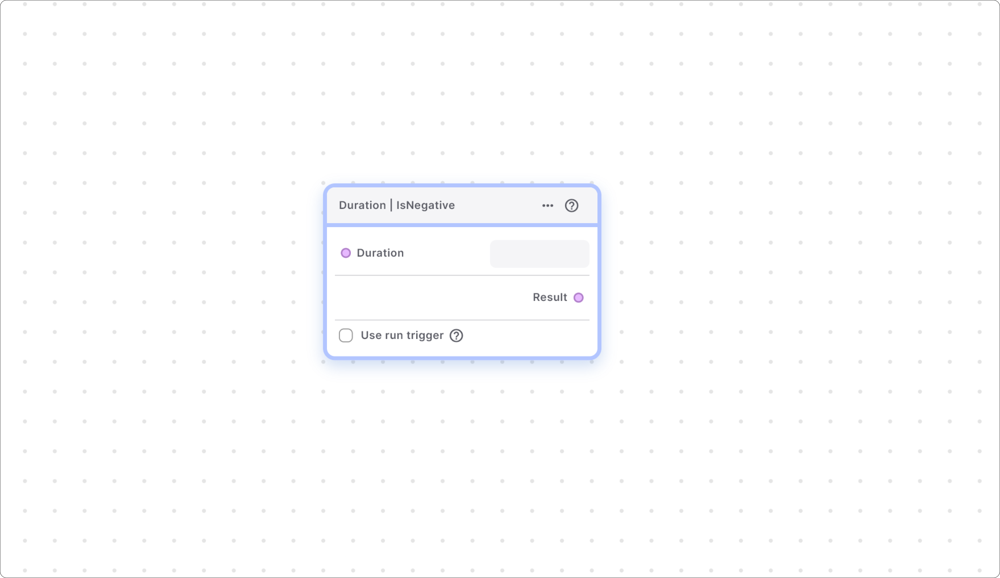
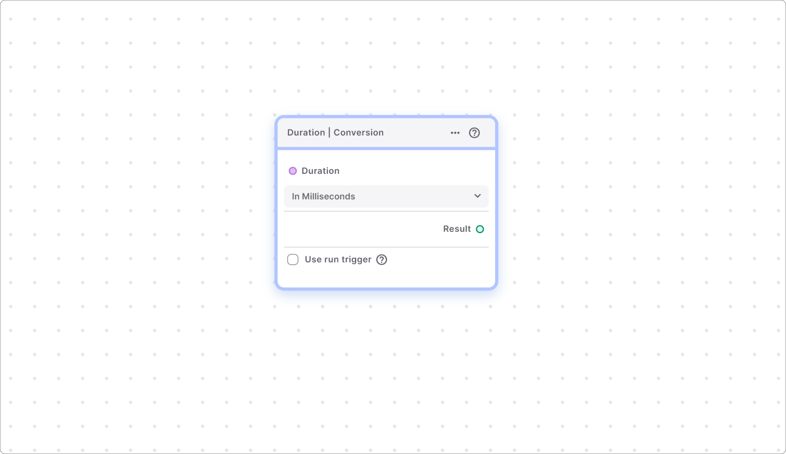

# Duration Helper Function Sub-Section

### Duration | Abs

This node returns a Duration that has the same length as the provided one but is always positive. If the duration is negative, this node converts it to a positive duration.

### Duration | Compare To

This node compares two durations and returns:

This node returns -&#x20;

1\. Zero if both durations are the same.&#x20;

2\. A negative integer if the first duration is shorter than the second.&#x20;

3\. A positive integer if the first duration is greater than the second.


<mark style="color:blue;">Note - A negative Duration is always considered shorter than a positive one.</mark>


### Duration | Is Negative

This node returns true if the duration provided is negative. If the duration is negative then this node returns true, if the duration is not negative then this node returns false.

### Duration | Conversion

This node helps you to convert the duration into the required format for example, hours into minutes.&#x20;

  
  
  Lofi music
  
  
  

