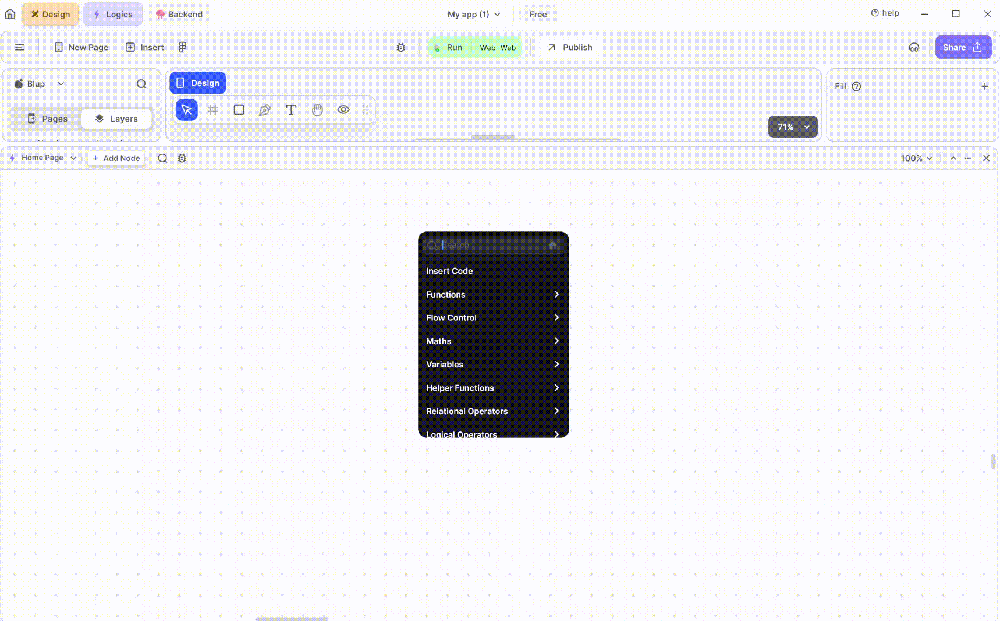
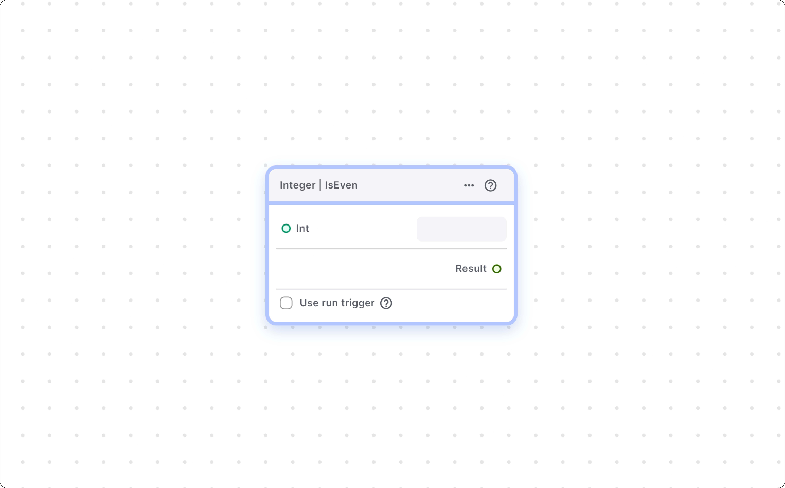
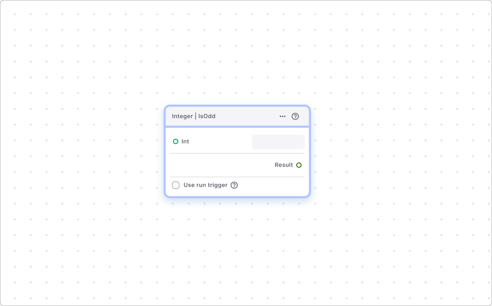
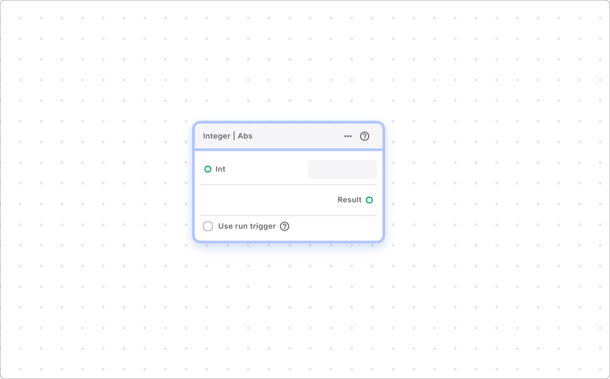
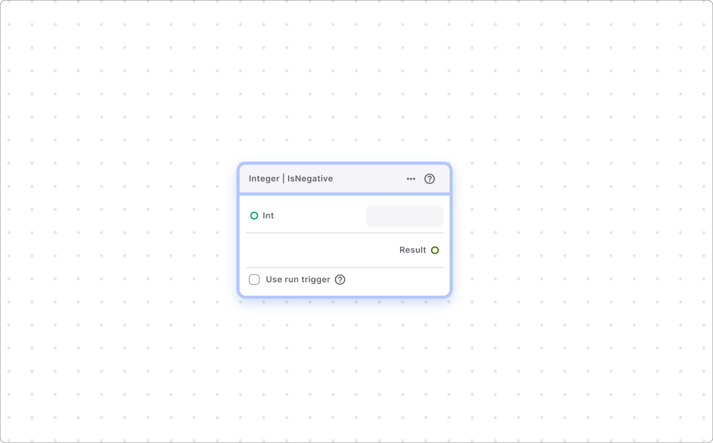

# Integer Helper Function

This subsection includes helper function nodes related to integers.

### Integer | Is Even Node

This node checks if the given integer number is even.

#### Components Of Node

1\. **Value** – Input node to provide the integer number to be checked. You can directly input the number into the box.

2\.   **Result** –  Output node that returns true if the input integer is even; otherwise, it returns false.

### Integer | Is Odd Node

This node helps you to check the given integer number is odd or not.

#### Components of Node

1\. **Value** – Input node to provide the integer number to be checked for odd. You can directly input the number into the box.&#x20;

2\.   **Result** – Output node that returns true if the input integer is odd; otherwise, it returns false.

### Integer | Abs Node

This node converts a number to its absolute form, meaning negative numbers are converted to positive, while positive numbers remain the same.

#### Components of Node

1\. **Value** – Input node providing the integer number to be converted to its absolute form. You can also directly input the value into the box.

2\. **Result** – Output node providing the positive number as output, regardless of whether the input number was negative or positive.

### Integer | IsNegative Node

This node checks whether the provided number is negative or not.

#### Components Of Node

1\. **Value** – Input node providing the integer number to be checked. You can also directly input the number into the box.

2\.   **Result** – Output node returning true if the provided number is negative; otherwise, it returns false.

  
  
  Lofi music
  
  
  

