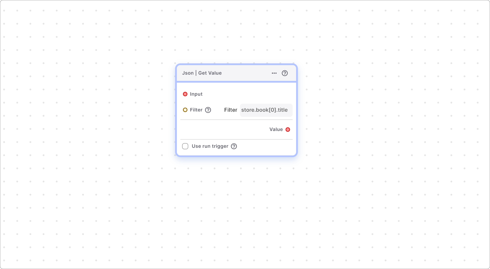

# Json Helper Functions

### JSON | Get Value



This node retrieves values from JSON data based on a specified filter.

Parameters

**Input:** JSON data (e.g., from the Response Body field of a Simple Http's On Success function).\
\
_Var Type_: String, Map, List.\
\
e.g.:&#x20;

```dart
{
  "store": {
    "book": [
      {
        "category": "reference",
        "author": "Nigel Rees",
        "title": "Sayings of the Century",
        "price": 8.95
      },
      {
        "category": "fiction",
        "author": "Evelyn Waugh",
        "title": "Sword of Honour",
        "price": 12.99
      },
    ],
    "bicycle": {
      "color": "red",
      "price": 19.95
    }
  }
}  
```

**Filter:** Requires a string input to filter the input parameter.

_Var Type_: String.

e.g: \
`store.book[0].title`  or  `store.book[*].title`

\------------------------------

**Note: **_**No** need to add `$.`_ _at the start. (as it adds that itself.)_

_------------------------------_\
**For more,**&#x20;

Detailed filters, please visit: \
[https://cburgmer.github.io/json-path-comparison/](https://cburgmer.github.io/json-path-comparison/)     or\
[https://ietf-wg-jsonpath.github.io/draft-ietf-jsonpath-base/draft-ietf-jsonpath-base.html](https://ietf-wg-jsonpath.github.io/draft-ietf-jsonpath-base/draft-ietf-jsonpath-base.html).

Online evaluator, please visit: [https://jsonpath.com/](https://jsonpath.com/)

\------------------------------

If you have any ideas to make Blup better you can share them through our [Discord community channel ](https://discord.com/channels/940632966093234176/965313562425823303)

## Music to go with.
 
<div class="container">
  
  
  Lofi music
  
  
  
</div>