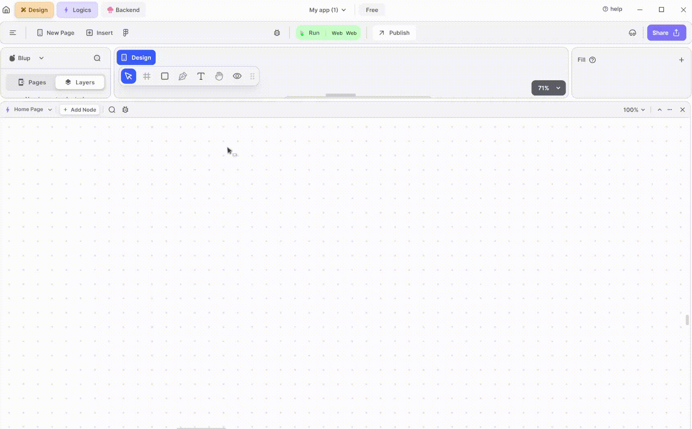
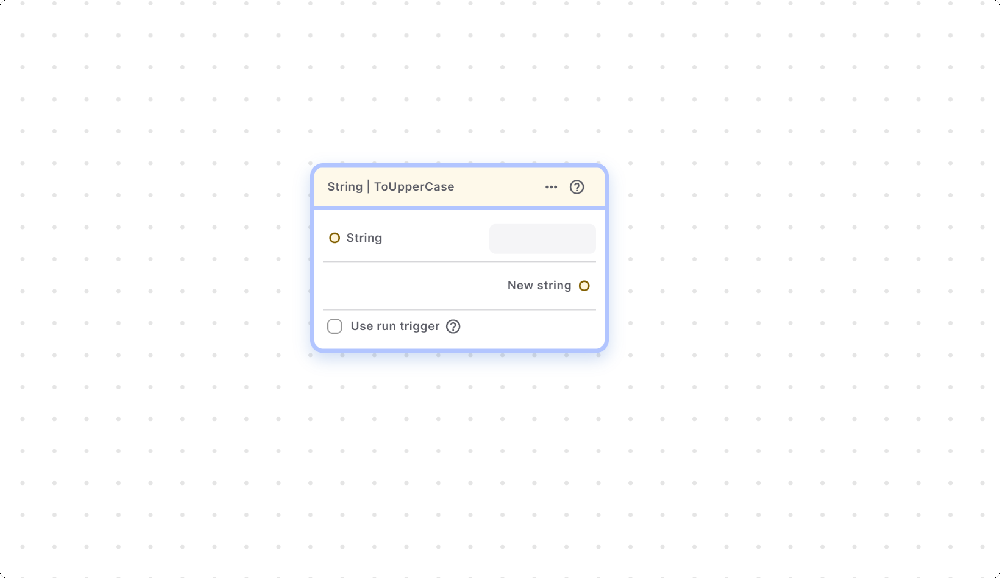
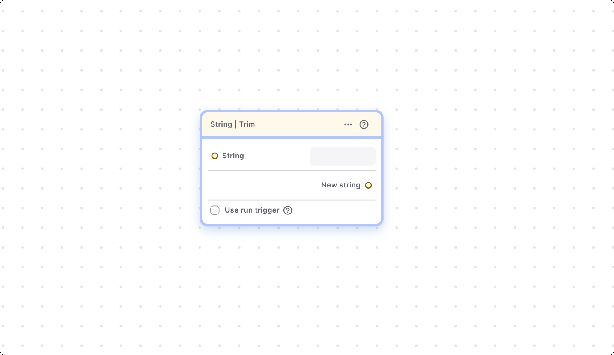
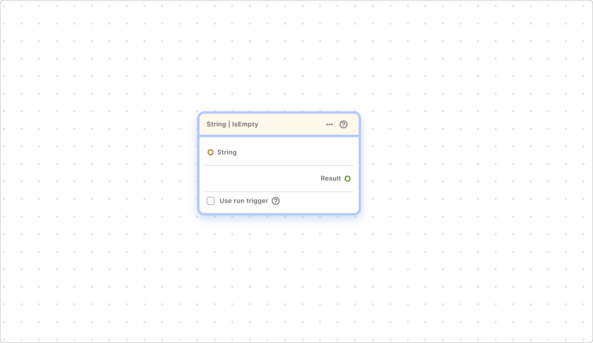
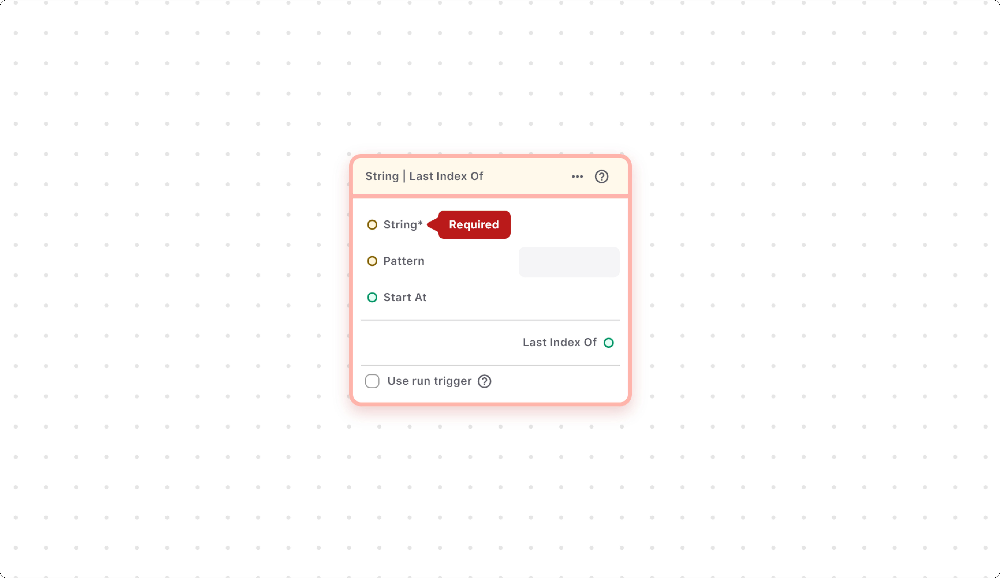
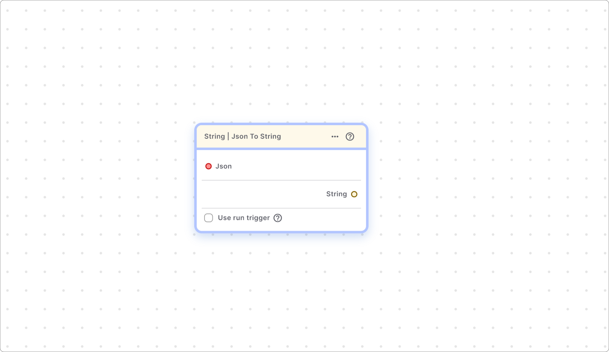
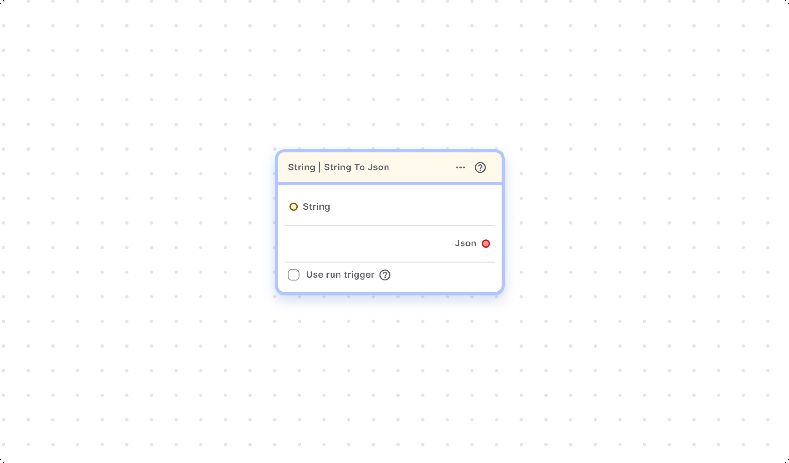

# String Helper Function Sub-Section

This sub-section consists of all the helper functions related to strings.

### String | Split

This node splits the string at matches of a pattern and returns a list of substrings. It finds all the matches of the pattern in the string and returns the list of substrings between the matches.&#x20;

For example If the value in string node is = "Hello world!" and Pattern value = “ ” Then it returns the list consisting of \['Hello', 'world!'];

### String | ToLowerCase

This node converts all characters in the string to lowercase.&#x20;

### String | ToUpperCase

This node converts all characters in the string to uppercase.

### String | Trim

This node returns the string without any leading and trailing whitespace. It removes leading and trailing whitespace from the string.

For example, if the string provided is “ Dart is fun ” this node return “Dart is fun”.

### String | Replace All

This node replaces all substrings that match a specified pattern with a replacement string.

For example, if the string provided is “resume” and the pattern is “e” and replaces it with is “E” then it returns “rEsumE” as result.

### String | SubString

This node helps you get a portion of the provided string by specifying start and end indices.

Note Indexing in a string starts from 0 instead of 1.

For example, strings “hello World” and you wanted to get only “hello” from the string you can pass start index is 0 and end index is 5 \[instead of 4 because end index is not included].

### String | Replace Range

This node replaces a portion of the string with a new provided string, specified by start and end indices.


<mark style="color:blue;">Note: Indexing in a string starts from 0 instead of 1.</mark>


For example, you have a string Hello World” and you wanted to replace it with “Hey World” so you can pass start index is 0 and end index is 5 \[instead of 4 because end index is not included], and replace String is “Hey”, then this node return “Hey World”.

### String | Concat

This node combines two strings into a single string.

For example, string1 is ”Hello” and String2 is “World”, then it returns “HelloWorld”,

To give space between both of the pass string 2 as ” World” \[with space] in beginning], then it returns “Hello world”.

### String | Contains

This node checks whether a given word or substring is present in the string and returns 'true' if it exists, otherwise 'false'.

### String | Equal

This node checks whether two strings are equal or not and returns 'true' if they are equal, otherwise 'false'.

For example, string1 = "hello" and string2 = "hello" ,it return true.

### String | IsEmpty

This node checks whether the provided string is empty (including blank spaces) and returns 'true' if it is empty, otherwise 'false'.

For example, if provided string ="", this node will return true.


<mark style="color:blue;">Note: This node returns true even if the provided string only contains blank space with out any character.</mark>


### String | ToString

This node converts other variables and collections like lists or maps into a string.

### String | Length

This node returns the length of the provided string, indicating how many characters it contains.

For example, the string is “Hello” – length is 5.

### String | Index Of

This node helps you find out the index of a character or substring present in the provided string. It returns the index of the first occurrence of that character or substring.


<mark style="color:blue;">Note - index starts from 0 in string.</mark>


For example, String = “resume” and character = “e”, node will return 1 \[index of first “e” in the string].

### String | Last Index Of

This node helps you find out the index of the last character or substring present in the provided string. If the string consists of multiple occurrences of the same character or substring, it returns the index of the last occurrence.

If no matching character is present in the provided string the node return -1.

If the string consists of only a single character then this node works like the index of node and return the index of the first occurrence of character.

For example, string = “resume” pattern is “e” Result = 5 \[index of last “e” is 5].

### String | Json to String

This node converts the JSON \[Javascript Object Notion] into the string.

This node is mostly used when you are dealing with JSON responses from any web server, in such cases, you need to convert the JSON into a string.

### String | String to JSON

This node helps to convert the string into JSON \[Javascript object notion], similar to the above node, this node is also used when you are dealing with responses from web servers, so in such scenarios, you need to convert the JSON into the string.

### String | Parse String To

This node converts variables like integers, doubles, or Booleans values back to strings.

For example, integer = 10 is convert into string = “10”, or Boolean = true is converted into “true”.

### String | Compare To

This node returns an integer representing the relationship between two strings:

0 − if the strings are equal.&#x20;

1 − if the first string is greater than the second&#x20;

\-1 − if the first string is smaller than the second

### String | Ends With

This node returns 'true' if the provided string ends with a particular substring, otherwise 'false'.

for example 1. string = “hello” pattern = “llo” , result = true; 2. string “hello” pattern =”e” , result = false.

### String | Starts With

This node returns 'true' if the provided string starts with a particular substring, otherwise 'false'.

for example&#x20;

&#x20;string = “hello” pattern = “hel” , result = true.

&#x20;string “hello” pattern =”yo” , result = false.

### String | Trim Left

This node returns the string without any leading whitespace on the left.&#x20;

For example&#x20;

1\. Input =” Hello” Output = “Hello”.

2\. Input =” Resume ”, Output = “Resume ”.

### String | Trim Right

This node returns the string without any trailing whitespace on the right.&#x20;

For example&#x20;

1\. Input =”Hello ” Output = “Hello”.

2\. Input =” Resume ”, Output = “ Resume”.

If you have any ideas to make Blup better you can share them through our [Discord community channel ](https://discord.com/channels/940632966093234176/965313562425823303)

## Music to go with.
 

  
  
  Lofi music
  
  
  

