# System Node Section

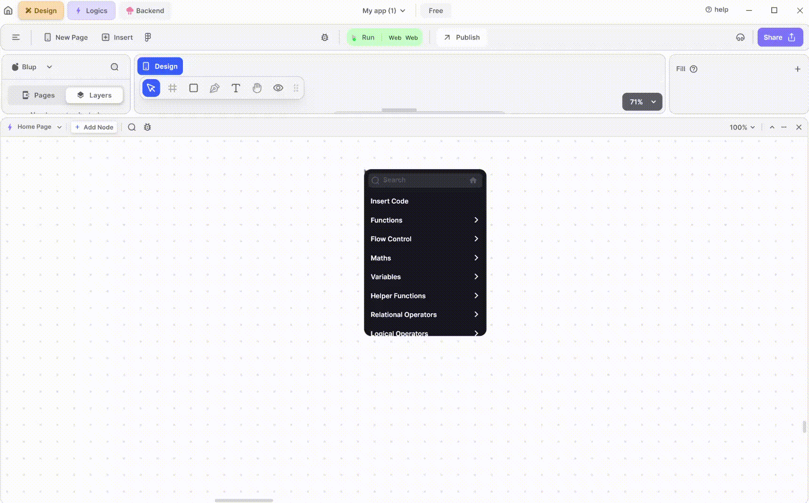

## System Nodes

This section comprises nodes providing essential system functionalities, such as accessing global variables and printing debug information. Let's explore each node in this section one by one.

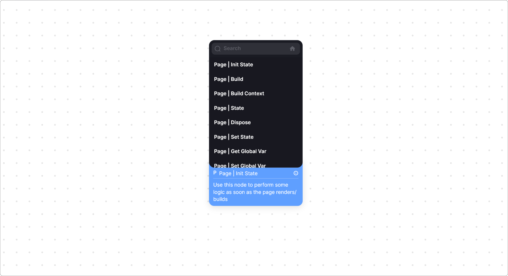

## Page | Init State Node

This node allows you to execute logic during the initialization state in Flutter. The initState method runs only once before the user interface (UI) is rendered, making it perfect for pre-rendering logic.

This node only consists of one output node point that is on Init State which helps to attach any logic.

## Page | Build Widget Node

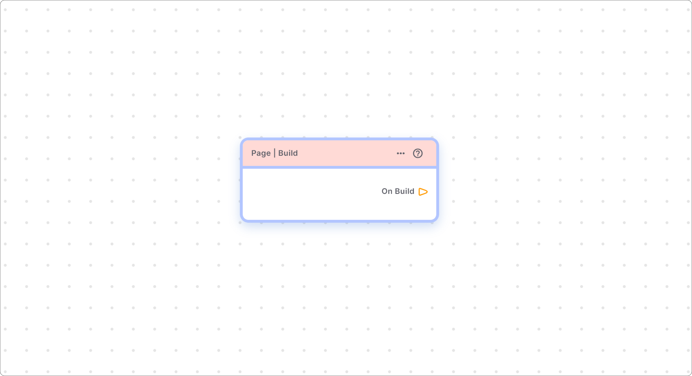

The Build Widget node enables you to execute logic while the UI is being built in Flutter. This method is responsible for constructing the visible UI on the screen, making it suitable for executing logic during UI construction.

This node also consists of one output node point to which you can attach any logic which you to execute when your UI is being built.

## Page | Build Context Node

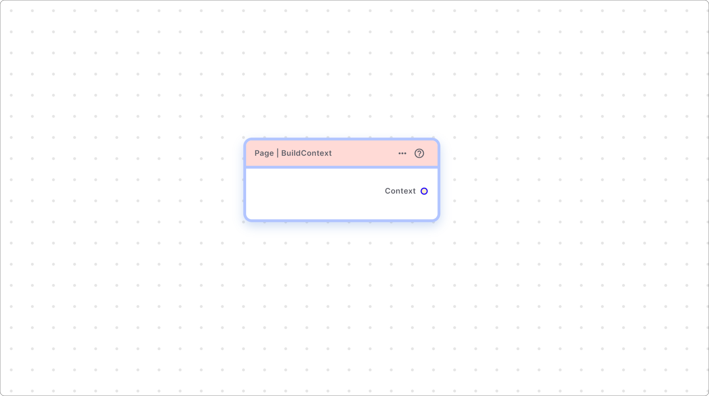

Build Context represents the location of a widget in the widget tree. It allows widgets to find and interact with other widgets in the tree, such as accessing theme data or navigating to different screens.

This node only consists of one output node point that is on Build context which helps to attach to other widgets.

## Page | State Node

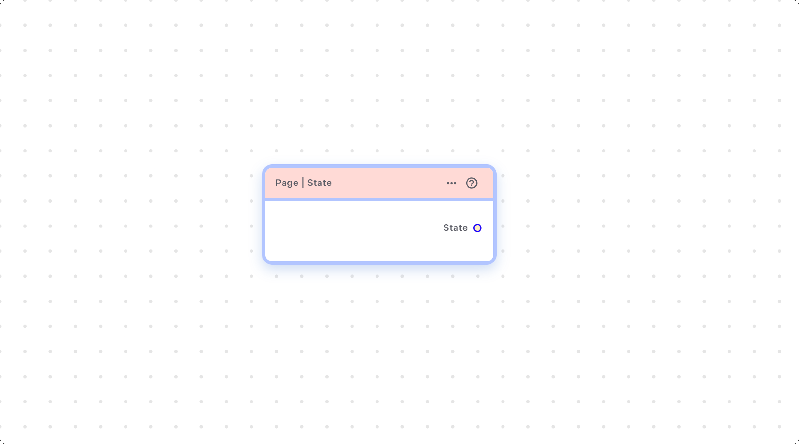

State represents the mutable data of a widget. It allows widgets to manage their internal state and respond to changes, such as user interactions or data updates. StatefulWidget is a Flutter widget that has mutable state, while StatelessWidget is a widget that does not have state and remains immutable.

This node only consists of one output node point that is on State which helps to attach any logic.

## Page | Dispose Node

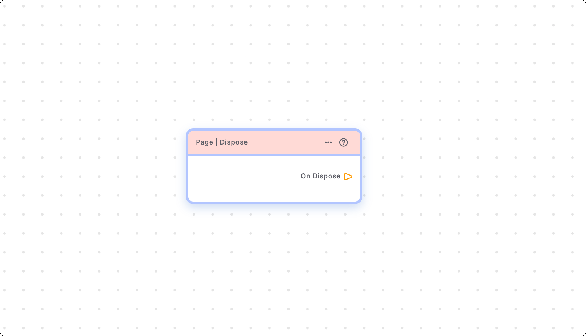

Use the Dispose Node in Flutter to release resources or reset variable values when an object is no longer focused or has been destroyed. It helps in freeing up resources associated with the object.

This node only consists of one output node to which you can attach logic which executes when your object is removed from focus and frees up the resources.

## Page | Set State Node

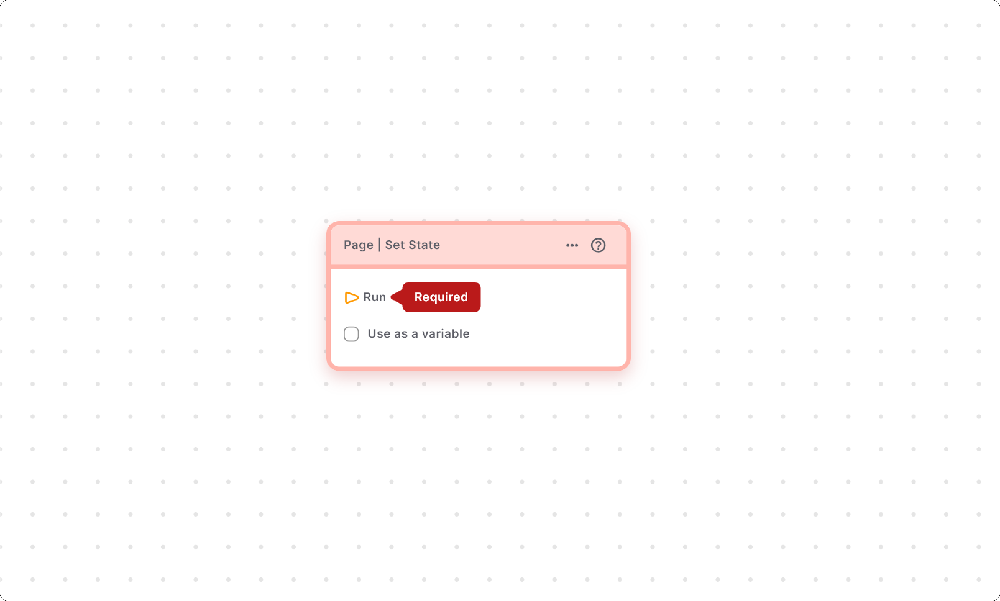

In Flutter, the Set State Node allows you to rebuild the UI with changes. It triggers a UI rebuild when there are updates to variables or other elements that affect UI appearance.
For example:– if you have changed the value of variables which is already present on the UI the changes won't be reflected in the device till the set state is called.

This node only consists of a run input node point which can be attached with any function node point where you want to rebuild the UI.

## Page | Get Global Var Node

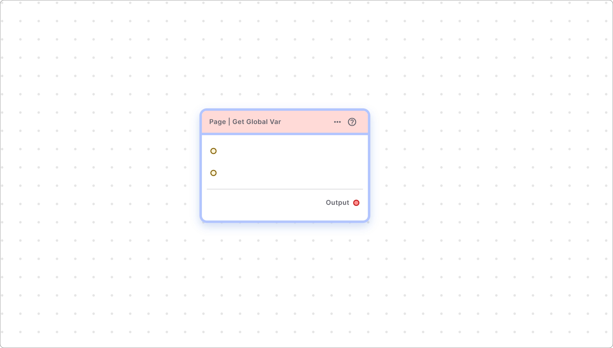

The Get Global Variable Node retrieves global data set by making a variable global in Flutter. Global variables facilitate data transfer between different parts of your app, making it easier to manage state.

You can consume the value on the same page as well, as soon as you create any variable node global by checking the make me global checkbox, it is reflected in the Page | Get global.

### How to use Get Global Var Node:

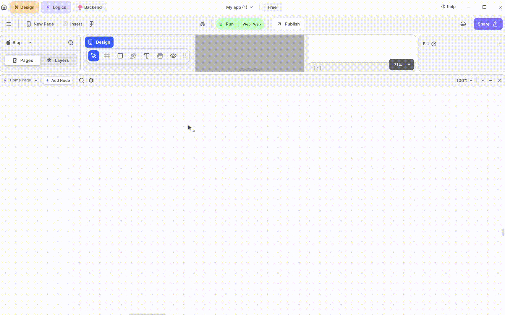

First, declare your variable in one page to make it global. Then, in any other page, use the "get global" node to access that variable. This node facilitates accessing your global variable from anywhere in your application.

### Components of Get Global Var Node

<table><thead><tr><th width="160"></th><th></th></tr></thead><tbody><tr><td><strong>Page name</strong></td><td>Specifies the page name where global variables are defined. You can choose from a dropdown menu containing all pages in your project or use a node point to pass the value. The dropdown displays options only if global variables exist; otherwise, it remains empty.</td></tr><tr><td><strong>Name of variables</strong></td><td> Specifies the name of the global variable. Similar to the Page name field, you can select from a dropdown menu or use a node point to pass the value. The dropdown displays options only if global variables exist; otherwise, it remains empty.</td></tr><tr><td><strong>Output</strong></td><td>Provides the value of the selected global variable.</td></tr></tbody></table>

## Page | Set Global Var

Use the Set Global Variable Node in Flutter to update or set the value of global variables across different parts of your app.

### How to use Set Global Var Node:

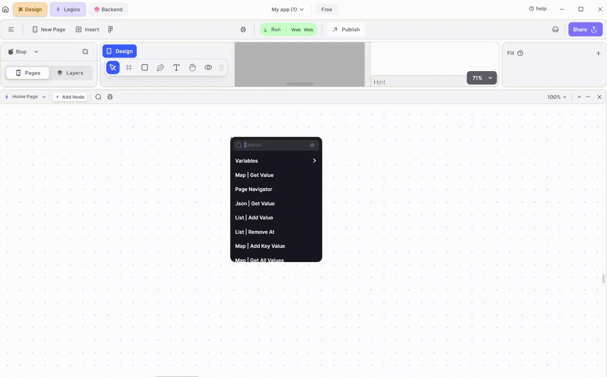

This node serves a similar purpose to the "get global var" node, with the added capability of allowing you to both get and set your global variables according to your needs. While the "get global var" node only allows you to retrieve global variables, this node provides the flexibility to both retrieve and update them as required.

### Components of blup

<table><thead><tr><th width="160"></th><th></th></tr></thead><tbody><tr><td><strong>Page name</strong></td><td> This node point helps to define the page name on which your global variables is present.</td></tr><tr><td><strong>Name of variables</strong></td><td> This node point provides the name of variables similar to the Page name node point.</td></tr><tr><td><strong>New Value</strong></td><td>This output node point is used to provide the new value which is replaced by the previous value present in global variables.</td></tr></tbody></table>


<mark style="color:blue;">Note: You can either use the provided dropdown menu which consists of all the pages that exist in your project or you can use the node point to pass value through it. Values inside the dropdown are only available if at least one global variables are present otherwise it is not shown.</mark>


## Debug | Print

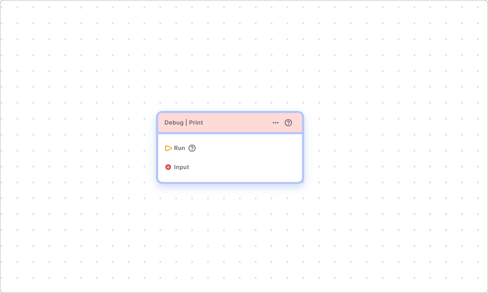

The Debug Print Node is used to print data values to the debug console of the blup logic, aiding in debugging logic.

### Components of Node

<table><thead><tr><th width="160"></th><th></th></tr></thead><tbody><tr><td><strong>Run</strong></td><td> This input node point acts as a starting point for the node.</td></tr><tr><td><strong>Input</strong></td><td> This input node point provides the input data that you wanted to print in debug console.</td></tr></tbody></table>

This is one of the most widely used node. This helps you to detect what's going wrong with your logic by printing it on debug console.

  
  
  Lofi music
  
  
  

