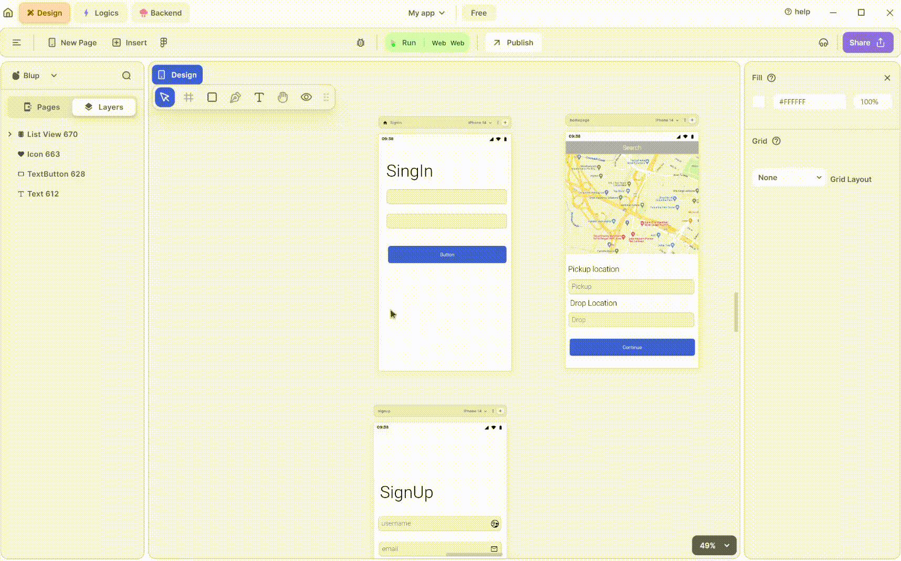

# Page ListView Node

Page ListView enables users to select different sections on one screen and navigate to corresponding screens in a ListView format. It provides flexibility to customize decorations according to your preferences.

## How to get the Page ListView Node.

To obtain the Page ListView, follow these steps:

**1.** Select a section similar to the rectangle UI node.

**2.** Right-click on the rectangle UI node, then choose "Page ListView."

**3.** On the right-hand side, below the margin settings, locate "Add Pages to PageList."

**4.** Select it and specify the container representing the page you want to display inside it.

### Components of Page ListView node

<table>
  <thead>
    <tr>
      <th>Component</th>
      <th>Description</th>
    </tr>
  </thead>
  <tbody>
    <tr>
      <td><strong>Parent</strong></td>
      <td>This input node retrieves the parent node within it.</td>
    </tr>
    <tr>
      <td><strong>Is Update</strong></td>
      <td>This input node enables the updating of the Page ListView node.</td>
    </tr>
    <tr>
      <td><strong>Page Index</strong></td>
      <td>Use this node when you have multiple pages within a rectangular section and need to navigate them. Assign indexes to these pages.</td>
    </tr>
    <tr>
      <td><strong>Item Count</strong></td>
      <td>This node allows you to count the number of items in the Page ListView.</td>
    </tr><tr>
      <td><strong>Is Hide</strong></td>
      <td> Use this input node to hide the Page ListView. It accepts a Boolean value; true hides the group, while false keeps it visible.</td>
    </tr>
    <tr>
      <td><strong>Extra Data</strong></td>
      <td>This input node points help to store data. which can be used in further cases.</td>
    </tr>
    <tr>
      <td><strong>On Page Scroll</strong></td>
      <td>This node provides functionality for the page ListView is scrolled.</td>
    </tr>
    <tr>
      <td><strong>List View Properties</strong></td>
      <td>Use this node to configure properties for your ListView, such as item count, visibility, and more.</td>
    </tr><tr>
      <td><strong>On Properties Update</strong></td>
      <td>This node allows you to update the decoration of your ListView by specifying width, spacing, and other attributes.</td>
    </tr>
    <tr>
      <td><strong>Edit Group Properties</strong></td>
      <td>This checkbox helps to access secondary input node points or Extra properties associated with the Page ListView node.</td>
    </tr>
    <tr>
      <td><strong>Width</strong></td>
      <td>Use this node to specify the width of your Page ListView Section.</td>
    </tr>
    <tr>
      <td><strong>Height</strong></td>
      <td>This node allows you to define the height of your Page ListView Section.</td>
    </tr><tr>
      <td><strong> Padding Left</strong></td>
      <td>This node point specify the padding from the left side of the Page ListView Section.</td>
    </tr>
    <tr>
      <td><strong>Padding Right</strong></td>
      <td>This node point specify the padding from the right side of the Page ListView Section.</td>
    </tr>
    <tr>
      <td><strong>Padding Top</strong></td>
      <td>This node point specify the padding from the top side of the Page ListView Section.</td>
    </tr>
    <tr>
      <td><strong>Padding Bottom</strong></td>
      <td>This node point specify the padding from the bottom side of the Page ListView Section.</td>
    </tr><tr>
      <td><strong>Grid Row Count</strong></td>
      <td>This node point define the number of rows in the grid of the section.</td>
    </tr><tr>
      <td><strong>Item Spacing</strong></td>
      <td>This node determine the spacing between items inside the page ListView.</td>
    </tr>
    <tr>
      <td><strong>Grid Spacing</strong></td>
      <td>This node point specify spacing in a grid manner.</td>
    </tr>
  </tbody>
</table>

  
  
  Lofi music
  
  
  

