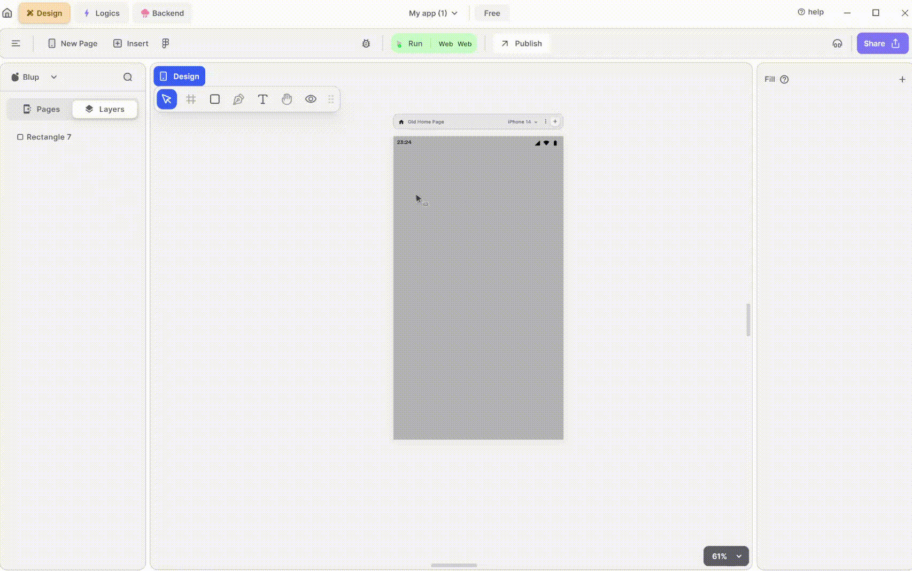

# Rectangle UI Node

This node facilitates interaction with UI rectangles, allowing dynamic modification of associated properties. It also captures events like on-click or property changes.

For example, if you wanted to navigate to another page with the click of the rectangle, such types of functionalities can be achieved with the help of this node.

## How to get rectangle Node.

**Step 1:** Select an ungrouped rectangle on the mobile canvas or pages.

**Step 2:** Right-click the selected rectangle to open the arsenal panel in Blup Designer.

**Step 3:** In the arsenal panel (which differs for Blup Logics), choose "Add Logics."

**Step 4:** This action generates a rectangle node in Blup Logics respective tab.

## Components of rectangle Nodes.

<table> 
    <thead>
    <tr>
      <th>Component</th>
      <th>Description</th>
    </tr>
  </thead><tbody><tr><td><strong>Child</strong></td><td>This input node receives the parent widget of the container.</td></tr><tr><td><strong>On Click</strong></td><td>This node allows you to trigger actions when the rectangle is clicked.</td></tr><tr><td><strong>Rect Properties</strong></td><td>This node provides properties for the rectangle such as width, height,file path and many more.</td></tr><tr><td><strong>Rect Extra Properties</strong></td><td>This node offers additional options to customize the rectangle, such as padding, corner radius, shadow effects and many more.</td></tr><tr><td><strong>Width</strong></td><td>This input node defines the width of the rectangle.</td></tr><tr><td><strong>Height</strong></td><td>This input node defines the height of the rectangle.</td></tr><tr><td><strong>Is Visible</strong></td><td>This input node point is used to hide the rectangle, this node point accepts a Boolean type value if the value is true it hides the rectangle, else the rectangle is visible.</td></tr><tr><td><strong>File Path</strong></td><td>This input node point provides the path of any image or gif to be shown inside the rectangle for mobile applications.</td></tr><tr><td><strong>File Bytes</strong></td><td>This input node point provides the data in bytes to be shown inside the rectangle for web applications.</td></tr><tr><td><strong>Extra Data</strong></td><td>This input node points stores data that can be used further along the line.</td></tr><tr><td><strong>Edit Checkbox</strong></td><td>This checkbox helps you to access secondary input node points or additional properties associated with the rectangle node. If the checkbox is checked, all the secondary input node points are visible, if not they are hidden and cannot be used. </td></tr><tr><td><strong>Corner Radius</strong></td><td>This input node helps to define the corner radius.</td></tr><tr><td><strong>Padding Left</strong></td><td>This node point is used to give left padding. </td></tr><tr><td><strong>Padding Right</strong></td><td>This node point is used to give Right padding. </td></tr><tr><td><strong>Padding Top</strong></td><td>This node point is used to give Top padding.</td></tr><tr><td><strong>Padding Bottom</strong> </td><td>This node point is used to give Bottom padding. </td></tr><tr><td><strong>Radius</strong></td><td>This input node helps to define the radius.</td></tr><tr><td><strong>Fill</strong></td><td>This node point helps to provide background colour to the rectangle. </td></tr><tr><td><strong>Border fill</strong> </td><td>This input node point helps to apply colour to the border of the rectangle. </td></tr><tr><td><strong>Border Width</strong></td><td>This input node point is used to define the width of the border of the rectangle.</td></tr><tr><td><strong>Shadow Fill</strong></td><td>This input node is used to provide colour to the shadow.</td></tr><tr><td><strong>Shadow X</strong></td><td> This input node point helps to move the shadow effect along the X-axis [horizontally]. </td></tr><tr><td><strong>Shadow Y</strong></td><td>This input box helps to move the shadow effect along the Y-axis[vertically]. </td></tr><tr><td><strong>Shadow blur</strong></td><td>This input node point helps you to expand the effect of shadow, If the value is smaller then the shadow is concentrated on a small area and vice versa. </td></tr><tr><td><strong>Inner Shadow</strong></td><td>This input node defines the inner shadow of the rectangle.</td></tr><tr><td><strong>Image Fill</strong></td><td>This input node point helps you provide a background colour to the image present in the rectangle.</td></tr><tr><td><strong>Image Fit</strong></td><td>This input node point helps to define how the image has to be fitted inside the rectangle.</td></tr></tbody></table>

If you have any ideas to make Blup better you can share them through our [Discord community channel ](https://discord.com/channels/940632966093234176/965313562425823303)

## Music to go with.
 

  
  
  Lofi music
  
  
  

