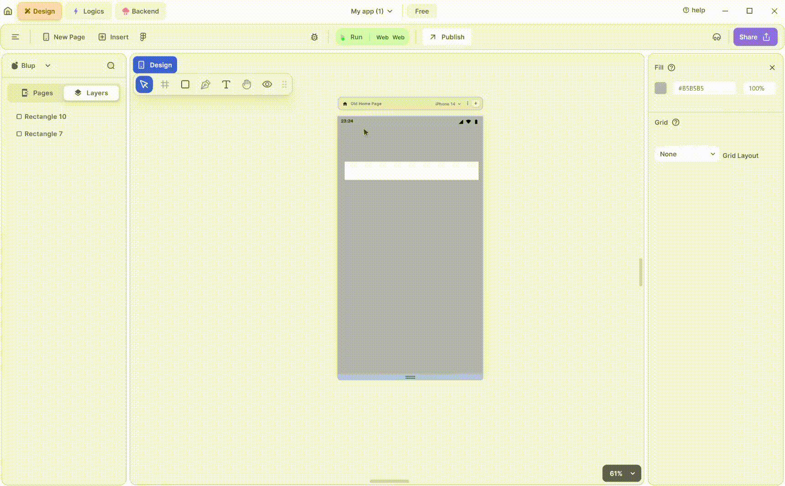

# Text UI Node

Text UI Node helps to perform logic On-click of text or when properties related to text changes.


<mark style="color:blue;">Note: Text or Text Field \[input box] has the same node i.e. text UI node.</mark>


### Components Of Text Node

<table><thead>
    <tr>
      <th>Component</th>
      <th>Description</th>
    </tr>
  </thead><tbody><tr><td><strong>Child</strong></td><td>This input node receives the parent widget of the Text.</td></tr><tr><td><strong>On Click</strong></td><td>This node allows you to trigger actions when the Text is clicked.</td></tr><tr><td><strong>Text Properties</strong></td><td>This node provides properties for the Text such as hide, extra data and many more.</td></tr><tr><td><strong>Text Extra Properties</strong></td><td>This node offers additional options to customize the Text, such as padding, font size, letter spacing and many more.</td></tr><tr><td><strong>Text</strong> </td><td>This input node point helps to provide the text to be shown.</td></tr><tr><td><strong>Is Visible</strong></td><td>This input node point is used to hide the Text or Textfield. This node point accepts a Boolean-type value if the value is true it hides the group, or else the group is visible.</td></tr><tr><td><strong>Extra Data</strong></td><td>This input node point helps to store data that can be used further down the line.</td></tr><tr><td><strong>Edit Checkbox</strong> </td><td>This checkbox helps you to access secondary input node points of the selected Text or TextField. If the checkbox is checked, all the secondary input node points are visible; if not they are hidden and cannot be used.</td></tr><tr><td><strong>Padding Left</strong></td><td>This node point helps to give the left padding.</td></tr><tr><td><strong>Padding Right</strong></td><td>This node point helps to give the Right padding.</td></tr><tr><td><strong>Padding Top</strong></td><td>This node point helps to give the Top padding.</td></tr><tr><td><strong>Padding Bottom</strong></td><td>This node point helps to give the Bottom padding.</td></tr><tr><td><strong>Font Size</strong></td><td> This input node point helps to define the font size of the text.</td></tr><tr><td><strong>Letter Spacing</strong> </td><td>This input node point helps to define the spacing between the letters of the text.</td></tr><tr><td><strong>Line Height</strong></td><td>This input node point helps to define a height between the text. The bigger the number, the bigger will be the height and vice versa.</td></tr><tr><td><strong>Max Lines</strong></td><td>This input node point helps to define the max line to which your text can expand , for example, if you define the maxline value as 2 then your text can only take up 2 lines.</td></tr><tr><td><strong>Text Vertical Wrap</strong></td><td>As the name suggests, this property helps to rotate your text 90 degree..</td></tr><tr><td><strong>Font Color</strong></td><td>As the name suggests, this property helps to define the font colour.</td></tr><tr><td><strong>Is Ellipses</strong></td><td>This input node point helps to convert the text expanded into multiple lines to a single line and show the rest of the text in “….” form.</td></tr></tbody></table>

  
  
  Lofi music
  
  
  

